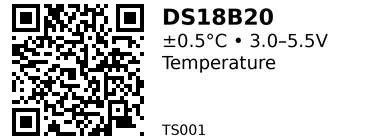

# Electronics Catalog

A tiny, Git-versioned catalog of my electronic parts with:

* **1–2 page Markdown sheets** per component (pinout, specs, links, gotchas).
* **Short URLs** per component (e.g. `/TS001/`) via MkDocs + GitHub Pages.
* **Printable QR stickers** (T02 mini printer friendly) generated from metadata.
* **Tags** (e.g. `temperature`, `i2c`, `rf`) to browse across categories.

---

## Quick start

```bash
# 0) Create & activate venv
mkvirtualenv electronics-catalog
workon electronics-catalog

# 1) Install deps
pip install mkdocs mkdocs-material qrcode pillow pyyaml

# 2) Build QR stickers (from page metadata)
python scripts/build_labels.py

# 3) Preview the site
mkdocs serve   # http://127.0.0.1:8000

# 4) Deploy to GitHub Pages (creates gh-pages branch)
mkdocs gh-deploy --force
```

---

## How to add a component (workflow)

1. **Pick an ID** (`CCNNN`, see categories below). Example: `TS001` for DS18B20.
2. **Create a page:** copy an existing one (e.g. `TS001.md`) and edit.
3. **Fill the front-matter** (YAML at the top), links, pinout, and a concise “Wiring Notes / Gotchas”.
4. **Generate sticker:** `python scripts/build_labels.py` → `docs/stickers/<ID>.png`
5. **Preview:** `mkdocs serve`
6. **Commit & deploy:** push; `mkdocs gh-deploy --force` for Pages.

---

## Front-matter template

```yaml
---
id: TS001                 # short code used for URL & sticker code
name: DS18B20             # title shown in nav
title: DS18B20            # optional override for page title
category: TS              # see “Categories” below
tags: [sensor, temperature, 1-wire, digital]
short: "±0.5°C • 3.0–5.5V • 1-Wire"     # 1-line spec for sticker
use: "Temperature measurements"         # brief use line for sticker
# Optional: override the QR URL; otherwise defaults to:
# https://thibserot.github.io/electronics-catalog/<ID>/
qr_url: "https://thibserot.github.io/electronics-catalog/TS001/"
---
```

### Optional per-page print metadata (inside the Markdown body)

```html
<!-- printer_meta:
title: "DS18B20"          # printed on the sticker (top line)
lines:                    # overrides short/use if present (wraps to fit)
  - "±0.5°C • 3.0–5.5V • 1-Wire"
  - "Use: Temperature measurements"
# qr_url (if present) overrides front-matter qr_url
-->
<!-- /printer_meta -->
```

---

## Categories (`CCNNN`)

Use the two-letter **category** + 3-digit counter:

* **TS** – Temperature sensors (DS18B20, PT100, MAX31865, etc.)
* **ENV** – Environmental sensors (BME280/BMP280, SHT4x, TSL2561…)
* **PS** – Power supplies/chargers/regulators (buck, LDO, TP4056…)
* **MC** – Microcontrollers / dev boards (ESP32, RP2040…)
* **RF** – Radios / comms (LoRa, nRF24, ESP-Now modules…)
* **IO** – I/O expanders / ADC / DAC / level shifting
* **AC** – Actuators (fans, motors, servos, relays, MOSFET boards)
* **CN** – Connectors / cables / adapters
* **OT** – Other / misc

> IDs are human-typeable, unique, and stable. Example: `ENV003` for BME280.

---

## Tags (cross-cutting search)

Add `tags:` in front-matter. Examples:

* DS18B20 → `tags: [sensor, temperature, 1-wire, digital]`
* BME280 → `tags: [sensor, temperature, humidity, pressure, i2c]`

Visit **`/tags/temperature/`** to see *all* temperature-capable parts across categories.

---

## QR sticker generator (T02-friendly)

* Script: `scripts/build_labels.py`
* Output: `docs/stickers/<ID>.png` (and `docs/stickers/index.csv`)
* Features:

  * QR left (sharp), text right (rendered at 2× then LANCZOS downscale)
  * Title (name) aligned to top of QR; code aligned to bottom
  * Word-wrap; up to 4 info lines with ellipsis
  * Width capped at **384 px** (T02 mini). Change to **576** for 80 mm printers.

**Re-run it any time** after editing a page to refresh the sticker.

---

## Deployment

* GitHub Pages (public): `mkdocs gh-deploy --force`
  Pages URL: `https://thibserot.github.io/electronics-catalog/`

---

## Troubleshooting

* **Sticker image not showing on page**
  Ensure sticker lives under `docs/stickers/` and the Markdown uses:

  ```md
  
  ```
* **MkDocs warning: page not in nav**
  Harmless. Add to `nav` if you want it visible, or ignore.
* **Odd characters on stickers (`°`, `±`, `•`)**
  Ensure the fonts in `fonts/` are present; the script uses those TTFs.
* **Sticker too wide**
  Lower `TEXT_COL_WIDTH` or `QR_BOX_SIZE` in the script, or keep text shorter.
* **Need multi-line “Use:”**
  The generator wraps and caps to 4 lines; shorten or split into two lines in `printer_meta.lines`.

---

## Contributing checklist (for Future-You)

* Keep pages **short**: quick facts, links, wiring notes, gotchas.
* Prefer **one clean photo** and **one pinout/wiring** image.
* Use **tags** liberally (they power discovery).
* Use **links with short labels** (`[AliExpress](…)`, `[Datasheet](…)`).
* Keep **IDs stable** once printed on stickers.

