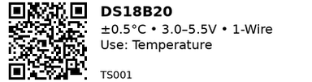

# DS18B20 — TS001

**Aliases:** DS18B20, DS18B20B+  
**Category:** TS  

## Quick Facts
- Digital temperature sensor (1-Wire), unique 64-bit ID.
- Use cases: ambient/liquid/soil; long runs; many on one pin.
- **Voltage:** 3.0–5.5 V • **Signal:** 1-Wire  
- **Accuracy/Range/Resolution:** ±0.5 °C (−10..+85 °C), −55..+125 °C, 9–12-bit

## Links
- **Where to buy:** [AliExpress](https://www.aliexpress.com/item/1005008644135794.html)
- **Tutorial:** [Random Nerd Tutorials](https://randomnerdtutorials.com/esp32-ds18b20-temperature-arduino-ide/)
- **Datasheet:** [Analog Devices PDF](https://www.analog.com/media/en/technical-documentation/data-sheets/ds18b20.pdf)

## Pinout
- Flat face towards you, legs down: **Left=GND**, **Middle=DQ**, **Right=VDD**  
- Waterproof probes often: **red=VDD**, **yellow/white=DQ**, **black=GND** (verify!)

## Wiring Notes
- 4.7 kΩ pull-up DQ→VDD required.
- Prefer bus/backbone wiring over star; keep twisted pair DQ/GND.
- Parasitic power works but is fussier — avoid if possible.

## Gotchas
- Missing pull-up ⇒ bogus 85 °C/127 °C readings.
- Wrong color codes on cheap probes; check with a meter.

---

*QR for printing will appear here after you run the script:*

