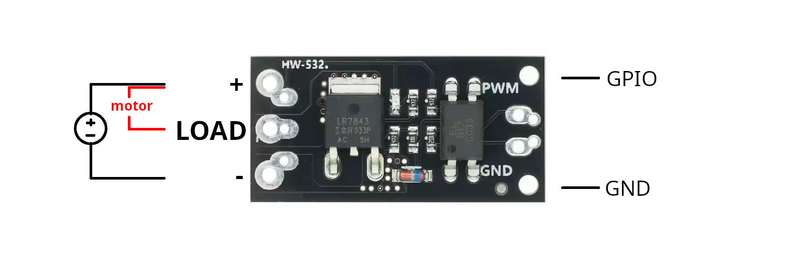
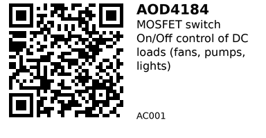

# AOD4184 (D4184) MOSFET Module — AC001

**Aliases:** D4184 / AOD4184 “MOSFET relay” module (various vendors)  
**Category:** AC

## Quick Facts
- **Type:** N-channel MOSFET low-side switch (module). You put the **load between `LOAD` and `+`**, the module **switches the ground** side.  
- **Logic:** Accepts MCU input (3.3–5 V on most modules)
- **Current:** Marketing says “50 A”, but real-world continuous is ~**10 A @ 12 V** without extra heatsinking due to PCB thermal limits.


## Links
- **Where to buy:** [AliExpress](https://www.aliexpress.com/item/1005008686365002.html)  

## Typical Pinout (varies by seller)
- **Power side:** `+` (to supply +), `LOAD` (to load’s negative end), `-` must be connected to supply - and GND of esp
- **Control side:** `PWM`: Connect to GPIO, `GND`: Connect to GND from esp. 


## Wiring (ESP32 → 12 V fan example)
- 12 V **+** → **+** on module, 12 V **−** → module **GND** (power ground).  
- Fan **+** → 12 V **+**; fan **−** → **LOAD** on module.  
- ESP32 **GPIO** (e.g., `GPIO 23`) → **PWM** on module; ESP32 **GND** → module **GND**.  

> **Remember:** Load goes **between `LOAD` and `+`**. The module sinks current to ground (low-side).



## Gotchas
- **Audible ringing with PWM:** Buzz often comes from the load/PSU when you PWM in the **audible band (<20 kHz)**. Two easy fixes: use **time-proportioning (slow duty cycling)** with multi-second periods (see example below) or push PWM **>20 kHz**.

---

## Code — Easiest: 5s ON, 5s OFF (ESP32 / Arduino)
```cpp
// AC001: D4184 / AOD4184 module test — 5s ON, 5s OFF
// Wire: ESP32 GPIO 23 -> IN, GNDs common
const int RELAY_PIN = 23;

void setup() {
  pinMode(RELAY_PIN, OUTPUT);
  digitalWrite(RELAY_PIN, LOW); // start OFF
}

void loop() {
  digitalWrite(RELAY_PIN, HIGH); // ON
  delay(5000);
  digitalWrite(RELAY_PIN, LOW);  // OFF
  delay(5000);
}
```

## Code - "x% power" without audible whine (slow time-proportioning)

```cpp
// AC001: Time-proportioning control (TPC) with a long period (no audible PWM)
const int RELAY_PIN = 23;

// set desired power level (0–100)
int power_percent = 30;           // e.g., 30% average power
const unsigned long PERIOD_MS = 10000; // 10s cycle

void setup() {
  pinMode(RELAY_PIN, OUTPUT);
  digitalWrite(RELAY_PIN, LOW);
}

void loop() {
  unsigned long on_ms  = (PERIOD_MS * power_percent) / 100;
  unsigned long off_ms = PERIOD_MS - on_ms;

  if (on_ms > 0) {
    digitalWrite(RELAY_PIN, HIGH);
    delay(on_ms);
  }
  if (off_ms > 0) {
    digitalWrite(RELAY_PIN, LOW);
    delay(off_ms);
  }
}

```

---


*QR for printing will appear here after you run the script:*


