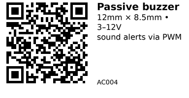

# 12085 passive buzzer - AC004

A small **passive buzzer** in a 12 mm × 8.5 mm can (“12085”). Passive means it **needs a square‑wave signal** (PWM/LEDC) to make sound. Use it for **beeps/alerts** or simple melodies. The AliExpress listing mentions **“42R”** which typically indicates a **magnetic** passive buzzer (coil) rather than a piezo disc, so **treat the exact type as ambiguous** until verified. If it’s magnetic, include a **flyback diode** when switching it with a transistor; if it’s piezo, the diode is not needed.

> Source: AliExpress listing  
> 10PCS 12085 Passive Buzzer 12×8.5 mm • “42R” resistance • 3–12 V common
> Diameter: 12 mm • Height: 8.5 mm
> Notes: The listing calls it “Mini Piezo Buzzer” but also mentions “42R”, which usually indicates a **magnetic** buzzer (coil). Treat the exact type as **ambiguous** unless you verify the inside or see a **+** polarity mark.


## Links

- **Where to buy:** [AliExpress](https://www.aliexpress.com/item/1005007274812383.html)
- **Datasheet:** Representative 12×8.5 mm buzzer datasheet (exact model on listing not specified) — [Link](https://www.lcsc.com/product-detail/Buzzers_Fengming-YS-MBZ12085C05R42_C409842.html)
- **Tutorial:** [ESP32 buzzer with PWM (techtutorialsx)](https://techtutorialsx.com/2017/07/01/esp32-arduino-controlling-a-buzzer-with-pwm/)

## Specifications

- **Form factor:** Ø12 mm × 8.5 mm can (a.k.a. “12085”)
- **Type (from listing):** *Passive* (requires AC drive / PWM)
- **Electrical (from listing):** “3–12 V”, “42 Ω” (ambiguous: may indicate magnetic type)
- **Typical drive (general):** 2–5 Vpp square wave at ~2 kHz (piezo) or 3–5 V square wave (magnetic)
- **Polarity:** Piezo versions often have a **+** mark; magnetic types may be non‑polar. Verify before wiring.
- **Use cases:** Beeps/alerts, UI feedback, simple melodies.


## Pinout & Addresses (common breakout labels)

Two leads only:
- **+ / SIG** – drive signal (connect to transistor/driver; some piezo cans mark **+**).
- **− / GND** – ground return.
If no **+** is marked and DC resistance ≈ 42 Ω, it’s likely a **magnetic** passive buzzer.


## Wiring

**Recommended (safe & loud): NPN driver (e.g., 2N2222) + ESP32 PWM**

- ESP32 GPIO → 1 kΩ → **base** of NPN, **emitter** to GND.
- Buzzer between **+5 V** (or **3.3 V**) and **collector**.
- **If magnetic** buzzer, add a **flyback diode** (1N4148/1N5819) across the buzzer (**+** to **+V** side).
- **If piezo**, no diode is needed.
- Share grounds between ESP32 and supply.

**Quick/quiet test (not for volume):** Drive directly from a GPIO with a **330–1 kΩ series resistor**; works for many piezo cans but expect low volume. Avoid direct drive for magnetic 42 Ω types (may over‑current the pin).


## Gotchas

- The listing mixes **“piezo”** wording with **“42R”** (magnetic). Verify type before adding or omitting a flyback diode.
- Directly powering a **magnetic 42 Ω** unit from a GPIO can exceed the pin’s current rating. Use a transistor.
- For loudness, drive at or near the part’s **resonant frequency** (often ~2 kHz but varies by model).


## How to use

```cpp
// ESP32 (Arduino) – simple tone on a passive buzzer via LEDC PWM
// Wiring: use NPN driver; connect buzzer to +5V and NPN collector (see wiring section).

const int BUZZER_PIN = 18;   // any PWM-capable GPIO
const int LEDC_CHANNEL = 0;
const int LEDC_TIMER   = 0;

void setup() {
  ledcSetup(LEDC_CHANNEL, 2000 /* Hz */, 10 /* bits */);
  ledcAttachPin(BUZZER_PIN, LEDC_CHANNEL);

  // Play a short beep at 2 kHz
  ledcWriteTone(LEDC_CHANNEL, 2000);
  delay(200);
  ledcWriteTone(LEDC_CHANNEL, 0); // stop
  delay(300);

  // Simple 3-note pattern
  int notes[] = { 1000, 1500, 2000, 0 };  // Hz; 0 = rest
  for (int i = 0; notes[i] >= 0; ++i) {
    if (notes[i] == 0) {
      ledcWriteTone(LEDC_CHANNEL, 0);
    } else {
      ledcWriteTone(LEDC_CHANNEL, notes[i]);
    }
    delay(180);
  }
}

void loop() { /* nothing */ }
```

---

*QR for printing will appear here after you run the script:*


