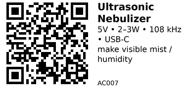

# Ultrasonic Nebulizer Driver - AC007

A small driver board for **ultrasonic atomizer discs** (≈20 mm piezo, ~108–113 kHz). These boards create a cool visible mist by pushing water through a porous mesh at ultrasonic frequency.  
**Use when you need quick humidification or fog effects** in enclosures, incubators, props, or scent projects. These particular boards are **power‑only** devices (no documented control I/O); you typically switch their **5 V power** from a microcontroller.

## Links

- **Where to buy (6‑nozzle):** [AliExpress](https://www.aliexpress.com/item/1005007251645508.html)
- **Where to buy (dual‑nozzle):** [AliExpress](https://www.aliexpress.com/item/1005007145508293.html)
- **Datasheet (transducer specs):** [STEMinc 20 mm / 113 kHz atomizer](https://www.steminc.com/PZT/en/ultrasonic-mist-generation-metal-mesh-atomizer-113khz-10%C2%B5m)
- **Tutorials / build ideas:** 
    - [Seeed Studio “Grove – Water Atomization”](https://wiki.seeedstudio.com/Grove-Water_Atomization/)
    - [CircuitDigest “Ultrasonic Mist Maker using ESP‑01”](https://circuitdigest.com/microcontroller-projects/ultrasonic-mist-maker-using-esp01-and-ultrasonic-humidifier-module)

## Specifications

**Six‑nozzle board (from listing):**

- Supply: **5 V (USB‑C)**  
- Current / Power: **~300 mA board rating; recommend ≥ 2 A 5 V supply** (seller notes “Minimum 2A”)  
- Power: **2.5–3 W**
- Atomization frequency: **108 kHz ± 2 kHz**
- Modes: six‑spray / dynamic / single / multiple (mode cycling on board)
- PCB: **FR‑4, 1.2 mm**
- Module size: **65 × 30 mm**; disc connector: **PH2.0** to **20 mm** atomizer tablets (aperture **4–5 µm**)
- Accessories: brackets + cotton wicks (per kit)

**Dual‑nozzle board (from listing):**

- Power: **2–3 W**, intended for **USB 5 V** sources
- Operating temperature (claimed): **−40 … +80 °C**  
- Other details are vague in seller text; treat as a **similar 5 V 108–113 kHz** atomizer driver. If critical, verify with the exact board in hand.

**Atomizer discs (typical 20 mm metal‑mesh):**

- Resonant frequency: **~113 kHz**
- Droplet size: **≈10 µm**
- Rated input at the disc: tens of **Vp‑p** driven by the board (do **not** drive discs directly from GPIO)
- Example transducer specs: see “Datasheet” link above.

## Pinout & Addresses (common breakout labels)

These boards are usually **power‑only**:

- **USB‑C 5 V in** (or VBUS/GND pads if provided)
- **Disc connectors** (JST‑PH 2.0) to the piezo atomizer tablets  

Some variants expose a **push‑button** to change spray modes. **No documented logic‑level control pins** are provided on the referenced listings.

## Wiring

**Goal:** switch the board’s 5 V power from an ESP32.

- Provide a **separate 5 V supply rated ≥ 2 A** for multi‑nozzle boards. Do not power from the ESP32 or USB hub ports.
- Switch power using one of:
  - A **5 V relay module** (easy, but bulky/noisy), or
  - A **high‑side P‑MOSFET load switch** board rated ≥ 2–3 A (preferred for silence/efficiency).
- Common ground between ESP32 and the 5 V supply/load switch. Keep high‑current 5 V traces short and away from the ESP32 RF.
- Keep the atomizer away from electronics; **condensation** is real. Use a **splash guard** and route the mist upward.

**Minimal wiring (P‑MOSFET switch):**

- ESP32 **GPIO → gate driver/control** of the load‑switch module
- Load‑switch **VIN = 5 V**, **VOUT → humidifier board VBUS**
- Grounds tied together

## Gotchas

- These boards **do not accept ESP32 GPIO control directly**; you must **switch their 5 V**.
- **Current spikes** at start‑up can reset your system—use a **stout 5 V supply** and short wiring.
- **Moisture** will corrode boards: mount vertically, add drip protection, and avoid enclosed spaces without airflow.
- Atomizer discs are **consumables**; performance drops over time. Keep spare **20 mm, ~108–113 kHz** discs.
- If your board cycles “modes,” that behavior is internal; it can’t be set digitally unless your specific PCB exposes pads (not documented here).

## How to use

Example: **toggle the mist** with a GPIO driving a typical **active‑low EN pin** on a P‑channel high‑side load‑switch module. Uses only `Arduino.h` on an ESP32.

```cpp
// ESP32: toggle a 5V load switch controlling the nebulizer board
const int MIST_EN = 15;   // connect to load-switch EN (active-low or -high varies by board)
bool activeLow = true;    // set according to your switch board

void setup() {
  pinMode(MIST_EN, OUTPUT);
  // default off
  digitalWrite(MIST_EN, activeLow ? HIGH : LOW);
}

void mistOn()  { digitalWrite(MIST_EN, activeLow ? LOW : HIGH); }
void mistOff() { digitalWrite(MIST_EN, activeLow ? HIGH : LOW); }

void loop() {
  mistOn();
  delay(10 * 1000);   // 10 s ON
  mistOff();
  delay(20 * 1000);   // 20 s OFF
}
```

> Libraries: none (plain Arduino core). If using a **relay module**, drive its IN pin instead.  
> For humidity‑based control, pair with a **SHT4x/DHT22** and implement simple on/off hysteresis.

---

*QR for printing will appear here after you run the script:*


