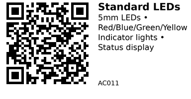

# Standard 5mm LEDs - AC011

Assorted 5mm through-hole LEDs for indicator lights, status displays, and visual feedback. Includes single-color LEDs (red, blue, green, yellow, white) and RGB LEDs. Standard forward voltage ~2-3.5V depending on color. Use with current-limiting resistors (typically 220Ω-1kΩ for 3.3V/5V systems).

## Available Colors

**Single-color LEDs:**

- Red: ~2.0V forward voltage, 20mA typical
- Green: ~2.1V forward voltage, 20mA typical
- Blue: ~3.2V forward voltage, 20mA typical
- Yellow: ~2.1V forward voltage, 20mA typical
- White: ~3.2V forward voltage, 20mA typical

**RGB LEDs:**

- Common cathode or common anode
- 4 pins: R, G, B, Common
- Each color channel: 20mA max

## Links

- **Where to buy:** [AliExpress - 5mm LED Assortment](https://www.aliexpress.com/item/32848810276.html)
- **Tutorial:** [ESP32 LED Control (Random Nerd)](https://randomnerdtutorials.com/esp32-pwm-arduino-ide/)

## Specifications

- **Package:** 5mm (F5) through-hole
- **Lens:** Clear or diffused (varies by color)
- **Forward current:** 20mA typical, 30mA max
- **Viewing angle:** ~20-30° (clear), ~60° (diffused)
- **Lifespan:** ~50,000 hours typical

## Wiring

**Single LED with current-limiting resistor:**

```
ESP32 GPIO → Resistor (220Ω-1kΩ) → LED Anode (+) → LED Cathode (-) → GND
```

**Resistor calculation:**

- For 3.3V GPIO: R = (3.3V - Vf) / 0.02A
- Example (red LED, Vf=2.0V): R = (3.3 - 2.0) / 0.02 = 65Ω → use 220Ω for safety
- Example (blue LED, Vf=3.2V): R = (3.3 - 3.2) / 0.02 = 5Ω → use 100Ω minimum

**RGB LED (common cathode):**
```
GPIO_R → Resistor → R pin
GPIO_G → Resistor → G pin
GPIO_B → Resistor → B pin
Common → GND
```

## Identifying LED Pins

- **Flat edge:** Indicates cathode (-) side
- **Longer leg:** Anode (+)
- **Shorter leg:** Cathode (-)
- **RGB:** Longest pin is usually the common pin

## Gotchas

- **Always use current-limiting resistors** - connecting directly to GPIO will damage the LED and/or ESP32
- **Blue/white LEDs need higher voltage** (~3.2V) - may be dim on 3.3V systems
- **Check polarity** - LEDs only work in one direction
- **RGB common anode vs cathode** - verify your LED type before wiring
- **PWM for dimming** - use LEDC on ESP32 for brightness control

## How to use

**Simple blink (ESP32):**

```cpp
const int LED_PIN = 2;  // any GPIO

void setup() {
  pinMode(LED_PIN, OUTPUT);
}

void loop() {
  digitalWrite(LED_PIN, HIGH);
  delay(1000);
  digitalWrite(LED_PIN, LOW);
  delay(1000);
}
```

**PWM brightness control:**

```cpp
const int LED_PIN = 2;
const int PWM_CHANNEL = 0;

void setup() {
  ledcSetup(PWM_CHANNEL, 5000, 8);  // 5kHz, 8-bit
  ledcAttachPin(LED_PIN, PWM_CHANNEL);
}

void loop() {
  // Fade in
  for (int brightness = 0; brightness <= 255; brightness++) {
    ledcWrite(PWM_CHANNEL, brightness);
    delay(5);
  }
  // Fade out
  for (int brightness = 255; brightness >= 0; brightness--) {
    ledcWrite(PWM_CHANNEL, brightness);
    delay(5);
  }
}
```

**RGB LED control (common cathode):**

```cpp
const int PIN_R = 25;
const int PIN_G = 26;
const int PIN_B = 27;

void setup() {
  ledcSetup(0, 5000, 8);
  ledcSetup(1, 5000, 8);
  ledcSetup(2, 5000, 8);
  ledcAttachPin(PIN_R, 0);
  ledcAttachPin(PIN_G, 1);
  ledcAttachPin(PIN_B, 2);
}

void setColor(int r, int g, int b) {
  ledcWrite(0, r);
  ledcWrite(1, g);
  ledcWrite(2, b);
}

void loop() {
  setColor(255, 0, 0);    // Red
  delay(1000);
  setColor(0, 255, 0);    // Green
  delay(1000);
  setColor(0, 0, 255);    // Blue
  delay(1000);
  setColor(255, 255, 0);  // Yellow
  delay(1000);
}
```

---

*QR for printing will appear here after you run the script:*


