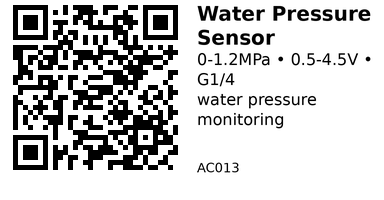

# Water Pressure Sensor (G1/4 Thread, 0-1.2MPa) - AC013

Analog voltage output pressure transducer for monitoring water pressure in pipes and systems. G1/4" threaded connection, 0.5-4.5V output proportional to pressure.

## Key Specifications

| Parameter | Value |
|-----------|-------|
| **Pressure range** | 0 - 1.2 MPa (0-174 PSI, 0-12 bar) |
| **Output type** | Analog voltage (0.5V - 4.5V) |
| **Supply voltage** | 5V DC |
| **Output range** | 0.5V @ 0 MPa, 4.5V @ 1.2 MPa |
| **Accuracy** | ±1.5% FS (full scale) |
| **Thread size** | G1/4" male |
| **Response time** | <2ms |
| **Media** | Water, air, non-corrosive liquids/gases |
| **Temperature** | -20°C to 85°C (compensated 0-50°C) |
| **Protection** | IP65 (with connector sealed) |
| **Cable length** | ~1m (3-wire: +5V, GND, Signal) |

## Pinout / Wiring

3 wires (typically):

- **Red**: +5V (power supply)
- **Black**: GND (ground)
- **Yellow/White/Green**: Signal (0.5-4.5V output)

**Output voltage formula:**

```
V_out = 0.5V + (Pressure_MPa / 1.2) × 4.0V
```

Examples:

- 0 MPa → 0.5V
- 0.6 MPa → 2.5V
- 1.2 MPa → 4.5V

## Typical Wiring (ESP32)

```
Sensor Red    → ESP32 5V (or external 5V supply)
Sensor Black  → ESP32 GND
Sensor Signal → ESP32 GPIO34 (ADC pin)
```

**Note:** ESP32 ADC max is 3.3V, so pressures above ~0.7 MPa will saturate the ADC. Use voltage divider or external ADC for full range.

## Example Code (ESP32)

```cpp
// Pressure sensor on ADC pin
#define PRESSURE_PIN 34

void setup() {
  Serial.begin(115200);
  analogSetAttenuation(ADC_11db);  // 0-3.3V range
}

void loop() {
  int adc_value = analogRead(PRESSURE_PIN);

  // Convert ADC to voltage (12-bit ADC, 0-4095)
  float voltage = (adc_value / 4095.0) * 3.3;

  // Convert voltage to pressure (MPa)
  // V_out = 0.5 + (P / 1.2) * 4.0
  // P = ((V_out - 0.5) / 4.0) * 1.2
  float pressure_mpa = ((voltage - 0.5) / 4.0) * 1.2;

  // Clamp to valid range
  if (pressure_mpa < 0) pressure_mpa = 0;
  if (pressure_mpa > 1.2) pressure_mpa = 1.2;

  // Convert to other units
  float pressure_bar = pressure_mpa * 10.0;
  float pressure_psi = pressure_mpa * 145.038;

  Serial.print("ADC: ");
  Serial.print(adc_value);
  Serial.print(" | Voltage: ");
  Serial.print(voltage, 2);
  Serial.print("V | Pressure: ");
  Serial.print(pressure_mpa, 2);
  Serial.print(" MPa (");
  Serial.print(pressure_bar, 1);
  Serial.print(" bar, ");
  Serial.print(pressure_psi, 1);
  Serial.println(" PSI)");

  delay(1000);
}
```

## Voltage Divider for Full Range

If you need to measure full 0-1.2 MPa range (0.5-4.5V output) with ESP32 (3.3V ADC):

```
Sensor Signal ---[10kΩ]---+---[22kΩ]--- GND
                           |
                      ESP32 ADC Pin
```

Divider ratio: 22k / (10k + 22k) = 0.688

- 4.5V input → 3.1V at ADC (safe)
- 0.5V input → 0.34V at ADC

Adjust formula accordingly:

```cpp
float voltage_sensor = voltage_adc / 0.688;
float pressure_mpa = ((voltage_sensor - 0.5) / 4.0) * 1.2;
```

## Installation

**Plumbing:**

1. Wrap G1/4" threads with PTFE tape (3-5 wraps)
2. Thread into G1/4" female port or adapter
3. Hand-tighten, then wrench for final turn (don't overtighten)
4. Ensure flow direction doesn't matter (sensor measures static pressure)

**Electrical:**

1. Connect wires to microcontroller ADC pin
2. Use twisted-pair or shielded cable if running long distances
3. Seal cable entry point if outdoor/wet installation

## Gotchas

1. **ESP32 ADC limit:** 3.3V max - use voltage divider or external ADC for full range
2. **Offset voltage:** 0.5V offset (not 0V) at zero pressure
3. **Power supply:** Needs stable 5V - use good regulator, not USB directly
4. **Thread sealant:** Use PTFE tape, not liquid sealant (can clog sensor port)
5. **Pressure spikes:** Water hammer can briefly exceed max pressure - add snubber if needed
6. **Accuracy:** ±1.5% error means ±0.018 MPa (±2.6 PSI) uncertainty
7. **Media compatibility:** Water/air only - don't use with oils or corrosive liquids

## Calibration

For best accuracy, calibrate with known pressure:

1. **Zero point:** Disconnect from pressure source (atmospheric pressure) - should read ~0.5V
2. **Full scale:** Apply known pressure (e.g., 0.6 MPa / 87 PSI) - verify output voltage
3. **Adjust formula:** Correct offset and scale factor in code

## Applications

**Water system monitoring:** Home/garden water pressure

**Pump control:** Turn pump on/off based on pressure

**Leak detection:** Detect pressure drop indicating leak

**Irrigation automation:** Coordinate with solenoid valve (AC012)

**Aquarium/pond:** Monitor filter pump pressure

## Example Project: Pump Auto-Shutoff

```cpp
#define PRESSURE_PIN 34
#define PUMP_PIN     25

float pressure_threshold_low  = 0.3;  // MPa (turn pump ON)
float pressure_threshold_high = 0.8;  // MPa (turn pump OFF)

void loop() {
  float voltage = (analogRead(PRESSURE_PIN) / 4095.0) * 3.3;
  float pressure_mpa = ((voltage - 0.5) / 4.0) * 1.2;

  if (pressure_mpa < pressure_threshold_low) {
    digitalWrite(PUMP_PIN, HIGH);  // Start pump
  } else if (pressure_mpa > pressure_threshold_high) {
    digitalWrite(PUMP_PIN, LOW);   // Stop pump
  }

  delay(1000);
}
```

## Compatible Components

**Actuators:**

- AC012 (Solenoid Valve) - coordinate pressure with valve control
- AC301 (MOSFET) - switch pump based on pressure

**Other sensors:**

- ENV401 (Soil Moisture) - combine for smart irrigation

**ADC:**

- Use external 16-bit ADC (ADS1115) for better resolution

## Pressure Unit Conversions

| MPa | bar | PSI | kPa |
|-----|-----|-----|-----|
| 0.1 | 1.0 | 14.5 | 100 |
| 0.3 | 3.0 | 43.5 | 300 |
| 0.6 | 6.0 | 87.0 | 600 |
| 1.0 | 10.0 | 145.0 | 1000 |
| 1.2 | 12.0 | 174.0 | 1200 |

**Typical household water pressure:** 0.3-0.5 MPa (40-70 PSI)

## Links

- **Pakronics**: [Water Pressure Sensor G1/4 1.2MPa](https://www.pakronics.com.au/products/water-pressure-sensor-g1-4-1-2mpa-ss114991178-2)

---


