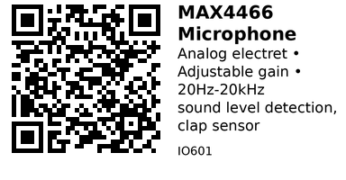

# MAX4466 Electret Microphone with Amplifier - IO601

Analog electret microphone module with MAX4466 operational amplifier. Features adjustable gain via potentiometer and optimized for voice frequencies. Perfect for sound level detection, clap-activated projects, and simple audio monitoring.

## Key Specifications

| Parameter | Value |
|-----------|-------|
| **Microphone type** | Electret condenser |
| **Amplifier** | MAX4466 (rail-to-rail op-amp) |
| **Frequency response** | 20 Hz to 20 kHz |
| **Supply voltage** | 2.4V - 5.5V (typically 3.3V or 5V) |
| **Output type** | Analog voltage (0.6V - 2.0V typical) |
| **Gain** | 25x to 125x (adjustable via pot) |
| **Current** | <1mA |
| **DC bias** | ~1.25V (VCC/2) |

## How It Works

**Signal chain:**
1. Electret mic capsule converts sound → weak AC voltage
2. DC bias circuit provides ~1.25V center point
3. MAX4466 amplifies AC signal (adjustable gain)
4. Output = DC bias ± AC audio signal
5. Read with ADC to measure sound amplitude

**AC coupling:**
- Output has DC offset (~1.25V or VCC/2)
- Audio signal swings above/below this bias
- Quiet: output ~1.25V
- Loud sound: output swings 0.6V to 2.0V (for example)

## Pinout

```
MAX4466 Microphone Module
    ___
   |   |
   | O |  Mic capsule
   |___|
   [POT]  Gain adjust

   | | |
   V O G
   C U N
   C T D

VCC = Power (2.4V - 5.5V)
OUT = Analog audio output
GND = Ground

POT = Gain adjustment potentiometer (25x to 125x)
```

## Typical Wiring (ESP32)

```
ESP32           MAX4466
-----           -------
3.3V   -------> VCC
GND    -------> GND
GPIO34 -------> OUT (use ADC1 pin)
```

**Important:** Use ADC1 pins (GPIO32-39) on ESP32, NOT ADC2 (conflicts with WiFi).

## Example Code - Sound Level Detection

```cpp
// ESP32 + MAX4466 Microphone
#define MIC_PIN 34

void setup() {
  Serial.begin(115200);
  analogSetAttenuation(ADC_11db);  // 0-3.3V range
}

void loop() {
  const int samples = 100;
  int minVal = 4095;
  int maxVal = 0;

  // Collect samples
  for (int i = 0; i < samples; i++) {
    int val = analogRead(MIC_PIN);
    minVal = min(minVal, val);
    maxVal = max(maxVal, val);
  }

  // Calculate peak-to-peak amplitude
  int amplitude = maxVal - minVal;

  Serial.printf("Amplitude: %d (min=%d, max=%d)\n", amplitude, minVal, maxVal);

  delay(100);
}
```

## Calibration - Find DC Bias

```cpp
void calibrate() {
  Serial.println("Calibrating... be quiet!");

  long sum = 0;
  const int samples = 1000;

  for (int i = 0; i < samples; i++) {
    sum += analogRead(MIC_PIN);
    delay(1);
  }

  int dcBias = sum / samples;
  Serial.printf("DC Bias: %d (should be ~%d for VCC=3.3V)\n",
                dcBias, 4095 / 2);  // Mid-point of ADC range
}
```

## Clap Detection

```cpp
#define MIC_PIN 34
#define CLAP_THRESHOLD 500  // Adjust based on calibration

void loop() {
  const int samples = 50;
  int minVal = 4095;
  int maxVal = 0;

  for (int i = 0; i < samples; i++) {
    int val = analogRead(MIC_PIN);
    minVal = min(minVal, val);
    maxVal = max(maxVal, val);
  }

  int amplitude = maxVal - minVal;

  if (amplitude > CLAP_THRESHOLD) {
    Serial.println("CLAP DETECTED!");
    // Toggle light, activate relay, etc.
    delay(500);  // Debounce
  }

  delay(10);
}
```

## Sound-Activated Light

```cpp
#define MIC_PIN 34
#define LIGHT_PIN 26
#define THRESHOLD 300

void loop() {
  int amplitude = getSoundLevel();  // From previous examples

  if (amplitude > THRESHOLD) {
    digitalWrite(LIGHT_PIN, HIGH);
    Serial.println("Sound detected - light ON");
    delay(5000);  // Keep on for 5 seconds
  } else {
    digitalWrite(LIGHT_PIN, LOW);
  }

  delay(50);
}
```

## VU Meter (Audio Visualizer)

```cpp
#define MIC_PIN 34
#define NUM_LEDS 8

int ledPins[] = {13, 12, 14, 27, 26, 25, 33, 32};

void loop() {
  int amplitude = getSoundLevel();

  // Map amplitude to number of LEDs
  int numLit = map(amplitude, 0, 1000, 0, NUM_LEDS);
  numLit = constrain(numLit, 0, NUM_LEDS);

  // Light up LEDs
  for (int i = 0; i < NUM_LEDS; i++) {
    digitalWrite(ledPins[i], i < numLit ? HIGH : LOW);
  }

  delay(50);
}
```

## Noise Level Monitoring

```cpp
void loop() {
  int amplitude = getSoundLevel();

  // Convert to approximate dB (rough estimation)
  // Note: This is not calibrated! For reference only.
  float dB = 20 * log10(amplitude + 1);  // +1 to avoid log(0)

  Serial.printf("Sound level: %d (approx %.1f dB)\n", amplitude, dB);

  if (amplitude > 800) {
    Serial.println("WARNING: Very loud!");
  } else if (amplitude > 400) {
    Serial.println("Moderate noise level");
  } else {
    Serial.println("Quiet");
  }

  delay(500);
}
```

## Frequency Analysis (FFT)

For frequency analysis, use FFT library:

```cpp
// Requires: arduinoFFT library
#include <arduinoFFT.h>

#define SAMPLES 128
double vReal[SAMPLES];
double vImag[SAMPLES];

arduinoFFT FFT = arduinoFFT();

void loop() {
  // Collect samples
  for (int i = 0; i < SAMPLES; i++) {
    vReal[i] = analogRead(MIC_PIN);
    vImag[i] = 0;
    delayMicroseconds(200);  // Sample rate = 5kHz
  }

  // Compute FFT
  FFT.Windowing(vReal, SAMPLES, FFT_WIN_TYP_HAMMING, FFT_FORWARD);
  FFT.Compute(vReal, vImag, SAMPLES, FFT_FORWARD);
  FFT.ComplexToMagnitude(vReal, vImag, SAMPLES);

  // Find peak frequency
  double peak = FFT.MajorPeak(vReal, SAMPLES, 5000);  // 5kHz sample rate
  Serial.printf("Dominant frequency: %.1f Hz\n", peak);

  delay(500);
}
```

## Gain Adjustment

**Potentiometer on module:**
- CW (clockwise) = higher gain (more sensitive)
- CCW (counter-clockwise) = lower gain (less sensitive)

**How to adjust:**
1. Run sound level code
2. Make normal sound (talking, music)
3. Adjust pot so amplitude is ~50-70% of maximum
4. Should not clip (max out) during normal sounds
5. Should register quiet sounds

**Too high gain:** Clipping (distortion), max values all the time
**Too low gain:** Weak signal, can't detect quiet sounds

## Key Features

**Adjustable gain:**
- 25x to 125x amplification
- Tune for application
- On-board potentiometer

**Wide frequency response:**
- 20 Hz to 20 kHz
- Covers human voice (80 Hz - 3 kHz)
- Suitable for music

**Low power:**
- <1mA current draw
- Good for battery projects
- Always-on monitoring

**Simple interface:**
- Just analog voltage
- Direct ADC reading
- No complex protocols

## Gotchas

1. **DC bias:** Output has DC offset (~1.25V) - not centered at 0V
2. **Gain critical:** Must adjust gain for application (too high = clipping)
3. **ADC noise:** ESP32 ADC noisy - use averaging, filtering
4. **Not calibrated:** Cannot measure absolute dB without calibration
5. **AC coupled:** Cannot measure constant pressure (only changing sound)
6. **Electret capsule fragile:** Avoid touching directly, can damage

## Comparison with I2S MEMS

| Feature | MAX4466 (IO601) | INMP441 (IO602) |
|---------|-----------------|-----------------|
| **Output** | Analog | Digital I2S |
| **Quality** | Basic (ADC noise) | High (no ADC noise) |
| **Code complexity** | Simple | Moderate (I2S driver) |
| **Frequency response** | 20 Hz - 20 kHz | 50 Hz - 15 kHz |
| **Use case** | Sound level | Voice recording |
| **Price** | $1-2 | $3-5 |

**Use MAX4466 when:**
- Simple sound detection
- No recording needed
- Budget constrained
- Easy code preferred

**Use INMP441 when:**
- Voice recording required
- Speech recognition needed
- High quality important
- I2S hardware available

## Applications

**Sound-activated lights:** Turn on lights with clap or sound.

**VU meter:** Audio visualizer with LED bar graph.

**Noise monitor:** Measure ambient noise level.

**Baby monitor:** Detect crying (simple threshold).

**Security:** Detect glass breaking, loud noises.

**Music reactive:** Control LEDs, motors based on music beat.

## Troubleshooting

**No reading / stuck at same value:**
- Check wiring (OUT connected to ADC pin?)
- Verify VCC power (3.3V or 5V)
- Microphone may be dead

**Always max reading:**
- Gain too high (turn pot CCW)
- Clipping/distortion
- Reduce gain until normal sounds are mid-range

**Very low readings:**
- Gain too low (turn pot CW)
- ADC attenuation wrong (use ADC_11db for 0-3.3V)
- Microphone damaged

**Constant noise / fluctuations:**
- Normal - ADC has noise
- Use averaging (read multiple samples)
- Add small capacitor (100nF) on power lines

---


