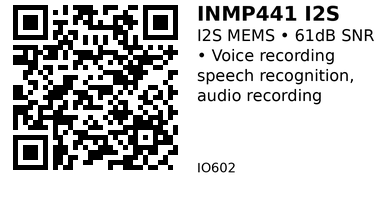

# INMP441 I2S MEMS Digital Microphone - IO602

High-quality MEMS microphone with digital I2S output. Features 61dB SNR and omnidirectional pickup pattern. Perfect for voice recording, speech recognition (Google Assistant, Alexa), and high-quality audio capture.

## Key Specifications

| Parameter | Value |
|-----------|-------|
| **Microphone type** | MEMS (omnidirectional) |
| **Interface** | I2S (digital audio) |
| **SNR** | 61 dB (signal-to-noise ratio) |
| **Sensitivity** | -26 dBFS |
| **Frequency response** | 50 Hz to 15 kHz (±3dB) |
| **Supply voltage** | 1.62V - 3.63V (module: 3.3V) |
| **Sample rate** | Up to 52 kHz |
| **Bit depth** | 24-bit |
| **Current** | ~1.4 mA |

## How It Works

**MEMS microphone:**
- Tiny silicon diaphragm vibrates with sound
- Capacitive sensing detects movement
- Built-in ADC converts to digital
- I2S interface outputs digital audio stream

**I2S protocol:**
- Serial audio interface (like SPI for audio)
- Three wires: SCK (clock), WS (word select), SD (data)
- Synchronous transmission
- Standard for digital audio devices

## Pinout

```
INMP441 Module
    ___
   |   |
   | O |  MEMS mic
   |___|
   | | | | | |
   L S W S V G
   / D S D C N
   R      C C D

L/R = Channel select (GND=left, VCC=right)
SD  = Serial Data (audio data output)
WS  = Word Select (left/right clock)
SCK = Serial Clock (bit clock)
VCC = Power (3.3V only!)
GND = Ground
```

**L/R pin:**
- Tie to GND for left channel
- Tie to VCC for right channel
- Needed when using 2 microphones (stereo)

## Typical Wiring (ESP32)

```
ESP32           INMP441
-----           -------
3.3V   -------> VCC (DO NOT use 5V!)
GND    -------> GND
GND    -------> L/R (left channel)
GPIO25 -------> SCK (I2S clock)
GPIO26 -------> WS  (word select)
GPIO33 -------> SD  (data)
```

**Important:** Use 3.3V only! 5V will damage MEMS chip.

## Example Code (ESP32 - I2S Driver)

```cpp
// ESP32 + INMP441 (I2S MEMS Microphone)
#include <driver/i2s.h>

#define I2S_WS 26      // Word Select (LRCK)
#define I2S_SD 33      // Serial Data (DOUT)
#define I2S_SCK 25     // Serial Clock (BCLK)

#define I2S_PORT I2S_NUM_0
#define SAMPLE_RATE 16000  // 16kHz (good for speech)
#define BUFFER_SIZE 1024

void setup() {
  Serial.begin(115200);

  // I2S configuration
  i2s_config_t i2s_config = {
    .mode = (i2s_mode_t)(I2S_MODE_MASTER | I2S_MODE_RX),
    .sample_rate = SAMPLE_RATE,
    .bits_per_sample = I2S_BITS_PER_SAMPLE_32BIT,
    .channel_format = I2S_CHANNEL_FMT_ONLY_LEFT,
    .communication_format = I2S_COMM_FORMAT_I2S,
    .intr_alloc_flags = ESP_INTR_FLAG_LEVEL1,
    .dma_buf_count = 4,
    .dma_buf_len = BUFFER_SIZE,
    .use_apll = false,
    .tx_desc_auto_clear = false,
    .fixed_mclk = 0
  };

  // Pin configuration
  i2s_pin_config_t pin_config = {
    .bck_io_num = I2S_SCK,
    .ws_io_num = I2S_WS,
    .data_out_num = I2S_PIN_NO_CHANGE,
    .data_in_num = I2S_SD
  };

  // Install and start I2S driver
  i2s_driver_install(I2S_PORT, &i2s_config, 0, NULL);
  i2s_set_pin(I2S_PORT, &pin_config);

  Serial.println("I2S microphone initialized");
}

void loop() {
  int32_t samples[BUFFER_SIZE];
  size_t bytes_read;

  // Read audio data from I2S
  i2s_read(I2S_PORT, &samples, sizeof(samples), &bytes_read, portMAX_DELAY);

  // Calculate RMS (root mean square) for volume level
  int64_t sum = 0;
  int samples_read = bytes_read / sizeof(int32_t);

  for (int i = 0; i < samples_read; i++) {
    sum += (int64_t)samples[i] * samples[i];
  }

  float rms = sqrt(sum / samples_read);

  Serial.printf("Audio level: %.0f\n", rms);
  delay(100);
}
```

## Record Audio to SD Card

```cpp
#include <driver/i2s.h>
#include <SD.h>
#include <SPI.h>

File audioFile;

void setup() {
  // ... (I2S init from previous example)

  // Initialize SD card
  if (!SD.begin(5)) {  // CS pin = 5
    Serial.println("SD card failed!");
    return;
  }

  // Create WAV file
  audioFile = SD.open("/recording.wav", FILE_WRITE);
  if (!audioFile) {
    Serial.println("Failed to create file");
    return;
  }

  // Write WAV header (see full implementation for details)
  writeWAVHeader(audioFile, SAMPLE_RATE, 16);  // 16-bit audio

  Serial.println("Recording... (10 seconds)");
}

void loop() {
  const int record_time = 10;  // seconds
  const int buffer_len = 512;
  int32_t i2s_buffer[buffer_len];
  size_t bytes_read;

  unsigned long start = millis();
  while (millis() - start < record_time * 1000) {
    // Read from I2S
    i2s_read(I2S_PORT, &i2s_buffer, sizeof(i2s_buffer), &bytes_read, portMAX_DELAY);

    // Convert 32-bit to 16-bit and write to SD
    int samples = bytes_read / sizeof(int32_t);
    for (int i = 0; i < samples; i++) {
      int16_t sample = i2s_buffer[i] >> 16;  // Convert 32-bit to 16-bit
      audioFile.write((byte*)&sample, sizeof(int16_t));
    }
  }

  audioFile.close();
  Serial.println("Recording complete");

  while (1) delay(1000);  // Stop
}
```

## Voice Activation (Simple)

```cpp
void loop() {
  int32_t samples[128];
  size_t bytes_read;

  i2s_read(I2S_PORT, &samples, sizeof(samples), &bytes_read, portMAX_DELAY);

  // Calculate peak amplitude
  int32_t peak = 0;
  for (int i = 0; i < 128; i++) {
    peak = max(peak, abs(samples[i]));
  }

  const int32_t VOICE_THRESHOLD = 500000;  // Adjust based on testing

  if (peak > VOICE_THRESHOLD) {
    Serial.println("Voice detected!");
    // Start recording, send to speech recognition, etc.
  }

  delay(50);
}
```

## Frequency Analysis (FFT)

```cpp
#include <arduinoFFT.h>

#define SAMPLES 512
double vReal[SAMPLES];
double vImag[SAMPLES];

arduinoFFT FFT = arduinoFFT();

void loop() {
  int32_t i2s_samples[SAMPLES];
  size_t bytes_read;

  // Read samples
  i2s_read(I2S_PORT, &i2s_samples, sizeof(i2s_samples), &bytes_read, portMAX_DELAY);

  // Prepare FFT input
  for (int i = 0; i < SAMPLES; i++) {
    vReal[i] = (double)i2s_samples[i] / INT32_MAX;  // Normalize
    vImag[i] = 0;
  }

  // Compute FFT
  FFT.Windowing(vReal, SAMPLES, FFT_WIN_TYP_HAMMING, FFT_FORWARD);
  FFT.Compute(vReal, vImag, SAMPLES, FFT_FORWARD);
  FFT.ComplexToMagnitude(vReal, vImag, SAMPLES);

  // Find dominant frequency
  double peak = FFT.MajorPeak(vReal, SAMPLES, SAMPLE_RATE);
  Serial.printf("Dominant frequency: %.1f Hz\n", peak);

  delay(500);
}
```

## Sample Rate Selection

**Common sample rates:**
- **8 kHz:** Telephony quality (minimal)
- **16 kHz:** Speech recognition (good)
- **22.05 kHz:** Low-quality music
- **44.1 kHz:** CD quality music
- **48 kHz:** Professional audio

**For speech:** Use 16 kHz (Google Assistant, Alexa standard)
**For music:** Use 44.1 kHz or 48 kHz

## Key Features

**Digital I2S output:**
- No ADC noise (pure digital)
- High SNR (61 dB)
- Better quality than analog mics

**MEMS technology:**
- Tiny silicon chip
- Robust, reliable
- Standard in smartphones

**Wide dynamic range:**
- Handles quiet to loud sounds
- No manual gain adjustment needed
- Automatic level control

**High sample rate:**
- Up to 52 kHz
- Good for music, voice
- 24-bit depth

## Gotchas

1. **3.3V only:** Do NOT use 5V! Will damage chip permanently
2. **I2S complexity:** More complex code than analog mic
3. **32-bit samples:** INMP441 outputs 24-bit in 32-bit container (shift right >>8 or >>16)
4. **ESP32 specific:** I2S driver code not portable to other MCUs
5. **No WiFi + I2S on same core:** May need to use I2S on core 0, WiFi on core 1
6. **Clock precision:** I2S timing sensitive (use hardware I2S, not bit-bang)

## INMP441 vs MAX4466

| Feature | INMP441 (IO602) | MAX4466 (IO601) |
|---------|-----------------|-----------------|
| **Output** | Digital I2S | Analog voltage |
| **SNR** | 61 dB | ~40 dB (limited by ADC) |
| **Code complexity** | High (I2S driver) | Low (analogRead) |
| **Quality** | Excellent | Basic |
| **Use case** | Voice recording | Sound level detection |
| **Price** | $3-5 | $1-2 |
| **MCU requirements** | I2S hardware | ADC pin |

**Use INMP441 when:**
- Recording audio
- Speech recognition required
- High quality critical
- ESP32 (has I2S hardware)

**Use MAX4466 when:**
- Simple sound detection
- No recording needed
- Budget constrained
- Any MCU with ADC

## Applications

**Voice assistants:** Google Assistant, Amazon Alexa integration.

**Speech recognition:** Wake word detection, voice commands.

**Audio recording:** Voice memos, dictation, interviews.

**Intercom system:** Two-way audio communication.

**Baby monitor:** High-quality audio monitoring.

**Music applications:** Audio analysis, pitch detection.

**Noise cancellation:** Reference mic for active noise cancellation.

## Troubleshooting

**No audio / all zeros:**
- Check wiring (SD, WS, SCK correct?)
- Verify 3.3V power (not 5V!)
- I2S driver not initialized
- Wrong I2S port or pins

**Garbled/distorted audio:**
- Wrong sample rate
- Bit depth mismatch (use 32-bit mode)
- I2S clock frequency incorrect
- DMA buffer too small

**Low volume:**
- Normal - INMP441 outputs full-scale digital
- Adjust gain in software (multiply samples)
- Not a hardware issue

**Clipping/distortion at loud sounds:**
- Normal - digital saturation
- Reduce sound level
- Apply compression/limiting in software

**WiFi causes audio dropouts:**
- Use different I2S port
- Run I2S on core 0, WiFi on core 1
- Increase DMA buffer size

## Stereo Configuration (2 Microphones)

```cpp
// Left microphone: L/R pin to GND
// Right microphone: L/R pin to VCC
// Share same SCK, WS pins
// Different SD pins (SD_LEFT, SD_RIGHT)

i2s_config_t i2s_config = {
  .mode = (i2s_mode_t)(I2S_MODE_MASTER | I2S_MODE_RX),
  .sample_rate = 16000,
  .bits_per_sample = I2S_BITS_PER_SAMPLE_32BIT,
  .channel_format = I2S_CHANNEL_FMT_RIGHT_LEFT,  // Stereo!
  // ... (rest of config)
};
```

## Links

- **AliExpress**: [INMP441 I2S MEMS Microphone](https://www.aliexpress.com/item/1005007889064664.html)

---


