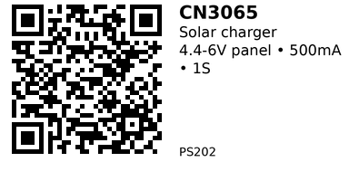

# CN3065 Solar Charger (1S) — PS202

**Type:** Solar‑oriented single‑cell charger  
**IC:** CN3065

# Summary / What it does

Compact Li‑ion/Li‑Po **solar** charger board built around the CN3065 charge‑management IC. Designed to be powered from a small solar panel and charge one cell, with LED status.

# Key specs (from listing)

- This is a supper mini Solar Lipo charger based on the CN3065 - a single lithium battery charge management chip.
- The output of the Solar Charger is intended to charge a single polymer lithium ion cell. The load should be connected in parallel with the battery. By default, the Solar charge comes set to a maximum charge current of 500mA with a maximum recommended input of 6V (minimum 4.4V). It's recommended that batteries not be charged at greater than their capacity rating.
- Solar panel input: 4.4-6V
- Max charge current: 500Ma
- Interface:  2-pin JST connectors(or PH2.0)
- Short circuit protection
- Continuous Charge Current Up to 500mA
- Battery status indication ( Red : Charging , Green: Charged )
- Micro-USB Connector

# How to use (from listing details)

- Connect a **small solar panel ~4.4–6 V** to the panel input.  
- Connect **one Li‑ion/Li‑Po cell** to the battery connector.  
- **Status LEDs:** Red = charging, Green = charged.  
- **Load connection:** Listing notes the load should be connected **in parallel with the battery**.  
- Includes **short‑circuit protection** (per listing).

# When to use

- Choose this board when charging from a **solar panel** (variable light/voltage).  
- If you have a **stable 5 V USB** source instead, prefer the **TP4056** USB charger.

## Links

- **Where to buy:** [AliExpress](https://www.aliexpress.com/w/wholesale-cn3065-solar-charger.html) (search results)

---

*QR for printing will appear here after you run the script:*

