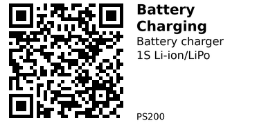

# Battery Charging - PS200

Single-cell (1S) lithium-ion and lithium-polymer battery chargers. Choose based on your power source: stable 5V USB or variable-voltage solar panel.

## Comparison

| Component | IC | Input Source | Input Voltage | Max Charge Current | Best For |
|-----------|----|--------------| --------------|-------------------|----------|
| [PS201](PS201.md) | TP4056 | USB (stable) | 5V (4.5-5.5V) | 1A (adjustable) | USB/wall adapter charging |
| [PS202](PS202.md) | CN3065 | Solar panel | 4.4-6V (variable) | 500mA | Direct solar panel charging |

## Selection Guide

**[PS201 - TP4056](PS201.md):** Choose when you have a stable 5V source (USB, wall adapter, or regulated power supply). Supports up to 1A charge current for faster charging.

**[PS202 - CN3065](PS202.md):** Choose when charging directly from a solar panel with fluctuating voltage/current. Handles variable input gracefully without external regulation.

## Common Applications

**USB power bank:** Use PS201 (TP4056) with USB input for building portable battery packs or charging stations.

**Solar-powered projects:** Use PS202 (CN3065) for outdoor sensors or off-grid devices powered by small 5-6V solar panels.

**ESP32 deep sleep projects:** Either module works, but PS201 supports faster charging (1A vs 500mA) if you have USB available during battery top-ups.

---

## Components in This Family

{{ children() }}

---

*QR for printing will appear here after you run the script:*

