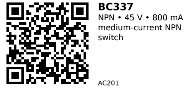

# BC337 - AC201

A small‑signal NPN transistor typically used as a medium‑current NPN switch / amplifier. It’s cheap, common, and easy to drive directly from an MCU pin through a base resistor.

## Links

- **Datasheet:** [BC337 datasheet](https://www.mouser.com/datasheet/2/149/BC337-193546.pdf)

## Specifications

- Type: NPN small‑signal BJT
- Package: TO-92
- V₍CEO₎ (collector–emitter voltage): ≈ 45 V
- I꜀ (max continuous collector current): ≈ 800 mA
- Typical application: medium‑current NPN switch / amplifier
- Package style is usually TO‑92; SMD and other variants exist for some manufacturers.

> **Pinout note** – Pinouts for these parts can vary slightly between manufacturers, especially for 2N/PN and A/C‑series parts.     For many TO‑92 versions, a very common orientation (flat face toward you, leads down) is **E – B – C (pins 1‑2‑3)**,     but always double‑check the datasheet for your exact device or confirm with a multimeter before committing to a PCB.

## When to use

Use **BC337** as a medium‑current NPN switch / amplifier when you want a cheap, general‑purpose NPN transistor and the ratings above     (V₍CEO₎ and I꜀) comfortably cover your load.     

If you need more current or voltage margin than this device provides, either move to a MOSFET module in the AC family or     pick a beefier BJT.

---

*QR for printing will appear here after you run the script:*

