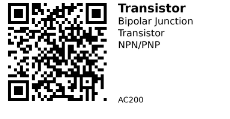

# Small‑signal BJTs – AC2xx family overview - AC200

This family groups together **common small‑signal BJTs** (both NPN and PNP) that you’re likely to reach for when you
need a simple transistor for switching or low‑power amplification. The idea is that you can land on this page, scan the
table, and then jump to the specific device page that best matches your required **voltage**, **current** and **role**.

## Components in This Family

{{ children() }}

## Quick comparison

| ID | Part | Polarity | Vceo (approx) | Ic max (approx) | Package | Typical role |
|----|------|----------|---------------|-----------------|---------|--------------|
| AC201 | BC337 | NPN | ~45 V | ~800 mA | TO-92 | medium‑current NPN switch / amplifier |
| AC202 | BC327 | PNP | ~45 V | ~800 mA | TO-92 | medium‑current PNP switch / amplifier |
| AC203 | 2N2222 | NPN | ~40 V | ~600 mA | TO-92 / TO-18 | robust NPN switch up to ~500–600 mA |
| AC204 | 2N2907 | PNP | ~40 V | ~600 mA | TO-92 / TO-18 | robust PNP switch up to ~500–600 mA |
| AC205 | 2N3904 | NPN | ~40 V | ~200 mA | TO-92 | low‑current fast NPN general‑purpose |
| AC206 | 2N3906 | PNP | ~40 V | ~200 mA | TO-92 | low‑current fast PNP general‑purpose |
| AC207 | S8050 | NPN | ~25 V | ~1.5 A | TO-92 | low‑voltage NPN up to ~1.5 A |
| AC208 | S8550 | PNP | ~25 V | ~1.5 A | TO-92 | low‑voltage PNP up to ~1.5 A |
| AC209 | A1015 | PNP | ~50 V | ~150 mA | TO-92 / SOT‑23 | audio PNP / small‑signal switch |
| AC210 | C1815 | NPN | ~50 V | ~150 mA | TO-92 / SOT‑23 | audio NPN / small‑signal switch |

## Selection Guide

**Low-current general purpose (≤200mA):** Use [AC205 - 2N3904](AC205.md) (NPN) or [AC206 - 2N3906](AC206.md) (PNP) for signal-level work, LED driving, or small loads.

**Medium-current switching (≤800mA):** Use [AC201 - BC337](AC201.md) (NPN) or [AC202 - BC327](AC202.md) (PNP) when you need more current in standard TO-92 package.

**High-current switching (≤1.5A):** Use [AC207 - S8050](AC207.md) (NPN) or [AC208 - S8550](AC208.md) (PNP) for higher current at lower voltage (25V max).

**Audio/small-signal:** Use [AC209 - A1015](AC209.md) (PNP) or [AC210 - C1815](AC210.md) (NPN) for audio amplification and small-signal applications.

**Robust general use:** Use [AC203 - 2N2222](AC203.md) (NPN) or [AC204 - 2N2907](AC204.md) (PNP) for reliable switching up to 600mA.

## Common Applications

**LED driving:** BC337/BC327 or 2N3904/2N3906 work great for switching LED strips or multiple LEDs from MCU pins.

**Relay/solenoid driving:** Use BC337 (NPN) for loads up to 800mA, or S8050 for higher current relays (up to 1.5A).

**Logic level shifting:** 2N3904/2N3906 pair makes simple bidirectional level shifters for 3.3V ↔ 5V conversion.

**Motor control:** S8050/S8550 can drive small DC motors directly, or use as pre-drivers for larger MOSFETs.

From here, jump into the individual part pages (AC201–AC210) for more detail on each device.

---

*QR for printing will appear here after you run the script:*

