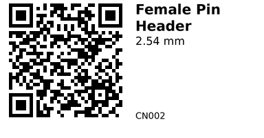

# Female Pin Header 2.54 mm - CN002

Generic 2.54 mm (0.1"") pin headers. Use as board‑to‑board jumpers, stacking connectors, or to break out modules on perfboard/PCBs. Cut to length.

## Links

- **Where to buy:** [AliExpress](https://www.aliexpress.com/item/1005003610333849.html)

## Gotchas

- 2.54 mm pitch only—ensure it matches your board.
- Count pins before cutting; finish edges flat for fit.
- Mind height: tall stacks can stress solder joints.

---

*QR for printing will appear here after you run the script:*

