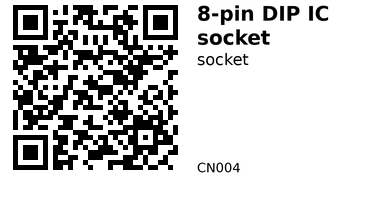

# 8-pin DIP IC socket - CN004

Simple through-hole socket for 8-pin DIP (dual in-line package) ICs.  
Use it whenever you want to be able to swap an 8-pin IC (op-amp, timer, small MCU, etc.) without resoldering, or to protect delicate IC legs from heat and mechanical stress.

Because this is just a mechanical connector, there is no electrical behaviour beyond passing each pin straight through.

## Links

- **Where to buy:** [AliExpress](https://www.aliexpress.com/item/1005006138697397.html)
- **Datasheet:** Not typically provided for simple IC sockets (mechanical connector only).

## Specifications

- 8-pin DIP socket (accepts standard 8-pin DIP ICs)
- 2.54 mm pin pitch (0.1")
- Standard 7.62 mm (300 mil) row spacing for DIP-8 IC packages
- Through-hole, solder-type legs for mounting on perfboard or PCBs
- Each pin is a straight one-to-one connection (no internal circuitry)

## Pinout & Addresses (common breakout labels)

Not applicable – this is a passive mechanical socket.  
Each socket position simply connects the IC leg on the top side to the corresponding pin on the bottom side.

## Wiring

- Solder the 8 pins into your PCB or perfboard where the DIP-8 IC would normally go.
- Route each pad/pin to your circuit as if the IC were soldered directly.
- When finished, insert the 8-pin IC into the socket, matching the notch or dot on the IC with the notch on the socket and silkscreen.

From the ESP32 (or any other MCU) point of view, there is no difference between an IC in a socket and one soldered directly.

## Gotchas

- **Orientation:** Always align the IC’s notch or dot with the socket’s notch and the PCB silkscreen to avoid reversed connections.
- **Mechanical stress:** Don’t lever the IC out using a single side – gently pry from both ends to avoid bending pins.
- **Soldering:** Avoid excessive soldering heat that could soften or deform the plastic body.

## How to use

No code example is needed – this is a purely mechanical connector.  
Just design your circuit for a normal 8-pin DIP IC footprint and place this socket there so you can plug/unplug the IC easily.

---

*QR for printing will appear here after you run the script:*

