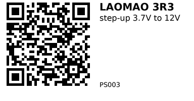

# DC Step Up Converter Modules, 3.7 to 12V — PS003

10pcs LAOMAO DC Step Up Converter Modules, 3.7 to 12V, Low Power Consumption - 
Versatile Voltage Regulator for Lithium Battery Boost, with 5V/8V/9V/12V Outputs, Ideal for Electronics Projects

# Description

* Input: 3.7V
* Output: 5V, 8V, 9V, 12V
* Current capacity: 1A (5V), 0.5A (8V), 0.45A (9V), 0.3A (12V)

**Link:** [Temu](https://www.temu.com/goods_snapshot.html?goods_id=601099535606569)

---

*QR for printing will appear here after you run the script:*

