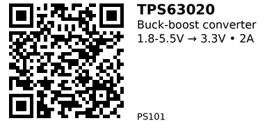

# TPS63020 3.3V Buck-Boost Module — PS101

**Topology:** Non-inverting buck-boost (single inductor)
**IC:** TI TPS63020

## Description

Buck-boost converter module based on the TI TPS63020 IC. Automatically steps voltage up or down to maintain a stable 3.3V/4.2V/5V output (selectable via jumper pads) from battery sources that fluctuate during discharge. Ideal for LiPo battery projects where input voltage varies from 4.2V (fully charged) down to 3.0V (depleted).

## Specifications

- **Input voltage:** 1.8-5.5V
- **Output voltage:** 3.3V / 4.2V / 5V (jumper-selectable)
- **Max output current:** ~1.3A @ 3.3V, ~1A @ 4.2V, ~0.9A @ 5V (with 3.7V input)
- **Switching frequency:** ~2.4MHz
- **Efficiency:** Up to 96%
- **Quiescent current:** ~25µA (IC), ≤50µA in power-save mode
- **Operating modes:** Normal / Power-save (jumper-selectable)
- **Module size:** 17.4 × 26.2mm

## Pinout

| Pin Name | Function |
|----------|----------|
| **VIN** | Power input positive (1.8-5.5V) |
| **GND** | Ground (common for input/output) |
| **VOUT** | Power output (3.3V / 4.2V / 5V) |
| **PS** | Short pad to enable Power Save Mode |
| **EN** | Enable pin (low = disabled) |
| **Voltage Jumper** | Short 3V3/4V2/5V pad to select output voltage |

## Usage Notes

- **Output current limits:** Do not exceed the current ratings in the table below, especially at lower input voltages
- **Power-save mode:** The onboard LED increases quiescent current; remove it if ultra-low sleep current is needed
- **Custom voltages:** Advanced users can adjust output voltage by disconnecting jumper pads and soldering 0603 resistors at ADJ position: `R1 + R2 = 180kΩ × (VOUT × 0.5 - 1)`

## Current Limits by Input Voltage

| Input Voltage | Output Voltage | Max Output Current |
|--------------|----------------|--------------------|
| 2 V          | 3.3 V          | 600 mA             |
| 3 V          | 3.3 V          | 1000 mA            |
| 3.7 V        | 3.3 V          | 1300 mA            |
| 5 V          | 3.3 V          | 1500 mA            |
| 2 V          | 4.2 V          | 400 mA             |
| 3 V          | 4.2 V          | 800 mA             |
| 3.7 V        | 4.2 V          | 1000 mA            |
| 5 V          | 4.2 V          | 1300 mA            |
| 2 V          | 5 V            | 400 mA             |
| 3 V          | 5 V            | 700 mA             |
| 3.7 V        | 5 V            | 900 mA             |
| 5 V          | 5 V            | 1200 mA            |

**Note:** Real continuous current on small modules is typically ~1-2A without extra cooling. Advertised "3A" ratings are peak/marketing values.

## Links

- **Where to buy:** [AliExpress](https://www.aliexpress.com/item/1005008099216597.html)

---

*QR for printing will appear here after you run the script:*

