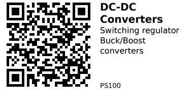

# DC-DC Converters - PS100

Switching voltage regulators for efficient power conversion. Choose buck (step-down), boost (step-up), or buck-boost (both) based on your input and output voltage requirements.

## Comparison

| Component | Topology | Input Range | Output | Max Current | Efficiency | Best For |
|-----------|----------|-------------|--------|-------------|------------|----------|
| [PS101](PS101.md) | Buck-Boost | 1.8-5.5V | 3.3V fixed | 2A | ~96% | Battery-powered 3.3V systems |
| [PS102](PS102.md) | Buck | 5-30V | 5V fixed | 3A | 96% | High-voltage to 5V conversion |
| [PS103](PS103.md) | Boost | 3.7V | 5-12V adj. | 0.3-1A | — | Single LiPo to higher voltages |

## Selection Guide

**[PS101 - TPS63020](PS101.md):** Choose when your input voltage can be higher or lower than 3.3V (e.g., LiPo battery 3.0-4.2V). Handles voltage fluctuations automatically.

**[PS102 - 5V Buck](PS102.md):** Choose when stepping down from 7-30V to fixed 5V with higher current needs (up to 3A). Ideal for automotive or 12V power supplies.

**[PS103 - Boost Converter](PS103.md):** Choose when you need to step up from a single LiPo (3.7V) to 5V, 9V, or 12V. Lower current capacity (300mA-1A depending on output).

## Common Applications

**LiPo battery to 3.3V:** Use PS101 (buck-boost) to maintain stable 3.3V throughout entire battery discharge (4.2V down to 3.0V).

**12V to 5V conversion:** Use PS102 (buck) when powering 5V devices from 12V automotive or wall adapter supplies.

**Single cell to USB 5V:** Use PS103 (boost) to create USB 5V power from a single 3.7V LiPo battery for charging or powering USB devices.

---

## Components in This Family

{{ children() }}

---

*QR for printing will appear here after you run the script:*

