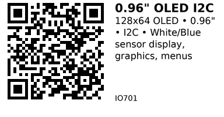

# 0.96" OLED Display I2C (SSD1306) - IO701

Small monochrome OLED display with 128x64 resolution. Features I2C interface and SSD1306 controller. Perfect for compact projects where space is limited. Commonly available in white or blue colors.

## Key Specifications

| Parameter | Value |
|-----------|-------|
| **Resolution** | 128 × 64 pixels |
| **Screen size** | 0.96 inch (diagonal) |
| **Active area** | 21.74 × 10.86 mm |
| **Color** | White or Blue (monochrome) |
| **Controller** | SSD1306 |
| **Interface** | I2C (default 0x3C or 0x3D) |
| **Supply voltage** | 3.3V - 5V |
| **Current** | 20mA (all pixels on) |
| **Viewing angle** | >160° |

## Pinout

```
0.96" OLED Module (I2C)
   ________
  |        |
  | OLED   |
  |________|
   | | | |
   G V S S
   N C D C
   D C A L

GND = Ground
VCC = Power (3.3V or 5V)
SDA = I2C Data
SCL = I2C Clock
```

## Typical Wiring (ESP32)

```
ESP32           OLED
-----           ----
3.3V   -------> VCC
GND    -------> GND
GPIO21 -------> SDA
GPIO22 -------> SCL
```

## Example Code (ESP32)

```cpp
// ESP32 + SSD1306 OLED
// Install: Adafruit SSD1306 + Adafruit GFX Library
#include <Wire.h>
#include <Adafruit_GFX.h>
#include <Adafruit_SSD1306.h>

#define SCREEN_WIDTH 128
#define SCREEN_HEIGHT 64
#define OLED_RESET -1  // No reset pin
#define SCREEN_ADDRESS 0x3C

Adafruit_SSD1306 display(SCREEN_WIDTH, SCREEN_HEIGHT, &Wire, OLED_RESET);

void setup() {
  Serial.begin(115200);

  if (!display.begin(SSD1306_SWITCHCAPVCC, SCREEN_ADDRESS)) {
    Serial.println("SSD1306 not found!");
    while (1) delay(10);
  }

  display.clearDisplay();
  display.setTextSize(1);
  display.setTextColor(SSD1306_WHITE);
  display.setCursor(0, 0);
  display.println("Hello, World!");
  display.display();
}

void loop() {
  // Update display as needed
}
```

## Draw Text

```cpp
display.clearDisplay();
display.setTextSize(2);              // 2x size
display.setTextColor(SSD1306_WHITE);
display.setCursor(10, 10);
display.println("Temp:");
display.print(temperature);
display.print(" C");
display.display();
```

## Draw Shapes

```cpp
display.clearDisplay();
display.drawCircle(64, 32, 20, SSD1306_WHITE);  // Circle
display.drawRect(10, 10, 40, 20, SSD1306_WHITE); // Rectangle
display.drawLine(0, 0, 127, 63, SSD1306_WHITE);  // Line
display.display();
```

## Sensor Dashboard

```cpp
void loop() {
  float temp = 25.3;
  int humidity = 65;

  display.clearDisplay();
  display.setTextSize(1);
  display.setCursor(0, 0);
  display.println("Environment Monitor");
  display.println();
  display.print("Temp: ");
  display.print(temp);
  display.println(" C");
  display.print("Humidity: ");
  display.print(humidity);
  display.println(" %");
  display.display();

  delay(2000);
}
```

## Key Features

- **High contrast:** OLED pixels emit light (no backlight)
- **Low power:** Only lit pixels consume power
- **Wide viewing angle:** >160°
- **Fast refresh:** No ghosting, instant updates

## Gotchas

1. **I2C address:** Usually 0x3C, sometimes 0x3D (run I2C scanner)
2. **Burn-in:** Static images cause pixel degradation (use timers)
3. **Limited lifespan:** ~10,000 hours continuous use
4. **Small size:** 0.96" is tiny! Hard to read from distance
5. **Clone controllers:** Some use SH1106 instead of SSD1306 (different init)

---


