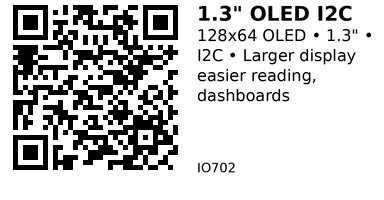

# 1.3" OLED Display I2C (SH1106) - IO702

Larger 1.3-inch OLED display with 128x64 resolution. Uses SH1106 controller (similar to SSD1306). Easier to read than 0.96" version due to larger physical size.

## Key Specifications

| Parameter | Value |
|-----------|-------|
| **Resolution** | 128 × 64 pixels |
| **Screen size** | 1.3 inch (diagonal) |
| **Active area** | ~26 × 13 mm |
| **Color** | White or Blue (monochrome) |
| **Controller** | SH1106 (some use SSD1306) |
| **Interface** | I2C (0x3C default) |
| **Supply voltage** | 3.3V - 5V |
| **Current** | ~25mA |

## Pinout

```
1.3" OLED Module (I2C)
   __________
  |          |
  |   OLED   |
  |__________|
   | | | |
   G V S S
   N C D C
   D C A L

GND = Ground
VCC = Power (3.3V or 5V)
SDA = I2C Data
SCL = I2C Clock
```

## Typical Wiring (ESP32)

```
ESP32           OLED 1.3"
-----           ---------
3.3V   -------> VCC
GND    -------> GND
GPIO21 -------> SDA
GPIO22 -------> SCL
```

## Example Code (ESP32)

```cpp
// ESP32 + SH1106 OLED (1.3")
// Install: Adafruit SH110X library
#include <Wire.h>
#include <Adafruit_GFX.h>
#include <Adafruit_SH110X.h>

#define SCREEN_WIDTH 128
#define SCREEN_HEIGHT 64
#define OLED_RESET -1

Adafruit_SH1106G display(SCREEN_WIDTH, SCREEN_HEIGHT, &Wire, OLED_RESET);

void setup() {
  Serial.begin(115200);

  if (!display.begin(0x3C)) {
    Serial.println("SH1106 not found!");
    while (1) delay(10);
  }

  display.clearDisplay();
  display.setTextSize(2);
  display.setTextColor(SH110X_WHITE);
  display.setCursor(10, 20);
  display.println("1.3 inch");
  display.println("OLED");
  display.display();
}
```

## Alternative: Using SSD1306 Library

Some 1.3" displays have SSD1306 controller:

```cpp
// If SH110X library doesn't work, try SSD1306
#include <Adafruit_SSD1306.h>

Adafruit_SSD1306 display(SCREEN_WIDTH, SCREEN_HEIGHT, &Wire, OLED_RESET);

void setup() {
  display.begin(SSD1306_SWITCHCAPVCC, 0x3C);
  // ... rest of code same as SSD1306
}
```

## Key Features

- **Larger size:** 35% bigger than 0.96" display
- **Same resolution:** 128×64 pixels (lower pixel density)
- **Easier reading:** Bigger characters, better for dashboards
- **Same interface:** Drop-in replacement for 0.96" code

## SH1106 vs SSD1306

**SH1106:**
- 132×64 internal resolution (only 128×64 visible)
- Slightly different command set
- Use Adafruit_SH110X library

**SSD1306:**
- 128×64 resolution
- More common controller
- Use Adafruit_SSD1306 library

**Note:** Many 1.3" displays labeled "SSD1306" actually use SH1106! Check if library doesn't work.

## Gotchas

1. **Controller confusion:** Check if SH1106 or SSD1306 (try both libraries)
2. **Same resolution:** Pixels are bigger, not more pixels
3. **More power:** Slightly higher current than 0.96" version
4. **Still small:** 1.3" still compact (not huge)

---


