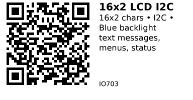

# 16x2 Character LCD with I2C Backpack - IO703

Classic 16-character by 2-line LCD display with I2C interface adapter. Features blue backlight and adjustable contrast. Perfect for displaying text messages, sensor readings, and simple menus.

## Key Specifications

| Parameter | Value |
|-----------|-------|
| **Display type** | Character LCD (not graphic) |
| **Characters** | 16 columns × 2 rows |
| **Character size** | 5×8 dots per character |
| **Display size** | 80mm × 36mm |
| **Controller** | HD44780-compatible |
| **I2C adapter** | PCF8574 (address 0x27 or 0x3F) |
| **Backlight** | Blue LED (always on) |
| **Supply voltage** | 5V (module), 2.7-5.5V (I2C chip) |
| **Current** | ~120mA (backlight on), ~20mA (backlight off) |

## Pinout

```
16x2 LCD with I2C Backpack
   ________________
  |                |
  | 16x2 LCD       |
  |________________|
   [POT] [I2C PCB]

   | | | |
   G V S S
   N C D C
   D C A L

GND = Ground
VCC = Power (5V recommended)
SDA = I2C Data
SCL = I2C Clock

POT = Contrast adjustment (back of module)
```

## Typical Wiring (ESP32)

```
ESP32           LCD I2C
-----           -------
5V     -------> VCC (or 3.3V works for most)
GND    -------> GND
GPIO21 -------> SDA
GPIO22 -------> SCL
```

## Example Code (ESP32)

```cpp
// ESP32 + 16x2 LCD I2C
// Install: LiquidCrystal I2C library by Frank de Brabander
#include <Wire.h>
#include <LiquidCrystal_I2C.h>

// Set address (0x27 or 0x3F), columns, rows
LiquidCrystal_I2C lcd(0x27, 16, 2);

void setup() {
  lcd.init();           // Initialize LCD
  lcd.backlight();      // Turn on backlight

  lcd.setCursor(0, 0);  // Column 0, Row 0
  lcd.print("Hello, World!");

  lcd.setCursor(0, 1);  // Column 0, Row 1
  lcd.print("ESP32 + LCD");
}

void loop() {
  // Update display as needed
}
```

## Sensor Display

```cpp
void loop() {
  float temperature = 25.3;
  int humidity = 65;

  lcd.clear();
  lcd.setCursor(0, 0);
  lcd.print("Temp: ");
  lcd.print(temperature);
  lcd.print(" C");

  lcd.setCursor(0, 1);
  lcd.print("Humidity: ");
  lcd.print(humidity);
  lcd.print("%");

  delay(2000);
}
```

## Scrolling Text

```cpp
void loop() {
  String message = "This is a long message that scrolls...";

  for (int pos = 0; pos < message.length(); pos++) {
    lcd.clear();
    lcd.setCursor(0, 0);
    lcd.print(message.substring(pos, pos + 16));
    delay(300);
  }
}
```

## Custom Characters

```cpp
// Define custom character (heart symbol)
byte heart[8] = {
  0b00000,
  0b01010,
  0b11111,
  0b11111,
  0b01110,
  0b00100,
  0b00000,
  0b00000
};

void setup() {
  lcd.init();
  lcd.backlight();

  lcd.createChar(0, heart);  // Store as character 0

  lcd.setCursor(0, 0);
  lcd.write(0);  // Display custom character
  lcd.print(" ESP32");
}
```

## Find I2C Address

If display doesn't work, find address:

```cpp
#include <Wire.h>

void setup() {
  Serial.begin(115200);
  Wire.begin();

  Serial.println("Scanning I2C...");
  for (byte addr = 1; addr < 127; addr++) {
    Wire.beginTransmission(addr);
    if (Wire.endTransmission() == 0) {
      Serial.printf("Found device at 0x%02X\n", addr);
    }
  }
}
```

Common addresses: 0x27, 0x3F, 0x20

## Contrast Adjustment

**Blue potentiometer on back of I2C module:**
- Turn clockwise/counter-clockwise
- Adjusts contrast (darkness of characters)
- If no characters visible, adjust contrast

## Key Features

- **Large characters:** Easy to read from distance
- **Backlight:** Blue LED backlight included
- **I2C interface:** Only 2 wires (vs 16-pin parallel)
- **Character set:** Alphanumeric + symbols + custom chars

## Gotchas

1. **5V recommended:** Works on 3.3V but backlight dimmer
2. **I2C address varies:** 0x27 or 0x3F (run scanner if unsure)
3. **No graphics:** Can't draw pixels (only predefined characters)
4. **Contrast adjustment:** Must adjust pot on back for visibility
5. **High current:** Backlight uses ~100mA (significant for battery projects)
6. **Slow refresh:** Character LCDs are slower than OLED

## 16x2 vs OLED

| Feature | LCD 16x2 (IO703) | OLED 0.96" (IO701) |
|---------|------------------|--------------------|
| **Type** | Character | Graphic (pixel) |
| **Resolution** | 16×2 chars | 128×64 pixels |
| **Graphics** | No (text only) | Yes |
| **Power** | ~120mA | ~20mA |
| **Visibility** | Good in daylight | Excellent |
| **Price** | $2-3 | $2-4 |

**Use LCD when:**
- Only text needed
- Larger characters desired
- Daylight readability important

**Use OLED when:**
- Graphics/icons needed
- Lower power critical
- Compact size preferred

## Links

- **AliExpress**: Search "16x2 LCD I2C" (~$2-3)

---


