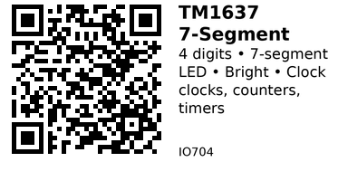

# TM1637 4-Digit 7-Segment Display - IO704

Bright 4-digit 7-segment LED display with TM1637 driver chip. Features adjustable brightness and simple 2-wire interface. Perfect for clocks, counters, timers, and numeric displays.

## Key Specifications

| Parameter | Value |
|-----------|-------|
| **Display type** | 7-segment LED (common anode) |
| **Digits** | 4 |
| **Digit height** | 0.36 inch (~9mm) |
| **Module size** | 30mm × 14mm (typical) |
| **Controller** | TM1637 |
| **Interface** | 2-wire serial (CLK + DIO) |
| **Supply voltage** | 3.3V - 5V |
| **Brightness** | 8 levels (adjustable) |
| **Current** | ~80mA (all segments on, max brightness) |
| **Color** | Red (most common), also white, green, blue |

## Pinout

```
TM1637 4-Digit Display
   ________
  | 8.8:8.8 |  7-segment LEDs
  |_________|
   | | | |
   C D V G
   L I C N
   K O C D

CLK = Clock (serial clock)
DIO = Data I/O (bidirectional data)
VCC = Power (3.3V or 5V)
GND = Ground
```

## Typical Wiring (ESP32)

```
ESP32           TM1637
-----           ------
3.3V   -------> VCC (or 5V for brighter)
GND    -------> GND
GPIO25 -------> CLK
GPIO26 -------> DIO
```

## Example Code (ESP32)

```cpp
// ESP32 + TM1637
// Install: TM1637Display library by Avishay Orpaz
#include <TM1637Display.h>

#define CLK_PIN 25
#define DIO_PIN 26

TM1637Display display(CLK_PIN, DIO_PIN);

void setup() {
  display.setBrightness(0x0a);  // 0x00 (dim) to 0x0f (bright)
}

void loop() {
  // Display number 1234
  display.showNumberDec(1234);
  delay(2000);

  // Display number with leading zeros: 0042
  display.showNumberDecEx(42, 0, true);  // true = show leading zeros
  delay(2000);
}
```

## Digital Clock

```cpp
void loop() {
  // Get time (hours and minutes)
  int hours = 14;    // 2 PM
  int minutes = 30;

  int displayValue = hours * 100 + minutes;  // 1430

  // Show with colon blinking
  display.showNumberDecEx(displayValue, 0b01000000, true);  // Colon on
  delay(500);
  display.showNumberDecEx(displayValue, 0, true);           // Colon off
  delay(500);
}
```

## Counter

```cpp
void loop() {
  for (int count = 0; count <= 9999; count++) {
    display.showNumberDec(count);
    delay(100);
  }
}
```

## Temperature Display

```cpp
void loop() {
  float temperature = 25.3;

  // Display "25.3" with decimal point
  display.showNumberDecEx((int)(temperature * 10), 0b00100000, false);
  // 0b00100000 = turn on decimal point after 2nd digit

  delay(1000);
}
```

## Custom Segments

```cpp
void loop() {
  // Display "HELP"
  uint8_t data[] = {
    0b01110110,  // H
    0b01111001,  // E
    0b00111000,  // L
    0b01110011   // P
  };

  display.setSegments(data);
  delay(2000);

  // Display "----" (all dashes)
  uint8_t dashes[] = {0b01000000, 0b01000000, 0b01000000, 0b01000000};
  display.setSegments(dashes);
  delay(2000);
}
```

## Brightness Control

```cpp
void setup() {
  // Set brightness (0x00 to 0x0f)
  display.setBrightness(0x05);  // Medium brightness
}

void loop() {
  // Fade in
  for (int brightness = 0; brightness <= 15; brightness++) {
    display.setBrightness(brightness);
    display.showNumberDec(8888);
    delay(100);
  }

  // Fade out
  for (int brightness = 15; brightness >= 0; brightness--) {
    display.setBrightness(brightness);
    display.showNumberDec(8888);
    delay(100);
  }
}
```

## Scrolling Number

```cpp
void loop() {
  long number = 123456789;

  // Scroll through digits
  for (int pos = 0; pos < 6; pos++) {
    int displayNum = (number / (long)pow(10, pos)) % 10000;
    display.showNumberDec(displayNum);
    delay(500);
  }
}
```

## 7-Segment Encoding

Each segment controlled by bit:

```
    A
   ---
F |   | B
   -G-
E |   | C
   ---
    D

Segments: (DP) G F E D C B A
Example:  0b01110111 = "8" (all segments on)
```

**Common characters:**
- 0-9: Built-in support
- A-F: Hexadecimal digits
- Limited letters: H, E, L, P, etc.
- Symbols: "-", "_", degree symbol

## Key Features

- **Very bright:** Easy to read from distance
- **Simple interface:** Only 2 wires (not standard I2C)
- **Low pin count:** Doesn't require many GPIO pins
- **Adjustable brightness:** 8 levels + off
- **Colon separator:** Built-in colon for clock display

## Gotchas

1. **Not I2C:** Uses custom 2-wire protocol (not standard I2C bus)
2. **Limited characters:** Only numbers, some letters, basic symbols
3. **4 digits only:** Can't expand (unlike I2C OLED which can multiplex)
4. **Common anode:** Can't control individual segments directly (driver IC handles it)
5. **High current:** Bright LEDs use more power than LCD/OLED
6. **No graphics:** Only 7-segment characters

## TM1637 vs LCD/OLED

| Feature | TM1637 (IO704) | LCD 16x2 (IO703) | OLED (IO701) |
|---------|----------------|------------------|--------------|
| **Characters** | 4 digits | 32 chars (16×2) | 128×64 pixels |
| **Brightness** | Very bright | Medium | Medium |
| **Content** | Numbers only | Text | Graphics + text |
| **Distance reading** | Excellent | Good | Poor (small) |
| **Power** | ~80mA | ~120mA | ~20mA |

**Use TM1637 when:**
- Only numbers needed
- Very bright display required
- Reading from distance
- Clock/counter/timer application

**Use LCD/OLED when:**
- Text messages needed
- More information to display
- Graphics required

## Applications

**Digital clock:** Time display with blinking colon.

**Countdown timer:** Kitchen timer, stopwatch.

**Counter:** People counter, event counter, score display.

**Temperature display:** Thermostat, weather station.

**Tachometer:** RPM display for motors.

**Voltage/current meter:** Power supply readout.

---


