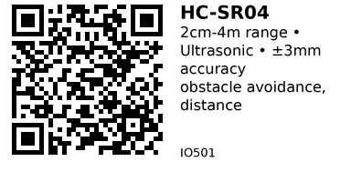

# HC-SR04 Ultrasonic Distance Sensor - IO501

Popular ultrasonic distance sensor using sonar principle. Measures distance from 2cm to 4 meters with ±3mm accuracy. Perfect for obstacle avoidance robots, parking sensors, and level monitoring.

## Key Specifications

| Parameter | Value |
|-----------|-------|
| **Technology** | Ultrasonic (40 kHz) |
| **Measurement range** | 2cm to 400cm (4 meters) |
| **Accuracy** | ±3mm |
| **Measuring angle** | ~15° cone |
| **Supply voltage** | 5V DC |
| **Current** | 15mA (operating), <2mA (standby) |
| **Trigger pulse** | 10μs minimum (HIGH) |
| **Echo pulse** | 150μs to 25ms (proportional to distance) |
| **Operating temp** | -15°C to +70°C |

## How It Works

**Sonar principle:**
1. Send 10μs HIGH pulse to TRIG pin
2. Module sends eight 40 kHz ultrasonic pulses
3. Wait for echo to bounce back
4. ECHO pin goes HIGH for duration proportional to distance
5. Measure ECHO pulse width
6. Calculate: Distance (cm) = pulse_duration (μs) / 58

**Formula:**
```
Distance = (Echo_Time × Speed_of_Sound) / 2
         = (Echo_Time_μs × 0.0343cm/μs) / 2
         = Echo_Time_μs / 58.3
```

Divide by 2 because sound travels to object and back (round trip).

## Pinout

```
HC-SR04
   ___________
  |  T  R  T  |  Ultrasonic transducers
  |___________| (T = transmitter, R = receiver)
   | | | |
   V T E G
   C R C N
   C I H D
     G O

VCC  = Power (5V)
TRIG = Trigger input (send 10μs pulse)
ECHO = Echo output (pulse width = distance)
GND  = Ground
```

## Typical Wiring (ESP32)

```
ESP32           HC-SR04
-----           -------
5V     -------> VCC
GND    -------> GND
GPIO25 -------> TRIG
GPIO26 -------> ECHO
```

**Note:** ECHO outputs 5V! ESP32 is 3.3V tolerant on most GPIO pins, but consider voltage divider for safety:

```
ECHO ---[1kΩ]--- GPIO26
              |
            [2kΩ]
              |
             GND

Output voltage = 5V × (2kΩ / 3kΩ) = 3.3V
```

## Example Code (ESP32)

```cpp
// ESP32 + HC-SR04 Ultrasonic Sensor
#define TRIG_PIN 25
#define ECHO_PIN 26

void setup() {
  Serial.begin(115200);
  pinMode(TRIG_PIN, OUTPUT);
  pinMode(ECHO_PIN, INPUT);
}

long getDistance() {
  // Send 10μs trigger pulse
  digitalWrite(TRIG_PIN, LOW);
  delayMicroseconds(2);
  digitalWrite(TRIG_PIN, HIGH);
  delayMicroseconds(10);
  digitalWrite(TRIG_PIN, LOW);

  // Measure echo pulse width (timeout after 30ms = ~5m)
  long duration = pulseIn(ECHO_PIN, HIGH, 30000);

  // Calculate distance in cm
  long distance = duration / 58;

  return distance;
}

void loop() {
  long dist = getDistance();

  if (dist > 0 && dist < 400) {
    Serial.printf("Distance: %ld cm\n", dist);
  } else {
    Serial.println("Out of range");
  }

  delay(500);
}
```

## Improved Version with Averaging

Reduce noise with multiple readings:

```cpp
long getDistanceAvg() {
  const int samples = 5;
  long sum = 0;
  int validCount = 0;

  for (int i = 0; i < samples; i++) {
    long dist = getDistance();
    if (dist > 0 && dist < 400) {
      sum += dist;
      validCount++;
    }
    delay(50);
  }

  return (validCount > 0) ? (sum / validCount) : 0;
}

void loop() {
  long dist = getDistanceAvg();
  Serial.printf("Distance: %ld cm (averaged)\n", dist);
  delay(1000);
}
```

## Obstacle Avoidance (Robot)

```cpp
#define TRIG_PIN 25
#define ECHO_PIN 26
#define MOTOR_LEFT 27
#define MOTOR_RIGHT 14

void loop() {
  long dist = getDistance();

  if (dist < 20) {  // Obstacle within 20cm
    Serial.println("OBSTACLE! Stopping...");
    digitalWrite(MOTOR_LEFT, LOW);
    digitalWrite(MOTOR_RIGHT, LOW);
    delay(500);

    // Back up and turn
    // ... (add reverse and turn logic)
  } else {
    // Move forward
    digitalWrite(MOTOR_LEFT, HIGH);
    digitalWrite(MOTOR_RIGHT, HIGH);
  }

  delay(100);
}
```

## Water Level Monitoring

```cpp
void loop() {
  long dist = getDistance();

  // Sensor mounted at top of tank
  // Distance 0 = full, distance 100cm = empty
  int tankHeight = 100;  // cm
  int waterLevel = tankHeight - dist;
  int levelPercent = (waterLevel * 100) / tankHeight;

  Serial.printf("Water level: %d cm (%d%%)\n", waterLevel, levelPercent);

  if (levelPercent < 20) {
    Serial.println("WARNING: Tank almost empty!");
  }

  delay(5000);
}
```

## Parking Sensor

```cpp
#define BUZZER_PIN 27

void loop() {
  long dist = getDistance();

  if (dist < 10) {
    // Very close - solid beep
    digitalWrite(BUZZER_PIN, HIGH);
  } else if (dist < 30) {
    // Close - fast beeping
    digitalWrite(BUZZER_PIN, HIGH);
    delay(100);
    digitalWrite(BUZZER_PIN, LOW);
    delay(100);
  } else if (dist < 50) {
    // Medium - slow beeping
    digitalWrite(BUZZER_PIN, HIGH);
    delay(100);
    digitalWrite(BUZZER_PIN, LOW);
    delay(500);
  } else {
    // Far - no beep
    digitalWrite(BUZZER_PIN, LOW);
  }

  delay(50);
}
```

## Temperature Compensation

Speed of sound varies with temperature:

```cpp
float getDistanceWithTemp(float tempC) {
  // Send trigger pulse
  digitalWrite(TRIG_PIN, LOW);
  delayMicroseconds(2);
  digitalWrite(TRIG_PIN, HIGH);
  delayMicroseconds(10);
  digitalWrite(TRIG_PIN, LOW);

  long duration = pulseIn(ECHO_PIN, HIGH, 30000);

  // Speed of sound at given temperature
  // v = 331.3 + (0.606 × T) m/s
  float speedOfSound = 331.3 + (0.606 * tempC);  // m/s
  float distance = (duration * speedOfSound) / 20000.0;  // cm

  return distance;
}
```

## Key Features

**Simple interface:**
- Just 2 control pins (TRIG, ECHO)
- No I2C/SPI complexity
- Direct GPIO connection

**Good range:**
- 2cm to 4m
- Suitable for most applications
- Medium-range obstacle detection

**Affordable:**
- Very cheap (~$1-2)
- Widely available
- Good value for range/accuracy

**Non-contact:**
- Works through air
- No physical contact needed
- Safe for moving robots

## Gotchas

1. **5V power required:** Won't work reliably on 3.3V
2. **ECHO is 5V:** May damage 3.3V MCU (use voltage divider)
3. **Minimum distance:** Can't measure <2cm (too close)
4. **Soft surfaces:** Foam, fabric absorb sound (poor echo)
5. **Angled surfaces:** Deflect sound away (no echo)
6. **Narrow objects:** Thin wires, poles may not reflect enough
7. **Temperature:** Speed of sound changes with temperature
8. **Crosstalk:** Multiple sensors can interfere (time-multiplex readings)

## HC-SR04 vs HC-SR04+

**HC-SR04+ (newer version):**
- Works on 3.3V or 5V power
- ECHO output 3.3V (safer for ESP32)
- Otherwise identical to HC-SR04

If you have HC-SR04+, can connect directly without voltage divider!

## Comparison with Laser ToF

| Feature | HC-SR04 (IO501) | VL53L0X (IO502) |
|---------|-----------------|-----------------|
| **Technology** | Ultrasonic | Laser ToF |
| **Range** | 2cm - 4m | 3cm - 2m |
| **Accuracy** | ±3mm | ±3% |
| **Speed** | ~30-50ms | <30ms |
| **Outdoor** | Good (not affected by light) | Poor (sunlight interference) |
| **Soft surfaces** | Poor (absorbs sound) | Good |
| **Price** | $1-2 | $4-6 |

**Use HC-SR04 when:**
- Outdoor use
- Long range needed (>2m)
- Budget constrained
- Simplicity preferred

**Use VL53L0X when:**
- Indoor precision needed
- Fast measurement required
- Soft/dark surfaces
- I2C interface preferred

## Applications

**Obstacle avoidance:** Robots, autonomous vehicles, drones.

**Parking sensor:** Reverse parking assistance.

**Level monitoring:** Water tanks, grain silos, bins.

**People counting:** Detect entry/exit through doorways.

**Automatic door:** Trigger door opening on approach.

**Security:** Perimeter detection, intrusion alarm.

## Troubleshooting

**Returns 0 or no reading:**
- Check wiring (TRIG/ECHO swapped?)
- Verify 5V power (not 3.3V)
- Object too close (<2cm) or too far (>4m)
- Object not reflecting sound (soft/angled surface)

**Erratic readings:**
- Electrical noise (separate sensor power from motors)
- Multiple sensors interfering (time-multiplex)
- Temperature changing rapidly
- Add averaging

**Always same reading:**
- ECHO pin not connected
- Sensor damaged/dead
- Test with known distance (30cm flat surface)

## Links

- **AliExpress**: Search "HC-SR04 ultrasonic sensor" (~$1-2)

---


