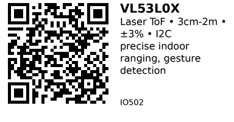

# VL53L0X Time-of-Flight Laser Distance Sensor - IO502

Precise laser distance sensor using Time-of-Flight (ToF) measurement. Measures distance from 30mm to 2 meters with ±3% accuracy. Features I2C interface and narrow beam angle for precise targeting. Perfect for gesture recognition, indoor navigation, and bin level monitoring.

## Key Specifications

| Parameter | Value |
|-----------|-------|
| **Technology** | Laser Time-of-Flight (infrared) |
| **Measurement range** | 30mm to 2000mm (2 meters) |
| **Accuracy** | ±3% (up to 1m), ±10% (1-2m) |
| **Field of View** | 25° |
| **Supply voltage** | 2.6V - 3.5V (module: 3.3V - 5V) |
| **Interface** | I2C (up to 400 kHz) |
| **I2C address** | 0x29 (default, programmable) |
| **Measurement time** | 20ms to 200ms (configurable) |
| **Operating temp** | -20°C to +70°C |
| **Current** | 19mA (ranging), 5μA (standby) |

## How It Works

**Time-of-Flight principle:**
1. Emit short infrared laser pulse (940nm)
2. Pulse reflects off target object
3. SPAD (Single Photon Avalanche Diode) detects return
4. Measure time between emission and detection
5. Calculate distance: Distance = (Time × Speed_of_Light) / 2

**Advantages over ultrasonic:**
- Much faster measurement (<30ms)
- Not affected by surface texture/color (mostly)
- Narrow beam (more precise targeting)
- Works through air gaps, transparent materials

## Pinout (GY-VL53L0XV2 Module)

```
GY-VL53L0XV2 Module
    ___
   |   |
   | V |
   | L |
   | 5 |
   | 3 |
   |___|
   | | | | | |
   V G S S X G
   C N D C D P
   C D A L O I
           T O

VCC  = Power (3.3V or 5V, module has regulator)
GND  = Ground
SDA  = I2C Data
SCL  = I2C Clock
XSDT = Shutdown (optional, active LOW)
GPIO = Interrupt output (optional)
```

**Common module:** Most modules only break out VCC, GND, SDA, SCL.

## Typical Wiring (ESP32)

```
ESP32           VL53L0X
-----           -------
3.3V   -------> VCC
GND    -------> GND
GPIO21 -------> SDA
GPIO22 -------> SCL
```

**Pull-ups:** Module has built-in pull-up resistors.

## Example Code (ESP32)

```cpp
// ESP32 + VL53L0X
// Install: Adafruit VL53L0X library
#include <Wire.h>
#include <Adafruit_VL53L0X.h>

Adafruit_VL53L0X lox = Adafruit_VL53L0X();

void setup() {
  Serial.begin(115200);
  Wire.begin();

  if (!lox.begin()) {
    Serial.println("VL53L0X not found!");
    while (1) delay(10);
  }

  Serial.println("VL53L0X initialized");
}

void loop() {
  VL53L0X_RangingMeasurementData_t measure;

  lox.rangingTest(&measure, false);

  if (measure.RangeStatus != 4) {  // 4 = out of range
    Serial.printf("Distance: %d mm\n", measure.RangeMilliMeter);
  } else {
    Serial.println("Out of range");
  }

  delay(100);
}
```

## Measurement Modes

VL53L0X has different ranging profiles:

```cpp
void setup() {
  // ... (init code)

  // Default mode (good accuracy, ~30ms)
  lox.configSensor(Adafruit_VL53L0X::VL53L0X_SENSE_DEFAULT);

  // High accuracy mode (slower, ~200ms)
  lox.configSensor(Adafruit_VL53L0X::VL53L0X_SENSE_HIGH_ACCURACY);

  // Long range mode (up to 2m, lower accuracy)
  lox.configSensor(Adafruit_VL53L0X::VL53L0X_SENSE_LONG_RANGE);

  // High speed mode (fast, ~20ms, less accurate)
  lox.configSensor(Adafruit_VL53L0X::VL53L0X_SENSE_HIGH_SPEED);
}
```

## Continuous Measurement

For faster updates:

```cpp
void setup() {
  // ... (init code)

  // Start continuous ranging
  lox.startRangeContinuous();
}

void loop() {
  if (lox.isRangeComplete()) {
    VL53L0X_RangingMeasurementData_t measure;
    lox.rangingTest(&measure, false);

    if (measure.RangeStatus != 4) {
      Serial.printf("Distance: %d mm\n", measure.RangeMilliMeter);
    }
  }

  // Do other tasks...
  delay(10);
}
```

## Gesture Detection (Swipe)

Detect hand swiping over sensor:

```cpp
void loop() {
  VL53L0X_RangingMeasurementData_t measure;
  lox.rangingTest(&measure, false);

  if (measure.RangeStatus != 4) {
    int dist = measure.RangeMilliMeter;

    static int lastDist = 1000;
    static unsigned long lastTime = 0;

    // Detect fast approach (swipe down)
    if (dist < 200 && lastDist > 300) {
      unsigned long now = millis();
      if (now - lastTime < 300) {  // Fast motion
        Serial.println("SWIPE DOWN detected!");
      }
      lastTime = now;
    }

    // Detect fast retreat (swipe up)
    if (dist > 300 && lastDist < 200) {
      unsigned long now = millis();
      if (now - lastTime < 300) {
        Serial.println("SWIPE UP detected!");
      }
      lastTime = now;
    }

    lastDist = dist;
  }

  delay(20);
}
```

## Proximity Detection

Trigger action when hand approaches:

```cpp
#define PROXIMITY_THRESHOLD 100  // mm

void loop() {
  VL53L0X_RangingMeasurementData_t measure;
  lox.rangingTest(&measure, false);

  if (measure.RangeStatus != 4) {
    if (measure.RangeMilliMeter < PROXIMITY_THRESHOLD) {
      Serial.println("Hand detected - activating!");
      // Trigger soap dispenser, turn on light, etc.
    }
  }

  delay(100);
}
```

## Bin Level Monitoring

```cpp
void loop() {
  VL53L0X_RangingMeasurementData_t measure;
  lox.rangingTest(&measure, false);

  if (measure.RangeStatus != 4) {
    int dist = measure.RangeMilliMeter;

    // Sensor mounted at top of bin
    int binDepth = 500;  // mm
    int fillLevel = binDepth - dist;
    int fillPercent = (fillLevel * 100) / binDepth;

    Serial.printf("Bin level: %d mm (%d%% full)\n", fillLevel, fillPercent);

    if (fillPercent > 90) {
      Serial.println("WARNING: Bin almost full!");
    }
  }

  delay(5000);
}
```

## Multiple Sensors (Address Change)

Use shutdown pin to program different I2C addresses:

```cpp
#define XSHUT1_PIN 25
#define XSHUT2_PIN 26

Adafruit_VL53L0X sensor1 = Adafruit_VL53L0X();
Adafruit_VL53L0X sensor2 = Adafruit_VL53L0X();

void setup() {
  // Shutdown both sensors
  pinMode(XSHUT1_PIN, OUTPUT);
  pinMode(XSHUT2_PIN, OUTPUT);
  digitalWrite(XSHUT1_PIN, LOW);
  digitalWrite(XSHUT2_PIN, LOW);
  delay(10);

  // Enable sensor 1, set address 0x30
  digitalWrite(XSHUT1_PIN, HIGH);
  delay(10);
  sensor1.begin(0x30);

  // Enable sensor 2, set address 0x31
  digitalWrite(XSHUT2_PIN, HIGH);
  delay(10);
  sensor2.begin(0x31);

  Serial.println("Both sensors initialized");
}
```

## Key Features

**Fast measurement:**
- 20-200ms depending on mode
- Faster than ultrasonic
- Good for real-time applications

**Precise targeting:**
- 25° field of view
- Narrow laser beam
- Can target small objects

**I2C interface:**
- Simple 2-wire connection
- Multiple sensors on same bus (with address change)
- Standard protocol

**Low power:**
- 19mA active, 5μA standby
- Sleep mode available
- Good for battery devices

## Gotchas

1. **Sunlight interference:** Direct sunlight reduces range/accuracy (indoor best)
2. **Dark surfaces:** Black surfaces absorb more IR (reduced range)
3. **Transparent surfaces:** Glass invisible to sensor (measures through it)
4. **Limited range:** Max 2m (ultrasonic better for >2m)
5. **Temperature:** Accuracy degrades in extreme temperatures
6. **Cover glass:** Protective window must be IR-transparent
7. **I2C only:** No analog output (unlike ultrasonic with ECHO pin)

## VL53L0X vs HC-SR04

| Feature | VL53L0X (IO502) | HC-SR04 (IO501) |
|---------|-----------------|-----------------|
| **Technology** | Laser ToF | Ultrasonic |
| **Range** | 3cm - 2m | 2cm - 4m |
| **Accuracy** | ±3% | ±3mm |
| **Speed** | 20-200ms | ~30-50ms |
| **Interface** | I2C | Digital pulse |
| **Outdoor** | Poor (sunlight) | Good |
| **Soft surfaces** | Good | Poor (absorbs sound) |
| **Price** | $4-6 | $1-2 |

**Use VL53L0X when:**
- Indoor use (no sunlight)
- Precise targeting needed
- Fast measurement required
- I2C interface preferred
- Gesture recognition

**Use HC-SR04 when:**
- Outdoor use
- Longer range needed (>2m)
- Budget constrained
- Simple GPIO interface preferred

## Applications

**Gesture control:** Touchless interfaces, swipe detection.

**Proximity sensor:** Hand sanitizer dispenser, automatic soap dispenser.

**Bin level monitoring:** Smart trash cans, inventory management.

**People counting:** Entry/exit detection (narrow beam = one person).

**Robot navigation:** Indoor obstacle detection with precision.

**Smart shelving:** Product presence detection, inventory tracking.

**Drone altitude:** Indoor altitude hold (ultrasonic alternative).

## Troubleshooting

**Sensor not found:**
- Check I2C wiring (SDA/SCL correct?)
- Verify address (0x29 default)
- Run I2C scanner
- Module may need 3.3V (not 5V on some boards)

**Always "out of range":**
- Object too close (<30mm)
- Object too far (>2m)
- Sunlight interference (cover sensor or move indoors)
- Dark surface absorbing IR

**Erratic readings:**
- Sunlight (use indoors or shade sensor)
- Reflective surface (mirror, metal)
- Transparent surface (glass)
- Temperature changing rapidly

**Short range only:**
- Dark surface (black absorbs IR)
- Angled surface (reflects IR away)
- Dirty lens (clean gently)
- Low battery (voltage drop)

## Links

- **AliExpress**: Search "VL53L0X laser distance sensor" (~$4-6)

---


