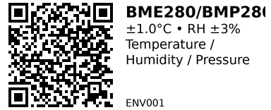

# BME280 / BMP280 — ENV001

**Aliases:** Bosch BME280 / BMP280 (common breakouts: CJMCU, GY-BME280, GY-BMP280)  
**Category:** ENV

## Quick Facts
- BME280: Temperature, **Humidity**, Pressure.  
- BMP280: Temperature, Pressure (**no humidity**).  
- **Buses:** I²C or SPI • **I²C addrs:** `0x76` (default) / `0x77` (SDO high)  
- **Voltage (chip):** 1.71–3.6 V • Most breakouts accept 3.3 V (some are 5 V-tolerant via onboard LDO/level shifting).  
- **Typical accuracy:** T ±1.0 °C (can be improved with calibration), RH ±3% (BME280), Pressure ±1 hPa.

## Links
- **Tutorial:** [Random Nerd Tutorials](https://randomnerdtutorials.com/esp32-bme280-arduino-ide-pressure-temperature-humidity/)
- **Where to buy:** [AliExpress](https://www.aliexpress.com/item/1005007274304296.html?spm=a2g0o.order_list.order_list_main.15.1b4918025rXc9J)
- **Datasheets:**  
    - [BME280 (Bosch)](https://www.bosch-sensortec.com/media/boschsensortec/downloads/datasheets/bst-bme280-ds002.pdf)  
    - [BMP280 (Bosch)](https://www.bosch-sensortec.com/media/boschsensortec/downloads/datasheets/bst-bmp280-ds001.pdf)

## Pinout & Addresses (common breakout labels)
- **VIN / 3V3** (power), **GND**  
- **SDA**, **SCL** (I²C)  
- **SDO** (I²C addr select): low→`0x76`, high→`0x77`  
- **CSB**, **SCK**, **SDI**, **SDO** (SPI mode on some boards)

> Many boards expose both I²C and SPI; leave **CSB** high for I²C.  
> For I²C on ESP32, default pins are **GPIO21 (SDA)** / **GPIO22 (SCL)** unless you choose others.

## Wiring (ESP32 • I²C)
- **VIN → 3.3 V**, **GND → GND**  
- **SDA → GPIO 21**, **SCL → GPIO 22**  
- If you have bus errors on long cables, drop I²C speed (e.g., 100 kHz) and use ~4.7 kΩ pull-ups to 3.3 V.


(Credit: [Random Nerd Tutorials](https://randomnerdtutorials.com/esp32-bme280-arduino-ide-pressure-temperature-humidity/))

## Gotchas
- **Clone confusion:** Many boards marked “BME280” actually carry **BMP280** (no RH). Check chip ID: **BME280 = 0x60**, **BMP280 = 0x58**.
- **Address mismatch:** If `0x76` fails, try `0x77` (tie SDO high or use the solder-jumper).
- **Voltage:** Some cheap boards are **3.3 V only** (no regulator/level shifter). Feeding 5 V can kill the sensor—inspect the PCB.
- **Condensation:** For accurate RH, avoid mounting where moisture condenses; add a small vented enclosure and allow airflow.
- **Humidity reads 0 or NAN:** You likely have a **BMP280** or a mislabeled breakout; check the chip ID.

## How to use (Arduino • auto-detect BME vs BMP)
```cpp
// ESP32 + BME280/BMP280 (I2C) — auto-detect, prints RH only if BME280
// Libraries (Library Manager): Adafruit BME280, Adafruit BMP280, Adafruit Unified Sensor
#include <Wire.h>
#include <Adafruit_BME280.h>
#include <Adafruit_BMP280.h>

#define SDA_PIN 21
#define SCL_PIN 22

Adafruit_BME280 bme;   // for BME280
Adafruit_BMP280 bmp;   // for BMP280
bool hasBME = false;
bool hasBMP = false;

bool beginAt(uint8_t addr) {
  if (bme.begin(addr)) { hasBME = true; return true; }
  if (bmp.begin(addr)) { hasBMP = true; return true; }
  return false;
}

void setup() {
  Serial.begin(115200);
  Wire.begin(SDA_PIN, SCL_PIN);     // you can also Wire.setClock(100000);

  // Try 0x76 then 0x77
  if (!beginAt(0x76) && !beginAt(0x77)) {
    Serial.println("Sensor not found at 0x76/0x77. Check wiring/address.");
    while (1) delay(10);
  }

  if (hasBME) {
    // Oversampling settings (balance noise vs. power/latency)
    bme.setSampling(Adafruit_BME280::MODE_NORMAL,
                    Adafruit_BME280::SAMPLING_X2,   // Temp
                    Adafruit_BME280::SAMPLING_X2,   // Hum
                    Adafruit_BME280::SAMPLING_X4,   // Pressure
                    Adafruit_BME280::FILTER_X4,
                    Adafruit_BME280::STANDBY_MS_125);
    Serial.println("BME280 ready (T/RH/Pressure).");
  } else {
    bmp.setSampling(Adafruit_BMP280::MODE_NORMAL,
                    Adafruit_BMP280::SAMPLING_X2,   // Temp
                    Adafruit_BMP280::SAMPLING_X4,   // Pressure
                    Adafruit_BMP280::FILTER_X4,
                    Adafruit_BMP280::STANDBY_MS_125);
    Serial.println("BMP280 ready (T/Pressure).");
  }
}

float seaLevelhPa = 1013.25;  // set to your local sea-level pressure for altitude calc

void loop() {
  if (hasBME) {
    float t = bme.readTemperature();           // °C
    float h = bme.readHumidity();              // %
    float p = bme.readPressure() / 100.0F;     // hPa
    float alt = bme.readAltitude(seaLevelhPa); // meters
    Serial.printf("T=%.2f°C  RH=%.1f%%  P=%.2f hPa  Alt≈%.1f m\n", t, h, p, alt);
  } else {
    float t = bmp.readTemperature();           // °C
    float p = bmp.readPressure() / 100.0F;     // hPa
    float alt = bmp.readAltitude(seaLevelhPa); // meters
    Serial.printf("T=%.2f°C  P=%.2f hPa  Alt≈%.1f m\n", t, p, alt);
  }
  delay(1000);
}
```

---


*QR for printing will appear here after you run the script:*


