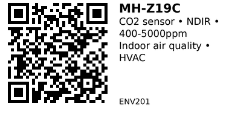

# MH-Z19C

NDIR (Non-Dispersive Infrared) CO2 sensor for accurate indoor air quality monitoring. Measures CO2 concentration from 400-5000ppm via UART or PWM interface. Ideal for ventilation control, HVAC systems, and indoor air quality projects.

## Key Specifications

- **Detection method:** NDIR (infrared)
- **Measurement range:** 400–5000 ppm
- **Accuracy:** ±(50ppm + 5% of reading)
- **Operating voltage:** 5.0V ± 0.1V DC
- **Interface:** UART (TTL 3.3V), PWM, Analog (DAC)
- **Average current:** <40mA (@5V), peak 125mA
- **Preheat time:** 3 minutes
- **Response time:** T90 < 120 seconds
- **Operating temp:** 0–50°C
- **Module size:** ~33mm × 20mm × 9mm

## Pinout

| Pin | Name | Description |
|-----|------|-------------|
| 1 | Vin | 5V power supply (4.5-5.5V) |
| 2 | GND | Ground |
| 3 | TX | UART transmit (3.3V logic) |
| 4 | RX | UART receive (3.3V logic) |
| 5 | NC | Not connected |
| 6 | HD | Analog output (0.4-2V, proportional to CO2) |
| 7 | PWM | PWM output (cycle = 1004ms, high pulse width varies with CO2) |

**Note:** UART operates at 9600 baud, 8N1 (8 data bits, no parity, 1 stop bit)

## Wiring

### Basic Connection (ESP32)

```
MH-Z19C    ESP32
--------   ------
Vin    --> 5V (requires 5V, not 3.3V!)
GND    --> GND
TX     --> GPIO 16 (RX2 - ESP32 hardware serial)
RX     --> GPIO 17 (TX2 - ESP32 hardware serial)
```

**Important:**

- Sensor requires 5V power (connect to ESP32 5V pin, NOT 3.3V)
- Logic levels are 3.3V (TX/RX safe for ESP32 GPIO)

## Usage Notes

### When to Use

**Use this component when:**

- Monitoring indoor CO2 for ventilation control (trigger fan when >1000ppm)
- Building HVAC systems with air quality feedback
- Logging indoor air quality data (schools, offices, homes)
- Need accurate, quantitative CO2 measurements

**Don't use when:**

- Detecting other gases (this sensor ONLY detects CO2)
- Need outdoor air monitoring (range starts at 400ppm, outdoor baseline)
- Budget is tight (MQ-135 is cheaper but less accurate)

### Common Issues

- **Requires 5V power:** Won't work reliably on 3.3V (brown-out, incorrect readings)
- **Preheat time:** Wait 3 minutes after power-on before first reading
- **Calibration drift:** Recalibrate every 6 months by exposing to fresh outdoor air (400ppm baseline)
- **Breath detection:** Exhaled breath is ~40,000ppm CO2 - sensor maxes out at 5000ppm, don't breathe directly on it
- **Ventilation needed:** Sensor consumes oxygen during operation - ensure enclosure has airflow

### Typical CO2 Levels

- **400ppm:** Outdoor air (baseline)
- **400-1000ppm:** Good indoor air quality
- **1000-2000ppm:** Acceptable (recommend ventilation)
- **2000-5000ppm:** Poor air quality (drowsiness, headaches)
- **>5000ppm:** Very poor (cognitive impairment)

## Code Examples

### Arduino/ESP32 (UART)

Using hardware Serial2 to read CO2 concentration:

```cpp
// MH-Z19C CO2 Sensor Example (ESP32)
#include <HardwareSerial.h>

HardwareSerial co2Serial(2);  // Use Serial2

// Command to read CO2 (9 bytes)
byte cmd[9] = {0xFF, 0x01, 0x86, 0x00, 0x00, 0x00, 0x00, 0x00, 0x79};
byte response[9];

void setup() {
  Serial.begin(115200);
  co2Serial.begin(9600, SERIAL_8N1, 16, 17);  // RX=16, TX=17

  delay(3000);  // Preheat
  Serial.println("MH-Z19C ready");
}

void loop() {
  // Send read command
  co2Serial.write(cmd, 9);
  delay(100);

  // Read response (9 bytes)
  if (co2Serial.available() >= 9) {
    co2Serial.readBytes(response, 9);

    // Verify checksum
    byte check = 0;
    for (int i = 1; i < 8; i++) {
      check += response[i];
    }
    check = 0xFF - check + 1;

    if (response[0] == 0xFF && response[1] == 0x86 && response[8] == check) {
      int co2ppm = (response[2] << 8) + response[3];
      Serial.printf("CO2: %d ppm\n", co2ppm);
    } else {
      Serial.println("Checksum error");
    }
  }

  delay(5000);  // Read every 5 seconds
}
```

### Using MH-Z19 Library (Easier)

Install library: **MH-Z19** by Jonathan Dempsey (Arduino Library Manager)

```cpp
#include <MHZ19.h>
#include <HardwareSerial.h>

MHZ19 myMHZ19;
HardwareSerial mySerial(2);  // Serial2

void setup() {
  Serial.begin(115200);
  mySerial.begin(9600, SERIAL_8N1, 16, 17);  // RX=16, TX=17

  myMHZ19.begin(mySerial);
  myMHZ19.autoCalibration(true);  // Auto-calibrate to 400ppm baseline

  delay(3000);  // Preheat
  Serial.println("MH-Z19C ready");
}

void loop() {
  int CO2 = myMHZ19.getCO2();  // Request CO2 (as ppm)

  if (CO2 > 0) {
    Serial.printf("CO2: %d ppm\n", CO2);

    // Ventilation logic
    if (CO2 > 1000) {
      Serial.println("⚠️  Poor air quality - increase ventilation");
    }
  }

  delay(5000);
}
```

## Calibration

**Auto-calibration (ABC):**
- Sensor assumes lowest reading in 24hrs = 400ppm (outdoor air)
- Enable with: `myMHZ19.autoCalibration(true);`
- Requires 24hr exposure to fresh air periodically

**Manual calibration:**
- Expose sensor to fresh outdoor air for 20 minutes
- Send calibration command via UART (see library docs)

## Links

- [Datasheet (MH-Z19C)](https://www.winsen-sensor.com/d/files/infrared-gas-sensor/mh-z19c-pins-type-co2-manual-ver1_0.pdf)
- [Purchase: AliExpress](https://www.aliexpress.com/item/1005007470467431.html)
- [Library: MH-Z19 (Jonathan Dempsey)](https://github.com/WifWaf/MH-Z19)

**Sources:**

- [Winsen MH-Z19C Datasheet](https://www.winsen-sensor.com/d/files/infrared-gas-sensor/mh-z19c-pins-type-co2-manual-ver1_0.pdf)
- [MH-Z19C Product Page](https://www.winsen-sensor.com/sensors/co2-sensor/mh-z19c.html)

---


