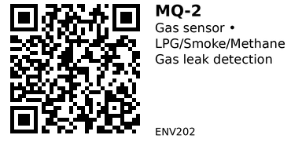

# MQ-2

Semiconductor gas sensor for detecting combustible gases and smoke. Detects LPG, methane, propane, hydrogen, smoke, and carbon monoxide via analog voltage output. Commonly used for gas leak alarms and fire detection systems.

## Key Specifications

- **Detection method:** Semiconductor (tin oxide SnO2)
- **Detects:** LPG, methane, propane, hydrogen, smoke, carbon monoxide
- **Detection range:** 200–10,000 ppm
- **Operating voltage:** 5V DC
- **Current consumption:** ~160mA (heater draws ~140mA)
- **Load resistance:** 20kΩ (typical)
- **Preheat time:** 24-48 hours (for stable/accurate readings)
- **Response/recovery time:** <10s / <30s (typical)
- **Operating temp:** -10 to 50°C
- **Module size:** ~32mm × 20mm (typical breakout)

## Pinout

### 4-Pin Module (Common)

| Pin | Name | Description |
|-----|------|-------------|
| 1 | VCC | 5V power supply |
| 2 | GND | Ground |
| 3 | DO | Digital output (comparator, active LOW when gas detected) |
| 4 | AO | Analog output (voltage proportional to gas concentration) |

**Module features:**

- **Onboard potentiometer:** Adjusts digital output threshold (DO triggers when gas > threshold)
- **Power LED:** Indicates module is powered
- **Signal LED:** Lights when DO goes LOW (gas detected)

## Wiring

### Basic Connection (ESP32)

```
MQ-2       ESP32
-----      ------
VCC    --> 5V (requires 5V, not 3.3V!)
GND    --> GND
AO     --> GPIO 34 (ADC1, any analog pin)
DO     --> GPIO 25 (optional, digital alarm)
```

**Important:**

- Sensor requires 5V power (heater element needs 5V)
- Analog output is 0-5V (exceeds ESP32 3.3V max!)
- **Use voltage divider:** 2:1 ratio (10kΩ + 10kΩ) to scale AO to 0-2.5V for ESP32 ADC
- OR use module with onboard 3.3V-safe output (check your specific module)

### Voltage Divider for ESP32

```
MQ-2 AO ----[10kΩ]---- ESP32 GPIO 34 (ADC)
                  |
               [10kΩ]
                  |
                 GND
```

This divides 5V output to 2.5V max (safe for ESP32).

## Usage Notes

### When to Use

**Use this component when:**

- Detecting combustible gas leaks (kitchen LPG, natural gas, propane)
- Building smoke/fire alarm systems
- Simple threshold-based gas detection (digital output)
- Budget-friendly gas sensing (qualitative detection)

**Don't use when:**

- Need precise ppm measurements (sensor is not calibrated, cross-sensitive)
- Detecting specific gases only (sensor responds to ALL combustible gases)
- Need fast startup (<24hrs preheat for accuracy)
- Monitoring CO2 (use ENV201 MH-Z19C instead)

### Common Issues

- **Long preheat required:** Needs 24-48 hours of continuous power for stable readings (heater element must "burn in")
- **Cross-sensitivity:** Responds to multiple gases (can't distinguish LPG from methane)
- **Requires calibration:** Analog output needs calibration curve (test with known gas concentrations)
- **High power consumption:** ~160mA continuous (heater always on)
- **5V output not ESP32-safe:** Use voltage divider on analog output
- **Temperature/humidity dependent:** Readings vary with ambient conditions

### Gas Detection Sensitivity

MQ-2 is most sensitive to:

1. **Propane** (highest sensitivity)
2. **Hydrogen**
3. **LPG** (butane/propane mix)
4. **Methane** (natural gas)
5. **Smoke** (combustion particles)
6. **Carbon monoxide** (lower sensitivity)

**Note:** Cannot distinguish between gases - triggers on ANY combustible gas or smoke.

## Code Examples

### Arduino/ESP32 (Analog Reading)

Basic example reading analog output (with voltage divider):

```cpp
// MQ-2 Gas Sensor Example (ESP32)
const int MQ2_PIN = 34;  // Analog input (ADC1)
const int THRESHOLD = 2000;  // Adjust based on calibration

void setup() {
  Serial.begin(115200);
  pinMode(MQ2_PIN, INPUT);

  Serial.println("MQ-2 Gas Sensor");
  Serial.println("⚠️  Preheating for 60 seconds...");
  delay(60000);  // Wait 60s (for demo - full accuracy needs 24-48hrs!)
  Serial.println("Ready");
}

void loop() {
  int sensorValue = analogRead(MQ2_PIN);  // 0-4095 (ESP32 12-bit ADC)

  Serial.printf("Gas level: %d", sensorValue);

  if (sensorValue > THRESHOLD) {
    Serial.println(" ⚠️  GAS DETECTED!");
  } else {
    Serial.println(" (normal)");
  }

  delay(1000);
}
```

### Digital Output (Simple Alarm)

Using digital output for threshold alarm:

```cpp
// MQ-2 Digital Output Example
const int DO_PIN = 25;  // Digital input

void setup() {
  Serial.begin(115200);
  pinMode(DO_PIN, INPUT);  // DO is active LOW

  Serial.println("MQ-2 Gas Alarm (digital mode)");
  delay(60000);  // Preheat
  Serial.println("Monitoring...");
}

void loop() {
  int gasDetected = digitalRead(DO_PIN);

  if (gasDetected == LOW) {
    Serial.println("🚨 GAS ALARM! Evacuate area!");
    // Trigger buzzer, LED, relay, etc.
  }

  delay(500);
}
```

**Adjust threshold:** Turn the onboard potentiometer (trimpot) until the signal LED just turns off in clean air, then back off slightly.

### Calibration (Advanced)

To get ppm readings, you need a calibration curve:

1. Expose sensor to known gas concentration (requires calibration gas)
2. Record analog voltage for each concentration
3. Plot voltage vs. ppm on log-log scale
4. Fit power curve: `ppm = A * (V/V0)^B`
5. Use curve in code to convert voltage → ppm

**Note:** This is complex and requires specialized equipment. For most DIY projects, threshold detection (digital output) is sufficient.

## Links

- [Datasheet (MQ-2 PDF)](https://www.pololu.com/file/0J309/MQ2.pdf)
- [Purchase: AliExpress](https://www.aliexpress.com/item/1005008493614271.html)
- [Tutorial: MQ-2 with Arduino (Last Minute Engineers)](https://lastminuteengineers.com/mq2-gas-senser-arduino-tutorial/)
- [Calibration Guide (Seeed Wiki)](https://wiki.seeedstudio.com/Grove-Gas_Sensor-MQ2/)

**Sources:**

- [Last Minute Engineers: MQ2 Gas Sensor Tutorial](https://lastminuteengineers.com/mq2-gas-senser-arduino-tutorial/)
- [Components101: MQ2 Gas Sensor Pinout](https://components101.com/sensors/mq2-gas-sensor)

---


