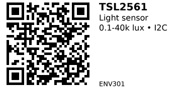

# TSL2561 Digital Light Sensor - ENV301

An I2C light-to-digital converter that approximates human eye response. Combines one broadband photodiode (visible+IR) and one IR photodiode to measure illuminance in lux. Popular for auto-brightness displays, outdoor weather stations, and smart lighting. Wide dynamic range (0.1 to 40,000+ lux) covers most common lighting conditions.

## Key Specifications

- **Range**: 0.1 to 40,000+ lux
- **Interface**: I2C (addresses: 0x29, 0x39, 0x49 - configurable via ADDR pin)
- **Dynamic Range**: 20-bit effective (16-bit resolution)
- **Supply Voltage**: 2.7V - 3.6V (3.3V typical)
- **Current**: 0.6 mA active, 0.015 mA power-down
- **Response**: Approximates photopic (human eye) response
- **Package**: Module with built-in pull-ups

## Pinout

| Pin | Function |
|-----|----------|
| VCC | Power (2.7-3.6V, use 3.3V) |
| GND | Ground |
| SDA | I2C data |
| SCL | I2C clock |
| ADDR | Address select (GND=0x29, Float=0x39, VCC=0x49) |

## Wiring

```
TSL2561 Module    ESP32
--------------    ------
VCC           --> 3.3V
GND           --> GND
SDA           --> GPIO 21 (I2C SDA)
SCL           --> GPIO 22 (I2C SCL)
ADDR          --> GND, Float, or 3.3V (sets I2C address)
```

**Note:** Most modules include 4.7kΩ pull-up resistors on SDA/SCL.

## Usage Notes

### When to Use

**Use this sensor when:**

- Need lux measurement for brightness control
- Want human eye-like response (photopic)
- Budget-friendly digital light sensor
- Range 0.1-40k lux covers your application

**Don't use when:**

- Need >40k lux (bright sunlight) - use ENV302 TSL2591 instead
- Need <0.1 lux (very dark) - use ENV302 TSL2591 instead
- Just need "dark/bright" threshold - use ENV304 photoresistor (cheaper)

## Code Example

```cpp
#include <Wire.h>
#include <Adafruit_Sensor.h>
#include <Adafruit_TSL2561_U.h>

Adafruit_TSL2561_Unified tsl = Adafruit_TSL2561_Unified(TSL2561_ADDR_FLOAT, 12345);

void setup() {
  Serial.begin(115200);
  if (!tsl.begin()) {
    Serial.println("TSL2561 not found!");
    while (1);
  }
  tsl.enableAutoRange(true);  // Auto-gain for wide range
}

void loop() {
  sensors_event_t event;
  tsl.getEvent(&event);

  if (event.light) {
    Serial.print("Light: ");
    Serial.print(event.light);
    Serial.println(" lux");
  }
  delay(1000);
}
```

**Libraries:**

- [Adafruit TSL2561](https://github.com/adafruit/Adafruit_TSL2561)

## Links

- [Datasheet: TSL2561 PDF](https://cdn-shop.adafruit.com/datasheets/TSL2561.pdf)
- [Purchase: TSL2561 Light Sensor Module](https://www.aliexpress.com/item/1005006811956625.html)
- [Tutorial: TSL2561 Hookup Guide (SparkFun)](https://learn.sparkfun.com/tutorials/tsl2561-luminosity-sensor-hookup-guide/all)

---


