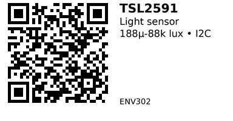

# TSL2591 High Dynamic Range Light Sensor - ENV302

An I2C light sensor with exceptional 600,000,000:1 dynamic range. Measures from near-darkness (188 µlux) to bright daylight (88,000 lux) without changing settings. Superior to TSL2561 for applications requiring extreme low-light sensitivity or bright outdoor measurement. Ideal for automatic camera exposure, solar trackers, and precision lighting control.

## Key Specifications

- **Range**: 188 µlux to 88,000 lux
- **Dynamic Range**: 600,000,000:1 (exceptional!)
- **Interface**: I2C (address: 0x29 - fixed, not configurable)
- **Supply Voltage**: 3.3V - 5V
- **Response**: Approximates photopic (human eye) response
- **Gain Settings**: 1x, 25x, 428x, 9876x (programmable)
- **Package**: Module with built-in pull-ups

## Pinout

| Pin | Function |
|-----|----------|
| VIN | Power (3.3V-5V) |
| GND | Ground |
| SDA | I2C data |
| SCL | I2C clock |

## Wiring

```
TSL2591 Module    ESP32
--------------    ------
VIN           --> 3.3V or 5V
GND           --> GND
SDA           --> GPIO 21 (I2C SDA)
SCL           --> GPIO 22 (I2C SCL)
```

**Note:** I2C address is 0x29 (fixed, cannot change).

## Usage Notes

### When to Use

**Use this sensor when:**

- Need extreme low-light sensitivity (<1 lux)
- Measuring bright sunlight (>40k lux)
- Want auto-gain over wide range (no manual switching)
- Precision lux measurement critical

**Don't use when:**

- Budget-constrained (ENV301 TSL2561 or ENV303 BH1750 cheaper)
- Only need "dark/bright" threshold (ENV304 photoresistor sufficient)
- Need configurable I2C address (TSL2591 fixed at 0x29)

## Code Example

```cpp
#include <Adafruit_Sensor.h>
#include "Adafruit_TSL2591.h"

Adafruit_TSL2591 tsl = Adafruit_TSL2591(2591);

void setup() {
  Serial.begin(115200);
  if (!tsl.begin()) {
    Serial.println("TSL2591 not found!");
    while (1);
  }
  tsl.setGain(TSL2591_GAIN_MED);  // 25x gain (or AUTO)
  tsl.setTiming(TSL2591_INTEGRATIONTIME_300MS);
}

void loop() {
  uint32_t lum = tsl.getFullLuminosity();
  uint16_t ir = lum >> 16;
  uint16_t full = lum & 0xFFFF;
  float lux = tsl.calculateLux(full, ir);

  Serial.print("Lux: ");
  Serial.println(lux);
  delay(1000);
}
```

**Libraries:**

- [Adafruit TSL2591](https://github.com/adafruit/Adafruit_TSL2591_Library)

## Links

- [Datasheet: TSL2591 PDF](https://cdn-shop.adafruit.com/datasheets/TSL25911_Datasheet_EN_v1.pdf)
- [Purchase: TSL2591 High Dynamic Range Light Sensor](https://www.aliexpress.com/item/1005007084088092.html)
- [Tutorial: Adafruit TSL2591 Guide](https://learn.adafruit.com/adafruit-tsl2591)

---


