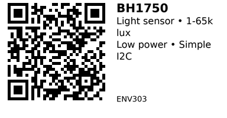

# BH1750 Digital Light Sensor - ENV303

A simple, low-power I2C light sensor that directly outputs lux values (no complex calculations needed). Uses 16-bit ADC for 1-65,535 lux range. Extremely low power consumption (0.12 mA) makes it ideal for battery-powered projects. Popular alternative to TSL2561/TSL2591 when you want simplicity and low cost.

## Key Specifications

- **Range**: 1 to 65,535 lux (adjustable to 0.11-100,000 lux)
- **Resolution**: 1 lux (H-mode) or 0.5 lux (H2-mode) or 4 lux (L-mode)
- **Interface**: I2C (addresses: 0x23 or 0x5C - configurable via ADDR pin)
- **Supply Voltage**: 2.4V - 3.6V (3.3V typical)
- **Current**: 0.12 mA (very low power!)
- **Measurement Time**: 16ms (L-mode) or 120ms (H-mode)
- **Package**: Module with built-in pull-ups

## Pinout

| Pin | Function |
|-----|----------|
| VCC | Power (2.4-3.6V, use 3.3V) |
| GND | Ground |
| SDA/SDI | I2C data |
| SCL/SCK | I2C clock |
| ADDR/ADD | Address select (GND=0x23, VCC=0x5C) |

## Wiring

```
BH1750 Module     ESP32
-------------     ------
VCC           --> 3.3V
GND           --> GND
SDA           --> GPIO 21 (I2C SDA)
SCL           --> GPIO 22 (I2C SCL)
ADDR          --> GND or 3.3V (sets I2C address)
```

**Note:** Most modules include 4.7kΩ pull-up resistors on SDA/SCL.

## Usage Notes

### When to Use

**Use this sensor when:**

- Need simple lux measurement with direct output
- Low power consumption critical (battery projects)
- Want inexpensive digital light sensor
- Range 1-65k lux sufficient (covers most indoor/outdoor)

**Don't use when:**

- Need <1 lux sensitivity (use ENV302 TSL2591 instead)
- Need >100k lux (very rare - extremely bright conditions)
- Want best dynamic range (ENV302 TSL2591 superior)

## Code Example

```cpp
#include <Wire.h>
#include <BH1750.h>

BH1750 lightMeter;

void setup() {
  Serial.begin(115200);
  Wire.begin();

  if (!lightMeter.begin()) {
    Serial.println("BH1750 not found!");
    while (1);
  }
}

void loop() {
  float lux = lightMeter.readLightLevel();

  Serial.print("Light: ");
  Serial.print(lux);
  Serial.println(" lux");

  delay(1000);
}
```

**Libraries:**
- [BH1750 by claws](https://github.com/claws/BH1750)

## Links

- [Datasheet: BH1750FVI PDF](https://www.mouser.com/datasheet/2/348/bh1750fvi-e-186247.pdf)
- [Purchase: BH1750 Light Sensor Module](https://www.aliexpress.com/item/32843036633.html)
- [Tutorial: BH1750 Digital Light Sensor (Instructables)](https://www.instructables.com/BH1750-Digital-Light-Sensor/)

---


