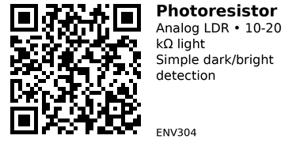

# GL5528 Photoresistor (LDR) - ENV304

A simple cadmium-sulfide (CdS) light-dependent resistor (LDR). Resistance drops as light increases - ideal for cheap "it's dark / it's bright" detection in night-lights, auto-dimming displays, and threshold-based switching. Not a precision lux sensor, but perfect when you just need an analog light level. Use with voltage divider and ESP32 ADC pin.

## Key Specifications

- **Type**: 5mm CdS photoresistor (GL5528)
- **Light Resistance**: 10-20 kΩ @ 10 lux
- **Dark Resistance**: ≥ 1 MΩ @ 0 lux
- **Spectral Peak**: ~540 nm (green)
- **Response Time**: 20-50 ms
- **Max Voltage**: ~150 V
- **Max Power**: ~100 mW @ 25°C
- **Temperature Range**: -30°C to +70°C
- **Package**: 5mm epoxy, 2-pin through-hole (no polarity)

**Note:** Not precision-calibrated; values vary by batch/vendor.

## Pinout

Simple 2-wire component (no polarity):

- **Pin 1**: LDR terminal
- **Pin 2**: LDR terminal

Use like a variable resistor - orientation doesn't matter.

## Wiring

### Voltage Divider (ESP32 ADC)

```
3.3V ---[LDR]--- ADC Pin (GPIO 34) ---[10kΩ]--- GND
```

**Circuit explanation:**
- LDR from 3.3V to ADC pin
- 10kΩ fixed resistor from ADC pin to GND
- As light increases, LDR resistance drops, ADC voltage rises

**Important:**

- Use ADC-capable pins only (GPIO 32-39 on most ESP32 boards)
- Keep divider at 3.3V (never 5V - damages ESP32)
- Optional: Add 0.1µF capacitor from ADC pin to GND (noise filter)

## Usage Notes

### When to Use

**Use this sensor when:**

- Need simple "dark/bright" threshold detection
- Budget-critical (cheapest light sensor option)
- Analog input acceptable (no I2C needed)
- Precision lux values not required

**Don't use when:**

- Need accurate lux measurement (use ENV301/ENV302/ENV303 instead)
- Need fast response (<10ms) - LDRs are slow
- Want consistent readings (LDRs vary significantly by unit)
- Cadmium restrictions apply in your region

## Code Example

```cpp
const int LDR_PIN = 34;  // ADC-capable pin
const int LED_PIN = 2;   // Built-in LED

void setup() {
  Serial.begin(115200);
  pinMode(LED_PIN, OUTPUT);
}

void loop() {
  int raw = analogRead(LDR_PIN);  // 0-4095

  // Simple threshold (adjust to taste)
  bool isDark = (raw < 1500);
  digitalWrite(LED_PIN, isDark ? HIGH : LOW);

  Serial.print("LDR: ");
  Serial.print(raw);
  Serial.print(" -> ");
  Serial.println(isDark ? "Dark" : "Bright");

  delay(200);
}
```

## Links

- [Datasheet: GL5528 Photoresistor PDF](https://cdn.sparkfun.com/datasheets/Sensors/LightImaging/SEN-09088.pdf)
- [Purchase: GL5528 5mm Photoresistor LDR](https://www.aliexpress.com/item/1005005968714360.html)
- [Tutorial: ESP32 Light Sensor (esp32io.com)](https://esp32io.com/tutorials/esp32-light-sensor)

---


