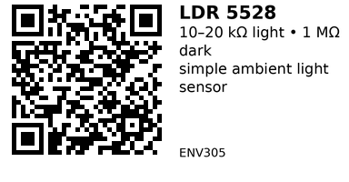

# LDR 5528 - ENV305

A **5528-series light-dependent resistor (LDR)** is a simple cadmium-sulfide (CdS) photoresistor. Its resistance drops as the light level increases, which makes it ideal as a very cheap, analog **ambient light sensor** for things like night-lights, auto-dimming displays, and "it's dark / it's bright" detection.

This specific GL5528-style part is a 5 mm epoxy-encapsulated LDR. In typical conditions it measures on the order of tens of kilo-ohms in moderate light and rises to around a megaohm in the dark, so it works very well in a classic voltage-divider configuration with a fixed resistor and an ESP32 ADC pin.

## Links

- **Where to buy:** [AliExpress](https://www.aliexpress.com/item/1005005968714360.html?)
- **Datasheet:** [PDF – GL5528 Photoresistor](https://cdn.sparkfun.com/datasheets/Sensors/LightImaging/SEN-09088.pdf)
- **Tutorial:** [ESP32 – Light Sensor (esp32io.com)](https://esp32io.com/tutorials/esp32-light-sensor)

## Specifications

Approximate characteristics for a typical GL5528/5528 LDR:

- **Package:** 5 mm CdS photoresistor (2-pin, through-hole)
- **Light resistance (bright, ~10 lux):** ~10–20 kΩ
- **Dark resistance (0 lux):** ≥ 1 MΩ
- **Maximum DC voltage:** ~150 V
- **Maximum power dissipation:** ~100 mW (at 25 °C)
- **Spectral peak:** ~540 nm (green)
- **Response time:** tens of milliseconds (order of 20–50 ms)
- **Operating temperature:** roughly −30 °C to +70 °C

These values are not precision-guaranteed for every random AliExpress batch, but they're good ballpark numbers for choosing divider resistors and thresholds.

## Pinout & Addresses (common breakout labels)

This is just the bare **2‑lead LDR component**, not a module, so there is no real "pinout":

- **Pin 1:** LDR terminal (no polarity)
- **Pin 2:** LDR terminal (no polarity)

You use it exactly like a variable resistor. Orientation does **not** matter. There is no I²C/SPI address or digital interface – you must build a simple resistor divider to read it with an ADC.

## Wiring

The classic way to use an LDR with an ESP32 is as a **voltage divider**:

1. Pick a fixed resistor value, typically in the same order of magnitude as the LDR in the mid-light range, e.g. **10 kΩ**.
2. Connect one LDR leg to **3.3 V**.
3. Connect the other LDR leg to:
   - the **ESP32 analog input pin**, e.g. GPIO 34 (ADC1_CH6), and
   - one side of the fixed resistor (**10 kΩ**) at the same node.
4. Connect the **other side of the fixed resistor** to **GND**.

That node between LDR and fixed resistor goes to the ESP32 ADC input. As light increases, the LDR resistance drops, changing the voltage at the ADC pin.

Notes:

- Use only **ADC-capable pins** on the ESP32 (e.g. 32–39 on most dev boards).
- Keep the divider tied to **3.3 V**, never 5 V, to avoid overstressing the ESP32.
- If needed, you can add a small capacitor (e.g. 0.1 µF) from the ADC node to GND to filter noise and ESP32 ADC sampling glitches.

## Gotchas

- **Not a precision lux sensor** – good for thresholds ("dark vs bright"), not for accurate lux readings.
- **Device-to-device variation** is large; you may need to tune thresholds per build.
- **Non-linear and slowish response** compared to photodiodes/phototransistors – not suitable for fast light changes or data links.
- Contains **CdS (cadmium sulfide)**; some regions have restrictions on cadmium-containing devices.
- Always use it in a **divider**, not directly across 3.3 V into an ADC pin.

## How to use

The ESP32 ADC is a 12-bit analog-to-digital converter by default. You can choose a basic reading, or do a small averaging loop to smooth out ESP32 ADC noise.

**Basic read:**

```cpp
// Wiring: LDR + 10kΩ divider → GPIO34 (ADC1_CH6)
const int LDR_PIN = 34;

void setup() {
  Serial.begin(115200);
  analogReadResolution(12);  // 0–4095
}

void loop() {
  int raw = analogRead(LDR_PIN);
  Serial.printf("ADC = %d\n", raw);
  delay(500);
}
```

**Threshold-based logic (e.g., turn on LED when dark):**

```cpp
const int LDR_PIN   = 34;
const int LED_PIN   = 2;   // onboard LED
const int THRESHOLD = 2000; // tune for your LDR + divider

void setup() {
  pinMode(LED_PIN, OUTPUT);
  analogReadResolution(12);
}

void loop() {
  int val = analogRead(LDR_PIN);

  // If ADC is high → LDR sees less light → darker
  if (val > THRESHOLD) {
    digitalWrite(LED_PIN, HIGH);  // turn on LED when dark
  } else {
    digitalWrite(LED_PIN, LOW);
  }

  delay(100);
}
```

**Averaging for stable reading:**

```cpp
const int LDR_PIN = 34;

int readLDR_Avg(int samples = 10) {
  long sum = 0;
  for (int i = 0; i < samples; i++) {
    sum += analogRead(LDR_PIN);
    delay(5);
  }
  return (int)(sum / samples);
}

void setup() {
  Serial.begin(115200);
  analogReadResolution(12);
}

void loop() {
  int avg = readLDR_Avg(10);
  Serial.printf("LDR avg = %d\n", avg);
  delay(1000);
}
```

---

*QR for printing will appear here after you run the script:*


