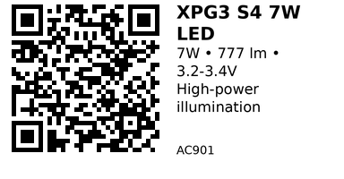

# XPG3 S4 7W High-Power LED - AC901

High-power 7W LED chip delivering up to 777 lumens. Available in cold white, warm white, and blue variants. Requires constant-current driver (2A typical) and proper thermal management (heatsink mandatory). Ideal for DIY flashlights, spotlights, grow lights, and high-brightness indicators.

**Warning:** This LED generates significant heat and requires a heatsink for safe operation. Never run without thermal management.

## Links

- **Where to buy:** [AliExpress - XPG3 S4 LED](https://www.aliexpress.com/item/32950069464.html)

## Specifications

- **Power:** 7W (nominal)
- **Forward Voltage:** 3.2-3.4V typical (varies by color)
- **Forward Current:** 2000mA (2A) nominal, 2500mA max
- **Luminous Flux:** ~777 lm @ 2A (cold white)
- **Color Options:**
  - Cold white (~6000-6500K)
  - Warm white (~3000-3500K)
  - Blue (~460-470nm)
- **Viewing Angle:** 140°
- **Package:** Star PCB (16mm or 20mm diameter typical)
- **Thermal Resistance:** Requires heatsink (junction-to-ambient)

## Pinout & Addresses

Two solder pads on LED star PCB:

- **Anode (+):** Positive terminal
- **Cathode (-):** Negative terminal, also thermal pad

The large metal backing serves as both electrical cathode and thermal path - mount to heatsink with thermal paste.

## Wiring

**Never connect directly to ESP32!** Requires constant-current LED driver.

**Option 1: Constant-Current Buck Driver (recommended)**

```
12V/24V Power Supply → Buck LED Driver (set to 2A) → LED
ESP32 GPIO → Driver EN pin (or MOSFET on input power)
```

Use drivers like:
- LM3414/LM3406 constant-current buck ICs
- PT4115 LED driver module
- Commercial constant-current driver boards

**Option 2: Current-Limiting Resistor (inefficient, not recommended for 7W)**

Only for testing at very low current (<200mA):
```
12V → Resistor (calculate for desired current) → LED → GND
```

**PWM Dimming:**
- Use PWM on driver's enable pin or input power MOSFET
- Frequency: 200Hz-20kHz typical
- Lower frequencies may cause visible flicker

## Thermal Management

**Mandatory heatsinking:**

1. **Heatsink size:** Minimum ~5-10 cm² surface area for passive cooling at 7W
2. **Thermal paste:** Apply thin layer between LED star and heatsink
3. **Mounting:** Use thermal epoxy or screws to ensure good contact
4. **Active cooling:** Add small fan for sustained 7W operation
5. **Temperature monitoring:** LED should not exceed 80-85°C junction temperature

**Without heatsink:** LED will overheat in seconds and fail permanently!

## Gotchas

- **Thermal runaway:** Forward voltage decreases with temperature; use constant-current driver, not constant-voltage
- **Heatsink is mandatory:** Will destroy LED in <60 seconds without proper cooling
- **ESD sensitive:** Handle with care, use wrist strap during assembly
- **Polarity matters:** Reverse voltage will damage the LED
- **Current limiting required:** Direct connection to power supply will destroy LED instantly
- **Eye safety:** 777 lumens is very bright - avoid direct viewing, use diffuser for indicators

## How to use

**Simple on/off control with constant-current driver:**

```cpp
// ESP32 controlling LED via driver enable pin or power MOSFET
const int LED_ENABLE_PIN = 25;  // controls driver or MOSFET

void setup() {
  pinMode(LED_ENABLE_PIN, OUTPUT);
  digitalWrite(LED_ENABLE_PIN, LOW);  // start off
}

void loop() {
  digitalWrite(LED_ENABLE_PIN, HIGH);  // LED on (full brightness)
  delay(2000);
  digitalWrite(LED_ENABLE_PIN, LOW);   // LED off
  delay(2000);
}
```

**PWM dimming:**

```cpp
// ESP32 PWM dimming via driver enable or MOSFET gate
const int LED_PWM_PIN = 25;
const int PWM_CHANNEL = 0;
const int PWM_FREQ = 1000;  // 1 kHz
const int PWM_RES = 8;      // 0-255

void setup() {
  ledcSetup(PWM_CHANNEL, PWM_FREQ, PWM_RES);
  ledcAttachPin(LED_PWM_PIN, PWM_CHANNEL);
  ledcWrite(PWM_CHANNEL, 0);  // start off
}

void loop() {
  // Fade in
  for (int brightness = 0; brightness <= 255; brightness += 5) {
    ledcWrite(PWM_CHANNEL, brightness);
    delay(20);
  }

  delay(1000);

  // Fade out
  for (int brightness = 255; brightness >= 0; brightness -= 5) {
    ledcWrite(PWM_CHANNEL, brightness);
    delay(20);
  }

  delay(1000);
}
```

**Temperature-based control (with temperature sensor):**

```cpp
// Reduce LED current if temperature exceeds threshold
// Assumes you have a temperature sensor on the heatsink

const int LED_PWM_PIN = 25;
const int TEMP_SENSOR_PIN = 34;  // ADC pin with thermistor
const float MAX_TEMP = 70.0;     // Max heatsink temp (°C)
const float SAFE_TEMP = 60.0;    // Safe operating temp

void setup() {
  ledcSetup(0, 1000, 8);
  ledcAttachPin(LED_PWM_PIN, 0);
}

void loop() {
  float temp = readTemperature();  // your temp reading function

  int brightness = 255;  // default full brightness

  if (temp > SAFE_TEMP) {
    // Reduce brightness proportionally
    float factor = (MAX_TEMP - temp) / (MAX_TEMP - SAFE_TEMP);
    factor = constrain(factor, 0.0, 1.0);
    brightness = (int)(255 * factor);
  }

  if (temp > MAX_TEMP) {
    brightness = 0;  // emergency shutdown
  }

  ledcWrite(0, brightness);
  delay(100);
}
```

---

*QR for printing will appear here after you run the script:*


