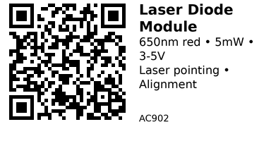

# 650nm Red Laser Diode Module - AC902

Compact red laser diode module emitting at 650nm wavelength with <5mW output power (Class 2). Requires regulated 3-5V DC supply or constant-current driver. Use for alignment, pointing, distance sensing, or DIY laser projects. Includes integrated collimating lens for focused beam.

**Safety:** Class 2 laser - avoid direct eye exposure. Safe for momentary viewing but can cause eye strain or temporary flash blindness with prolonged exposure.

## Links

- **Where to buy:** [AliExpress - 650nm Laser Diode](https://www.aliexpress.com/item/1005009410058180.html)
- **Laser Safety:** [FDA Laser Safety Guide](https://www.fda.gov/radiation-emitting-products/home-business-and-entertainment-products/laser-products-and-instruments)
- **Tutorial:** [Arduino Laser Control](https://www.instructables.com/Arduino-Laser-Show-With-Real-Galvos/)

## Specifications

- **Wavelength:** 650nm (red)
- **Output Power:** <5mW (Class 2)
- **Operating Voltage:** 3-5V DC (typical)
- **Operating Current:** ~20-40mA (varies by model)
- **Beam Diameter:** ~5mm @ aperture
- **Divergence:** ~1.5 mrad (varies by lens quality)
- **Modulation:** Can be modulated up to several kHz
- **Operating Temperature:** 0-40°C
- **Dimensions:** Typically 6mm diameter × 12-18mm length

## Pinout & Addresses

Most laser diode modules have 2 or 3 pins:

**2-pin version:**

- **Anode (+):** Positive supply (red wire typical)
- **Cathode (-):** Ground (black wire typical)

**3-pin version (with built-in driver):**

- **VCC:** Supply voltage (3-5V)
- **GND:** Ground
- **SIG/TTL:** Modulation input (some modules)

Check your specific module pinout - always test at low voltage first.

## Wiring

**⚠️ Never apply reverse voltage - will destroy laser diode instantly!**

**Option 1: Direct drive with current-limiting resistor (simple, not recommended for precision)**

```
5V → 100Ω resistor → Laser Diode (+) → Laser Diode (-) → GND
```

Calculate resistor: R = (Vsupply - Vf) / Idesired
- Typical Vf ≈ 2.5V, I ≈ 30mA
- For 5V: R = (5 - 2.5) / 0.030 = 83Ω → use 100Ω

**Option 2: Constant-current driver (recommended)**

Use dedicated laser diode driver IC or module for stable output and protection.

**Option 3: ESP32 control via MOSFET (on/off switching)**

```
ESP32 GPIO → 1kΩ → MOSFET Gate (e.g., 2N7000)
MOSFET Source → GND
Laser (+) → Current-limiting resistor → 5V
Laser (-) → MOSFET Drain
```

**Option 4: PWM modulation (for projects needing variable intensity)**

Drive MOSFET gate with PWM, but be aware laser diodes don't dim well at low currents - they may just turn off below threshold.

## Safety Precautions

**⚠️ LASER SAFETY:**

1. **Never point at eyes, people, animals, or aircraft**
2. **Avoid reflective surfaces** - unexpected reflections can be hazardous
3. **Use proper enclosure** for automated/unattended operation
4. **Post warning labels** if laser can be exposed
5. **Class 2 (<5mW)** is generally safe for momentary exposure but not staring
6. **Higher power lasers** require safety goggles, interlocks, and certifications
7. **Check local regulations** - some jurisdictions restrict laser use/ownership

## Gotchas

- **ESD sensitive:** Handle with anti-static precautions
- **Polarity critical:** Reverse voltage kills the diode instantly
- **Current sensitive:** Exceeding max current destroys diode
- **Temperature affects output:** Wavelength shifts ~0.25nm/°C
- **Cheap modules vary:** Power and beam quality vary significantly between batches
- **Not for burning/engraving:** 5mW is too low for material processing
- **Beam divergence:** Cheap lenses have poor beam quality; collimation degrades over distance

## How to use

**Simple on/off control (ESP32):**

```cpp
// Control laser via MOSFET (see wiring option 3)
const int LASER_PIN = 25;

void setup() {
  pinMode(LASER_PIN, OUTPUT);
  digitalWrite(LASER_PIN, LOW);  // laser off
}

void loop() {
  digitalWrite(LASER_PIN, HIGH);  // laser on
  delay(1000);
  digitalWrite(LASER_PIN, LOW);   // laser off
  delay(1000);
}
```

**Pulsed laser (distance sensing, TOF):**

```cpp
// Generate short laser pulses for time-of-flight sensing
const int LASER_PIN = 25;

void setup() {
  pinMode(LASER_PIN, OUTPUT);
}

void sendLaserPulse(int duration_us) {
  digitalWrite(LASER_PIN, HIGH);
  delayMicroseconds(duration_us);
  digitalWrite(LASER_PIN, LOW);
}

void loop() {
  sendLaserPulse(10);  // 10µs pulse
  delay(10);           // wait 10ms
  // Read photodiode sensor here for TOF measurement
}
```

**PWM modulation (variable brightness/communication):**

```cpp
// Modulate laser for optical communication or brightness control
const int LASER_PIN = 25;
const int PWM_CHANNEL = 0;
const int PWM_FREQ = 1000;  // 1 kHz
const int PWM_RES = 8;

void setup() {
  ledcSetup(PWM_CHANNEL, PWM_FREQ, PWM_RES);
  ledcAttachPin(LASER_PIN, PWM_CHANNEL);
}

void loop() {
  // Pulse pattern for optical communication
  for (int i = 0; i < 5; i++) {
    ledcWrite(PWM_CHANNEL, 255);  // full power
    delay(100);
    ledcWrite(PWM_CHANNEL, 0);    // off
    delay(100);
  }
  delay(1000);
}
```

---

*QR for printing will appear here after you run the script:*


