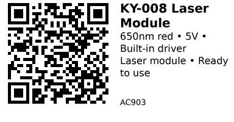

# KY-008 Laser Module - AC903

Ready-to-use red laser module with built-in current regulator. Simply apply 5V to emit a focused red beam. No external driver or current-limiting resistor needed. Perfect for quick laser projects, alignment tasks, line generation, and Arduino/ESP32 experiments.

**Safety:** Class 2 laser (<5mW) - avoid direct eye exposure.

## Links

- **Where to buy:** [AliExpress - KY-008 Laser Module](https://www.aliexpress.com/item/1005007567355579.html)
- **Tutorial:** [Arduino KY-008 Laser Tutorial](https://arduinomodules.info/ky-008-laser-transmitter-module/)

## Specifications

- **Wavelength:** 650nm (red)
- **Output Power:** <5mW (Class 2)
- **Operating Voltage:** 5V DC
- **Operating Current:** ~30-40mA
- **Built-in Driver:** Yes (current regulation included)
- **Beam Type:** Dot (circular spot)
- **PCB Size:** ~19mm × 15mm
- **Mounting Holes:** 2x mounting holes for M3 screws

## Pinout & Addresses

3-pin header:

- **S (Signal):** Not used / leave unconnected (some modules tie this to VCC internally)
- **Middle Pin (+):** 5V supply
- **- (GND):** Ground

**Note:** The "S" pin is a legacy from sensor modules - on laser modules it's typically just tied to VCC or unused. Connect only VCC and GND for normal operation.

## Wiring

**Direct connection (on/off via power):**

```
5V Supply → Module (+)
GND → Module (-)
S pin → leave unconnected
```

**ESP32 controlled (via MOSFET or relay):**

```
ESP32 GPIO → MOSFET Gate (through 1kΩ)
MOSFET Source → GND
5V Supply → Module (+)
Module (-) → MOSFET Drain
```

This allows ESP32 to turn laser on/off digitally.

**Alternative: Direct GPIO control (risky)**

Some users connect (+) to ESP32 GPIO directly, but this draws ~30-40mA which exceeds recommended GPIO current. Use MOSFET method above for safety.

## Safety Precautions

**⚠️ LASER SAFETY:**

1. **Never point at eyes, people, animals, or aircraft**
2. **Avoid reflective surfaces** - unexpected reflections can be hazardous
3. **Class 2 laser** - safe for brief exposure but not staring
4. **Use enclosures** for automated projects
5. **Check local regulations** for laser use

## Gotchas

- **S pin confusion:** Often labeled but not used - just connect VCC and GND
- **Power consumption:** ~30-40mA - don't drive from ESP32 GPIO directly
- **Always-on design:** Module is on whenever powered; use MOSFET for control
- **5V only:** Won't work well on 3.3V (dim or won't turn on)
- **Beam quality varies:** Cheap modules may have poor focus or alignment
- **No PWM dimming:** Built-in driver doesn't support PWM well (use on/off control)

## How to use

**Simple on/off control (ESP32 via MOSFET):**

```cpp
// Control KY-008 laser via MOSFET
// Wiring: See MOSFET wiring section above

const int LASER_PIN = 25;  // GPIO to MOSFET gate

void setup() {
  pinMode(LASER_PIN, OUTPUT);
  digitalWrite(LASER_PIN, LOW);  // laser off
}

void loop() {
  digitalWrite(LASER_PIN, HIGH);  // laser on
  delay(2000);
  digitalWrite(LASER_PIN, LOW);   // laser off
  delay(2000);
}
```

**Blink pattern (attention signal):**

```cpp
const int LASER_PIN = 25;

void setup() {
  pinMode(LASER_PIN, OUTPUT);
}

void blinkPattern() {
  // Three quick blinks
  for (int i = 0; i < 3; i++) {
    digitalWrite(LASER_PIN, HIGH);
    delay(100);
    digitalWrite(LASER_PIN, LOW);
    delay(100);
  }
}

void loop() {
  blinkPattern();
  delay(2000);
}
```

**Trigger-based laser (button activated):**

```cpp
const int LASER_PIN = 25;
const int BUTTON_PIN = 34;  // any input pin

void setup() {
  pinMode(LASER_PIN, OUTPUT);
  pinMode(BUTTON_PIN, INPUT_PULLUP);
  digitalWrite(LASER_PIN, LOW);
}

void loop() {
  if (digitalRead(BUTTON_PIN) == LOW) {
    digitalWrite(LASER_PIN, HIGH);  // laser on when button pressed
  } else {
    digitalWrite(LASER_PIN, LOW);   // laser off when button released
  }
  delay(10);
}
```

**Laser trip wire / beam break detector:**

```cpp
// Use KY-008 as transmitter, pair with photodiode/LDR as receiver
const int LASER_PIN = 25;
const int SENSOR_PIN = 34;  // photodiode/LDR ADC input
const int THRESHOLD = 2000;  // adjust based on calibration

void setup() {
  pinMode(LASER_PIN, OUTPUT);
  digitalWrite(LASER_PIN, HIGH);  // keep laser on
  Serial.begin(115200);
}

void loop() {
  int light_level = analogRead(SENSOR_PIN);

  if (light_level < THRESHOLD) {
    Serial.println("Beam broken!");
    // Trigger alarm, count objects, etc.
  }

  delay(100);
}
```

## Typical Applications

- **Alignment tool:** Level/align mechanical parts
- **Line generator:** With line lens attachment
- **Cat toy:** Safe Class 2 laser for pet entertainment
- **Trip wire sensor:** Beam break detection
- **Optical communication:** Simple line-of-sight data link
- **Target practice:** Laser pointer for aiming practice
- **Robotics:** Object detection, distance sensing (with receiver)

---

*QR for printing will appear here after you run the script:*


