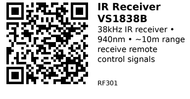

# VS1838B Infrared Receiver Module - RF301

38 kHz infrared receiver module for decoding remote control signals. Features integrated amplifier, filter, and demodulator. Perfect for remote control projects, universal remotes, and IR-controlled automation.

## Key Specifications

| Parameter | Value |
|-----------|-------|
| **Chip** | VS1838B (or compatible) |
| **Carrier frequency** | 38 kHz |
| **Wavelength** | 940 nm |
| **Reception angle** | ±45° |
| **Reception distance** | Up to 10 meters (typical) |
| **Supply voltage** | 2.7V - 5.5V |
| **Current** | ~1.5 mA |
| **Output** | Active LOW (inverted) |
| **Response time** | ~600 μs |

## Pinout

```
VS1838B Module
    ___
   | O |  IR receiver
   |___|
    |||
    |||
    VGS

V = VCC (2.7-5.5V)
G = GND
S = Signal OUT (active LOW)
```

**Some modules have different order:**
```
S G V  (Signal, GND, VCC)
or
G V S  (GND, VCC, Signal)
```

**Check markings on module!**

## Typical Wiring (ESP32)

```
ESP32           VS1838B
-----           -------
3.3V   -------> VCC
GND    -------> GND
GPIO15 -------> OUT (Signal)
```

## Example Code (ESP32)

```cpp
// ESP32 + VS1838B IR Receiver
// Install: IRremote library by shirriff/z3t0
#include <IRremote.h>

#define IR_RECEIVE_PIN 15

void setup() {
  Serial.begin(115200);
  IrReceiver.begin(IR_RECEIVE_PIN, ENABLE_LED_FEEDBACK);
  Serial.println("IR Receiver ready");
}

void loop() {
  if (IrReceiver.decode()) {
    Serial.print("Protocol: ");
    Serial.println(IrReceiver.decodedIRData.protocol);

    Serial.print("Address: 0x");
    Serial.println(IrReceiver.decodedIRData.address, HEX);

    Serial.print("Command: 0x");
    Serial.println(IrReceiver.decodedIRData.command, HEX);

    Serial.print("Raw: 0x");
    Serial.println(IrReceiver.decodedIRData.decodedRawData, HEX);

    Serial.println();

    IrReceiver.resume();  // Ready for next signal
  }
}
```

## Decode Remote Buttons

```cpp
void loop() {
  if (IrReceiver.decode()) {
    uint32_t code = IrReceiver.decodedIRData.decodedRawData;

    switch (code) {
      case 0xBA45FF00:  // Example: Power button
        Serial.println("POWER pressed");
        break;

      case 0xB847FF00:  // Example: Volume+
        Serial.println("VOLUME UP pressed");
        break;

      case 0xEA15FF00:  // Example: Volume-
        Serial.println("VOLUME DOWN pressed");
        break;

      default:
        Serial.print("Unknown button: 0x");
        Serial.println(code, HEX);
        break;
    }

    IrReceiver.resume();
  }
}
```

## Control LED with Remote

```cpp
#define LED_PIN 2

void loop() {
  if (IrReceiver.decode()) {
    uint32_t cmd = IrReceiver.decodedIRData.command;

    if (cmd == 0x45) {  // Power button
      digitalWrite(LED_PIN, !digitalRead(LED_PIN));  // Toggle
      Serial.println("LED toggled");
    }

    IrReceiver.resume();
  }
}
```

## Learn Remote Codes

```cpp
void setup() {
  Serial.begin(115200);
  IrReceiver.begin(IR_RECEIVE_PIN);

  Serial.println("IR Code Learning Tool");
  Serial.println("Press remote buttons to see codes...");
}

void loop() {
  if (IrReceiver.decode()) {
    Serial.println("===================");
    Serial.print("Protocol: ");

    switch (IrReceiver.decodedIRData.protocol) {
      case NEC: Serial.println("NEC"); break;
      case SONY: Serial.println("SONY"); break;
      case RC5: Serial.println("RC5"); break;
      case RC6: Serial.println("RC6"); break;
      case SAMSUNG: Serial.println("SAMSUNG"); break;
      default: Serial.println("UNKNOWN"); break;
    }

    Serial.print("Address: 0x");
    Serial.println(IrReceiver.decodedIRData.address, HEX);

    Serial.print("Command: 0x");
    Serial.println(IrReceiver.decodedIRData.command, HEX);

    Serial.print("Raw code: 0x");
    Serial.println(IrReceiver.decodedIRData.decodedRawData, HEX);

    IrReceiver.printIRResultShort(&Serial);
    Serial.println();

    IrReceiver.resume();
  }
}
```

## Handle Repeat Codes

Many remotes send repeat codes when button held:

```cpp
void loop() {
  if (IrReceiver.decode()) {
    if (IrReceiver.decodedIRData.flags & IRDATA_FLAGS_IS_REPEAT) {
      Serial.println("REPEAT");
    } else {
      // New button press
      Serial.print("New code: 0x");
      Serial.println(IrReceiver.decodedIRData.decodedRawData, HEX);
    }

    IrReceiver.resume();
  }
}
```

## Multi-Function Remote Control

```cpp
#define RELAY1_PIN 26
#define RELAY2_PIN 27
#define RELAY3_PIN 14

void loop() {
  if (IrReceiver.decode()) {
    uint8_t cmd = IrReceiver.decodedIRData.command;

    switch (cmd) {
      case 0x45:  // Button 1
        digitalWrite(RELAY1_PIN, !digitalRead(RELAY1_PIN));
        break;

      case 0x46:  // Button 2
        digitalWrite(RELAY2_PIN, !digitalRead(RELAY2_PIN));
        break;

      case 0x47:  // Button 3
        digitalWrite(RELAY3_PIN, !digitalRead(RELAY3_PIN));
        break;
    }

    IrReceiver.resume();
  }
}
```

## Key Features

**Integrated demodulator:**
- Amplifier + filter + demodulator in one
- Outputs clean digital signal
- No external components needed

**38 kHz carrier:**
- Standard frequency for consumer remotes
- Filters out ambient IR noise
- Works with most TV/AC remotes

**Wide angle:**
- ±45° reception cone
- Don't need precise aim
- Wall reflections work

**Low power:**
- ~1.5 mA consumption
- Always-on monitoring
- Battery-friendly

## Gotchas

1. **Active LOW output:** Output LOW when IR detected (inverted!)
2. **Direct sunlight:** Can overwhelm sensor (use indoors or shade)
3. **Protocol variations:** Different remotes use different protocols
4. **Pin order varies:** Check module markings (VGS vs SVG vs GVS)
5. **Range limited:** ~10m max, less through walls
6. **38 kHz only:** Won't work with non-standard frequencies

## Common IR Protocols

**NEC (most common):**
- Japanese standard
- Used by many manufacturers
- Easy to decode

**Sony SIRC:**
- Sony devices
- Variable bit length

**RC5/RC6:**
- Philips standard
- European devices

**Samsung:**
- Samsung TVs, ACs
- Similar to NEC

## IR Receiver vs RF Receiver

| Feature | IR (RF301) | RF 433MHz |
|---------|------------|-----------|
| **Range** | ~10m | ~100m+ |
| **Line-of-sight** | Required | Not required |
| **Through walls** | No | Yes |
| **Interference** | Sunlight | Other 433MHz devices |
| **Cost** | $0.30 | $1-2 |
| **Use case** | TV remote | Garage door, wireless sensors |

**Use IR when:**
- Indoor use
- Short range sufficient
- Line-of-sight acceptable
- Standard remote control

**Use RF when:**
- Outdoor use
- Long range needed
- Through-wall required

## Applications

**Universal remote:** Control multiple devices from one remote.

**Home automation:** IR-controlled lights, fans, appliances.

**IR repeater:** Extend range of existing remotes.

**Learning remote:** Record and replay commands.

**Smart home integration:** Control traditional devices from smart system.

## Troubleshooting

**No signal detected:**
- Check wiring (VCC/GND/Signal correct?)
- Verify pin order on module
- Remote batteries dead?
- Pointing at sensor?

**Sunlight interference:**
- Shield sensor from direct sunlight
- Move indoors or add shade
- Use different location

**Wrong codes received:**
- Different protocol (use learning mode)
- Interference from other IR sources
- Too far from sensor

**Intermittent reception:**
- Weak batteries in remote
- Too far away (move closer)
- Obstacles blocking path

## Links

- **AliExpress**: Search "VS1838B IR receiver" (~$0.30-0.50)

---


