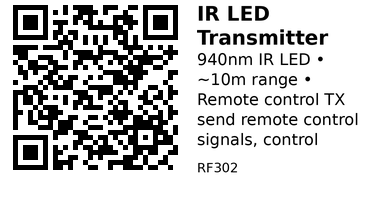

# Infrared LED Transmitter (940nm) - RF302

940nm infrared LED for transmitting IR remote control signals. Used with transistor driver circuit to control TVs, air conditioners, and other IR-controlled appliances. Pairs with IR receiver (RF301) for learning and replay.

## Key Specifications

| Parameter | Value |
|-----------|-------|
| **Type** | 5mm IR LED (940nm) |
| **Wavelength** | 940 nm (infrared, invisible) |
| **Forward voltage** | 1.2V - 1.4V |
| **Forward current** | 50mA (continuous), 1A (pulsed) |
| **Beam angle** | ~20-30° (typical) |
| **Range** | ~10 meters (with proper driver) |
| **Modulation** | 38 kHz carrier (standard) |

## How It Works

**IR transmission:**
1. MCU generates protocol-encoded signal (NEC, Sony, etc.)
2. Signal modulated at 38 kHz carrier frequency
3. Transistor switches IR LED on/off rapidly
4. LED emits invisible 940nm infrared pulses
5. Target device (TV, AC) receives and decodes

**Why transistor needed:**
- GPIO can't source enough current (~1A pulsed)
- Transistor amplifies current
- Allows multiple LEDs in parallel for more range

## Circuit

**Simple transistor driver:**

```
ESP32 GPIO ----[1kΩ]---- Base (2N2222 NPN)
                           |
                        Emitter --> GND
                           |
                        Collector --> IR LED cathode (-)
                                       |
                        IR LED anode (+) --> [100Ω] --> 3.3V
```

**Multiple LEDs for more range:**
```
                        Collector --> IR LED1 (-) ---[100Ω]--- 3.3V
                                  \-> IR LED2 (-) ---[100Ω]--- 3.3V
                                  \-> IR LED3 (-) ---[100Ω]--- 3.3V
```

## Typical Wiring (ESP32)

```
Component           Connection
---------           ----------
IR LED anode (+)    100Ω resistor to 3.3V
IR LED cathode (-)  2N2222 collector
2N2222 base         1kΩ resistor to GPIO25
2N2222 emitter      GND
```

**Polarity:**
- Longer leg = anode (+)
- Shorter leg = cathode (-)
- Flat side = cathode (-)

## Example Code (ESP32)

```cpp
// ESP32 + IR LED Transmitter
// Install: IRremote library by shirriff/z3t0
#include <IRremote.h>

#define IR_SEND_PIN 25

void setup() {
  Serial.begin(115200);
  IrSender.begin(IR_SEND_PIN);
  Serial.println("IR Transmitter ready");
}

void loop() {
  // Send NEC protocol command
  // Address: 0x00, Command: 0x45 (example: Power button)
  IrSender.sendNEC(0x00, 0x45, 0);

  Serial.println("Sent IR command");
  delay(2000);
}
```

## Send Learned Code

```cpp
void sendPowerButton() {
  // Example: TV power button (NEC protocol)
  uint32_t code = 0xBA45FF00;  // Code learned from receiver

  IrSender.sendNECRaw(code, 0);  // Send raw NEC code
  Serial.println("Power button sent");
}

void loop() {
  sendPowerButton();
  delay(5000);  // Send every 5 seconds
}
```

## Universal Remote Example

```cpp
void setup() {
  Serial.begin(115200);
  IrSender.begin(IR_SEND_PIN);
  Serial.println("Universal Remote");
  Serial.println("Commands: P=Power, V+=Vol+, V-=Vol-");
}

void loop() {
  if (Serial.available()) {
    char cmd = Serial.read();

    switch (cmd) {
      case 'P':  // Power
        IrSender.sendNEC(0x00, 0x45, 0);
        Serial.println("Power sent");
        break;

      case '+':  // Volume up
        IrSender.sendNEC(0x00, 0x46, 0);
        Serial.println("Volume+ sent");
        break;

      case '-':  // Volume down
        IrSender.sendNEC(0x00, 0x47, 0);
        Serial.println("Volume- sent");
        break;
    }
  }
}
```

## Learn and Replay

```cpp
// Combine with RF301 (receiver) to learn codes
uint32_t learnedCodes[10];
int codeCount = 0;

void learnMode() {
  Serial.println("Learning mode: Press remote buttons");

  for (int i = 0; i < 10; i++) {
    while (!IrReceiver.decode()) {
      delay(10);
    }

    learnedCodes[i] = IrReceiver.decodedIRData.decodedRawData;
    Serial.print("Learned button ");
    Serial.print(i);
    Serial.print(": 0x");
    Serial.println(learnedCodes[i], HEX);

    IrReceiver.resume();
    delay(1000);
  }

  Serial.println("Learning complete!");
}

void replayCode(int index) {
  if (index < 10) {
    IrSender.sendNECRaw(learnedCodes[index], 0);
    Serial.print("Replayed code ");
    Serial.println(index);
  }
}
```

## Control AC with Temperature

```cpp
void sendACPower() {
  IrSender.sendNEC(0x10, 0x12, 0);  // AC power (example code)
}

void sendACTemp(int temp) {
  // Most ACs use different codes for each temperature
  // Map temperature to command codes
  uint8_t tempCmd = map(temp, 16, 30, 0x20, 0x2E);  // Example mapping

  IrSender.sendNEC(0x10, tempCmd, 0);
  Serial.print("Set AC to ");
  Serial.print(temp);
  Serial.println("°C");
}

void loop() {
  float roomTemp = 28.5;  // Read from sensor

  if (roomTemp > 26.0) {
    sendACPower();       // Turn on AC
    delay(500);
    sendACTemp(22);      // Set to 22°C
    delay(60000);        // Wait 1 minute before next check
  }
}
```

## Multiple Devices Control

```cpp
void sendTVCommand(uint8_t cmd) {
  IrSender.sendNEC(0x00, cmd, 0);  // TV address 0x00
}

void sendACCommand(uint8_t cmd) {
  IrSender.sendNEC(0x10, cmd, 0);  // AC address 0x10
}

void sendStereoCommand(uint8_t cmd) {
  IrSender.sendSony(0x01, cmd, 2);  // Sony protocol for stereo
}

void loop() {
  // Turn everything off
  sendTVCommand(0x45);       // TV power
  delay(200);
  sendACCommand(0x12);       // AC power
  delay(200);
  sendStereoCommand(0x15);   // Stereo power

  Serial.println("All devices turned off");
  delay(10000);
}
```

## Increase Range

**Multiple LEDs in parallel:**
```cpp
// Hardware: 3 IR LEDs in parallel
// Each with own 100Ω resistor
// All cathodes to transistor collector
```

**Higher current:**
```cpp
// Use MOSFET instead of BJT for higher current
// IRLZ44N can handle >1A continuously
```

**Focused beam:**
```cpp
// Use IR LED with narrower beam angle (10-15°)
// Or add lens/reflector
```

## Key Features

**Invisible light:**
- 940nm wavelength (human eye can't see)
- Safe for continuous use
- Won't disturb people

**Wide compatibility:**
- Standard 38 kHz modulation
- Works with most consumer devices
- NEC, Sony, Samsung, etc. protocols

**Low cost:**
- IR LEDs very cheap (~$0.10)
- Simple circuit
- No complex hardware

**Direct MCU control:**
- Library handles modulation
- Just call sendNEC(), sendSony(), etc.
- Easy to use

## Gotchas

1. **Transistor required:** Direct GPIO connection won't work (insufficient current)
2. **Polarity matters:** LED won't work if reversed (no damage, just won't light)
3. **Resistor needed:** LED will burn out without current-limiting resistor
4. **Invisible light:** Can't see if working (use phone camera to check)
5. **Narrow beam:** Must aim at device (unlike RF which goes through walls)
6. **Device-specific codes:** Each brand/model has different codes

## Check If LED Works

**Camera test:**
1. Point phone camera at IR LED
2. Turn on IR LED
3. LED will appear purple/white on camera
4. Human eye sees nothing

Most phone cameras can see 940nm IR.

## IR LED vs RF Transmitter

| Feature | IR LED (RF302) | RF 433MHz |
|---------|----------------|-----------|
| **Range** | ~10m | ~100m+ |
| **Line-of-sight** | Required | Not required |
| **Through walls** | No | Yes |
| **Compatibility** | Standard (TV, AC) | Custom only |
| **Cost** | $0.10 (just LED) | $1-2 (module) |

**Use IR when:**
- Controlling consumer appliances
- Indoor use
- Standard remote protocols
- Low cost critical

**Use RF when:**
- Through-wall needed
- Long range required
- Custom applications

## Applications

**Universal remote:** Control TV, AC, stereo from one device.

**Home automation:** Scheduled AC control, TV automation.

**Voice-controlled remote:** Alexa/Google → IR commands.

**Smartphone remote:** WiFi → ESP32 → IR LED → TV.

**Smart thermostat:** Auto-control AC based on temperature.

**IR blaster:** Multi-room control with multiple LEDs.

## Troubleshooting

**LED not working:**
- Check polarity (anode to +, cathode to -)
- Verify transistor wiring
- Test with camera (LED should glow on screen)
- Check resistor value (should be ~100Ω)

**Short range:**
- Add more LEDs in parallel
- Use MOSFET for higher current
- Check LED is 940nm (not 850nm)
- Aim directly at device

**Device not responding:**
- Wrong code/protocol
- Learn codes from original remote
- Device not in line-of-sight
- LED beam too narrow (add more LEDs)

**Multiple commands sent:**
- Add delay between sends (200-500ms)
- Some protocols send repeat codes (normal)

---


