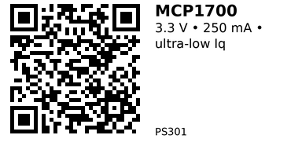

# MCP1700-3302E/TO — PS301

**Part:** Microchip **MCP1700-3302E/TO** (fixed 3.3 V, TO-92)
**Type:** CMOS LDO regulator

## Quick Facts (from datasheet)
- **Input range:** **2.3–6.0 V** (and must satisfy VIN ≥ (VOUT×1.03) + Vdropout)
- **Output:** **3.3 V** fixed (-3302 accuracy grade), **±2%** (device grade)
- **Max output current:** **250 mA**
- **Dropout:** **178 mV typ @ 250 mA**, **350 mV max @ 250 mA**
- **Quiescent current:** **1.6 µA typ** (no load)
- **PSRR:** ~**44 dB @ 100 Hz** (COUT=1 µF, IL=50 mA)
- **Caps (stable operation):** Use **1 µF ceramic on IN and OUT (X7R)** as baseline test conditions
- **Protections:** Over-current, over-temperature, short-circuit (per vendor datasheet)
- **Package:** **TO-92-3** (MCP1700-3302E/TO)

## Wiring Notes
- Place **CIN ~1 µF** near **VIN**, **COUT ~1 µF** near **VOUT** (ceramic, X7R). Keep return paths short.

## Links
- **Where to buy:** [AliExpress](https://www.aliexpress.com/item/1005005343871002.html)
- **Datasheet (Microchip):** [PDF](https://www.mouser.com/datasheet/3/282/1/MCP1700-Data-Sheet-20001826F.pdf)
- **Product page / key params:** [Microchip](https://www.microchip.com/en-us/product/MCP1700), [Digi-Key](https://www.digikey.com/en/products/detail/microchip-technology/MCP1700-3302E-TO/652680)

---

*QR for printing will appear after you run the script:*

