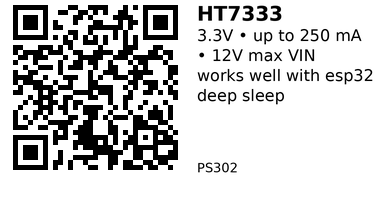

# HT7333 — PS302

**Part:** Holtek **HT7333** (HT73xx series, 3.3 V version)  
**Type:** Low-power high-voltage CMOS LDO

This one will handle better esp32 spikes and avoid brownout

## Quick Facts (from datasheet)
- **Input range:** up to **12 V** (HT73xx series)
- **Output:** **3.3 V** fixed (**HT7333**)
- **Max output current:** **250 mA** (VIN=4.3 V, VOUT ≥ 2.97 V)
- **Dropout (typ):** **~90 mV @ 40 mA** (HT7333) — rises with load current
- **Quiescent current:** **3.5 µA typ**, **7 µA max** (no load)
- **Line regulation:** **0.2–0.3 %/V** (typ/max around VIN ranges shown)
- **Packages (series):** **SOT-89-3**, 8SOP-EP (module listings commonly use SOT-89-3)

## Wiring Notes
- Use appropriate input/output capacitors per the Holtek datasheet (typical SOT-89 application uses small ceramics on IN/OUT). If you need exact values for your package/revision, tell me the **package code and marking** so I can pull the specific table.

## Links
- **Where to buy:** [AliExpress](https://aliexpress.com/item/1005005945684499.html)
- **Datasheet (Holtek HT73xx series):** [PDF](https://www.holtek.com/webapi/116711/HT73xxv180.pdf)  
  **30 V variant (HT73xx-1):** [PDF](https://www.holtek.com/webapi/116711/HT73xx-1v120.pdf)

---

*QR for printing will appear after you run the script:*

