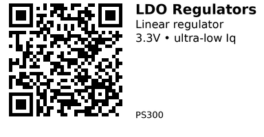

# LDO Regulators - PS300

Low dropout linear voltage regulators for clean, low-noise 3.3V power delivery. Ideal for battery-powered applications where ultra-low quiescent current extends runtime.

## Comparison

| Component | Output | Max Input | Max Current | Quiescent Current | Package | Best For |
|-----------|--------|-----------|-------------|-------------------|---------|----------|
| [PS301](PS301.md) | 3.3V | 6V | 250mA | 1.6µA | TO-92 | Ultra-low power, battery projects |
| [PS302](PS302.md) | 3.3V | 12V | 250mA | 3.5µA | SOT-89 | Higher input voltage, ESP32 deep sleep |

## Selection Guide

**[PS301 - MCP1700](PS301.md):** Choose when you need absolute minimum quiescent current (1.6µA) for battery life. Works with 5V or lower input.

**[PS302 - HT7333](PS302.md):** Choose when input voltage is 7-12V, or when you need better handling of ESP32 current spikes during WiFi transmission.

## Common Applications

**Battery-powered sensors:** Use PS301 for ultra-low sleep current in coin cell or AA battery projects with sensors that wake periodically.

**ESP32 deep sleep projects:** Use PS302 to handle WiFi transmission spikes (up to 240mA) and maintain stable 3.3V during brownout-sensitive operations.

**5V to 3.3V conversion:** Use PS301 when stepping down from USB 5V or 3xAA batteries (4.5V) to power 3.3V microcontrollers.

---

## Components in This Family

{{ children() }}

---

*QR for printing will appear here after you run the script:*

