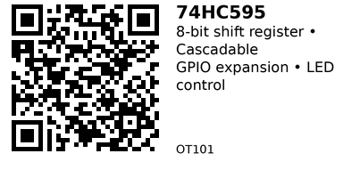

# 74HC595 8-Bit Shift Register - OT101

An 8-bit serial-in, parallel-out shift register with latched 3-state outputs. Use it to expand GPIO pins: control 8 outputs using only 3 microcontroller pins. Can cascade multiple chips for virtually unlimited expansion (16, 24, 32+ outputs). Common for LED matrices, 7-segment displays, and general GPIO expansion when you run out of pins.

## Key Specifications

- **Supply Voltage**: 2.0V - 6.0V (works with 3.3V and 5V logic)
- **Outputs**: 8 parallel latched outputs (3-state capable)
- **Input**: Serial data in (SPI-compatible)
- **Clock Frequency**: Up to 55 MHz @ 5V
- **Output Current**: ±6 mA typical per pin (20 mA absolute max, not recommended continuously)
- **Package**: 16-pin DIP (common), also available in SOIC/TSSOP
- **Cascading**: Q7' serial output for daisy-chaining multiple ICs

## Pinout

| Pin | Name | Description |
|-----|------|-------------|
| 1-7, 15 | Q0-Q7 | Parallel data outputs (Q0 is pin 15) |
| 8 | GND | Ground |
| 9 | Q7' | Serial data output (for cascading) |
| 10 | MR (CLR) | Master reset (active LOW) |
| 11 | SHCP (SRCLK) | Shift register clock (SPI SCK) |
| 12 | STCP (RCLK) | Storage register clock (latch pin) |
| 13 | OE | Output enable (active LOW) |
| 14 | DS (SER) | Serial data input (SPI MOSI) |
| 16 | VCC | Power supply (2.0-6.0V) |

**Notes:**

- Pin names vary by manufacturer (SHCP=SRCLK, STCP=RCLK, DS=SER)
- MR (master reset) should be HIGH during normal operation (tie to VCC)
- OE (output enable) should be LOW for outputs to be active (tie to GND)

## Wiring

### Basic Connection (ESP32)

```
74HC595    ESP32
--------   ------
VCC    --> 3.3V (or 5V if available)
GND    --> GND
DS     --> GPIO 23 (MOSI/Data)
SHCP   --> GPIO 18 (SCK/Clock)
STCP   --> GPIO 5 (Latch/CS)
MR     --> VCC (or GPIO for reset control)
OE     --> GND (or GPIO for enable control)
Q0-Q7  --> LEDs/devices (with current-limiting resistors)
```

**For cascading:** Connect Q7' (pin 9) of first IC to DS (pin 14) of second IC. Share SHCP, STCP, MR, OE between all ICs.

## Usage Notes

### When to Use

**Use this component when:**

- Need to expand GPIO pins (control 8+ outputs with only 3 pins)
- Driving LEDs, 7-segment displays, or LED matrices
- Controlling relays or other digital outputs
- Want to cascade for 16, 24, 32+ outputs

**Don't use when:**

- Need bidirectional I/O (this is output-only; use IO301 MCP23017 for I2C GPIO expansion)
- Need individual pin control in real-time (all pins update simultaneously on latch)
- Outputs require >6 mA continuous current (use transistor/MOSFET drivers)

### Common Issues

- **Outputs flicker during data shift:** This is normal. Use STCP (latch) to update all outputs simultaneously after shifting is complete.
- **Cascaded ICs not working:** Ensure Q7' of first IC connects to DS of second IC, and all clocks/control pins are shared.
- **Outputs stay off:** Check that OE (pin 13) is LOW. If tied HIGH, outputs are disabled.
- **Outputs dim/unstable:** Don't exceed ±6 mA per output. Use external transistors/drivers for higher currents.

## Code Examples

### Arduino/ESP32

```cpp
// 74HC595 shift register example - drive 8 LEDs
const int dataPin  = 23;  // DS (MOSI)
const int clockPin = 18;  // SHCP (SCK)
const int latchPin = 5;   // STCP (latch)

void setup() {
  pinMode(dataPin, OUTPUT);
  pinMode(clockPin, OUTPUT);
  pinMode(latchPin, OUTPUT);

  digitalWrite(latchPin, LOW);  // Initialize latch
}

void writeShiftRegister(uint8_t value) {
  digitalWrite(latchPin, LOW);  // Prepare to receive data
  shiftOut(dataPin, clockPin, MSBFIRST, value);  // Shift out 8 bits
  digitalWrite(latchPin, HIGH); // Latch data to outputs
}

void loop() {
  // Knight Rider pattern
  for (int i = 0; i < 8; i++) {
    writeShiftRegister(1 << i);  // Shift LED left
    delay(100);
  }
  for (int i = 6; i >= 1; i--) {
    writeShiftRegister(1 << i);  // Shift LED right
    delay(100);
  }
}
```

### Cascading Multiple ICs (16 outputs)

```cpp
// Control 16 outputs with 2 cascaded 74HC595s
void writeCascaded(uint16_t value) {
  digitalWrite(latchPin, LOW);
  shiftOut(dataPin, clockPin, MSBFIRST, (value >> 8) & 0xFF);  // Second IC (high byte)
  shiftOut(dataPin, clockPin, MSBFIRST, value & 0xFF);         // First IC (low byte)
  digitalWrite(latchPin, HIGH);
}

void loop() {
  writeCascaded(0b1010101010101010);  // Alternating pattern across 16 outputs
  delay(500);
  writeCascaded(0b0101010101010101);  // Inverse pattern
  delay(500);
}
```

## Links

- [Datasheet: Texas Instruments SN74HC595](https://www.ti.com/lit/ds/symlink/sn74hc595.pdf)
- [Purchase: AliExpress 74HC595](https://www.aliexpress.com/w/wholesale-74hc595.html)
- [Tutorial: 74HC595 Arduino Guide (Components101)](https://components101.com/ics/74hc595-shift-register-pinout-datasheet)
- [Tutorial: Adafruit 74HC595 Guide](https://learn.adafruit.com/74hc595/)

---


