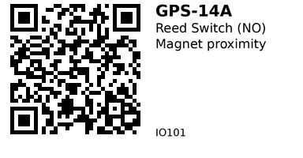

# Reed Switch — Magnetic Contact Sensor (Normally Open) — IO001

**What it is:** A passive **dry-contact** switch sealed in glass. A nearby magnet brings two ferromagnetic reeds together to **close** the circuit (for NO type). No polarity, no electronics, no power required.

> This page covers the common **Normally Open (NO)** reed switch. 

---

## Links
- **Where to buy:** [AliExpress](https://www.aliexpress.com/item/10000001201858.html)
- **Datasheets:** [Datasheet](https://www.exrayhk.com/uploads/e1cf54c7.pdf)

## Description

* **Material:** Plastic+Metal
* **Color:** Black+Gold
* **Model:** GPS-14A
* **Max. Contact Rating:** 10 W
* **Max. Switching Voltage:** 100V DC
* **Max. Switching Current:** 0.5 A
* **Min. Breakdown Voltage:** 150V DC
* **Max. Initial Contact Resistance:** 100mΩ (not include the wire)
* **Max. Release Time:** 0.3 ms
* **Max. Operate Time:** 1.0 ms
* **Total length:** 41.8mm/1.65"
* **Size:** 14x2.7mm/0.55x0.11"

---

## Pinout
Two leads, **no polarity**. Use heatshrink for strain relief.

---

## Wiring to ESP32 (NO reed → active LOW)
**Goal:** Close to GND when magnet present; otherwise read HIGH via pull-up.

```
ESP32 3.3V  ───(internal or 10k)───┐
                                   │
ESP32 GPIO  ◀───────────────────────┘─── REED ─── GND
```

- Use `pinMode(pin, INPUT_PULLUP)` or add a **10 kΩ** to 3.3 V.  
- When the magnet closes the reed, GPIO reads **LOW**; open = **HIGH**.  
- Wires long or noisy? Add **RC** near the ESP32: **1 kΩ in series** with GPIO and **100 nF** from GPIO to **GND** (or 10–100 nF across the reed).

---

## Minimal Code (Arduino / ESP32)
```cpp
const int REED_PIN = 14; // wire to any input-capable GPIO

void setup() {
  Serial.begin(115200);
  pinMode(REED_PIN, INPUT_PULLUP); // open = HIGH, closed = LOW
}

void loop() {
  bool closed = (digitalRead(REED_PIN) == LOW);
  Serial.println(closed ? "MAGNET CLOSE" : "open");
  delay(50); // simple debounce; for better, see below
}
```

### Debounced Version
```cpp
const int REED_PIN = 14;
const unsigned long DEBOUNCE_MS = 20;
bool state = false;            // stable state
bool lastRead = true;          // last raw read (true=open)
unsigned long lastEdge = 0;

void setup() {
  Serial.begin(115200);
  pinMode(REED_PIN, INPUT_PULLUP);
}

void loop() {
  bool raw = (digitalRead(REED_PIN) == LOW); // true when closed
  if (raw != lastRead) { lastRead = raw; lastEdge = millis(); }
  if ((millis() - lastEdge) >= DEBOUNCE_MS && raw != state) {
    state = raw;
    Serial.println(state ? "MAGNET CLOSE" : "open");
  }
}
```

---

## Using as End‑stop / Door Sensor
- Mount the reed **fixed** and the magnet on the **moving** part.  
- Align the magnet **lengthwise** to the reed for best sensitivity; adjust gap.  

---

## Using for RPM / Index
- Glue a small magnet on the rotating part; place reed nearby.  
- Each closure = one pulse. Use the debounce version, or hardware RC.  
- At high RPM, a **Hall sensor** (A3144E) gives cleaner, bounce‑free edges.

---

## Notes
- Magnetic field from neodymium magnets can be strong—avoid placing near compasses or magnetic sensors unintentionally.  
- If switching anything beyond MCU inputs (e.g., a relay coil), add a **flyback diode** across the load and ensure the reed’s **switching current** rating is respected.

---

*QR placeholder:*


