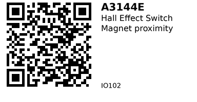

# A3144E Hall-Effect Switch — IO002

**Package:** TO‑92 (no PCB, no LED, no resistors)  
**Type:** Unipolar Hall‑effect **switch** (digital on/off) with **open‑collector** NPN output.

---

## Links
- **Where to buy:** [AliExpress](https://www.aliexpress.com/item/1005008248126536.html)
- **Datasheets:** [Datasheet](https://robot-kit.ru/wa-data/public/blog/download/3144E_Datasheet.pdf) 

## Can I wire it directly to an ESP32 GPIO?
**Yes, for reading**, but mind two rules:

1) **Power the A3144E from 5 V (min 4.5 V).** It is **not** a 3.3 V part.  
2) **Pull the OUT pin up to 3.3 V (not 5 V)** before feeding it to the ESP32.  
   - Because the output is **open‑collector (a switch to GND)**, you choose the pull‑up voltage. Using **3.3 V** keeps the ESP32 safe.  
   - The ESP32's internal pull‑up (~45–50 kΩ) often works at low speed, but an **external 10 kΩ to 3.3 V** is **recommended** for clean edges and noise immunity.

> Summary: **VCC=5 V**, **OUT → 10 kΩ → 3.3 V**, and read OUT on a GPIO with input mode. Common GND.

---

## Quick Specs (bare die)
- **VCC operating:** **4.5–24 V** (spec).  
- **ICC:** ~4–9 mA (typ range).  
- **Output:** Open‑collector (active **LOW** when magnet present).  
- **Sink current:** up to **25 mA** (max).  
- **Vout(sat):** ~0.2–0.4 V @ 20 mA.  
- **Magnetic thresholds (25 °C):** B<sub>OP</sub> ≈ 70…350 G; B<sub>RP</sub> ≈ 50…330 G (bin‑dependent).  
- **Temp (E suffix):** −40…+85 °C.

> Because it’s **unipolar**, only one magnet pole triggers on the branded/flat face. Flip the magnet if you don’t see switching.

---

## Pinout (TO‑92 • flat/branded face toward you, leads down)
1. **VCC** — 5 V (allowed 4.5–24 V)  
2. **GND** — Ground  
3. **OUT** — Open‑collector output (sinks to GND when triggered)

```
   [flat face]
   VCC | GND | OUT
```

---

## Minimal wiring to ESP32 (bare sensor)

```
A3144E (TO‑92)                 ESP32
┌─────────────┐
│   VCC  ─────┼── 5V
│   GND  ─────┼── GND ────────────────┐
│   OUT  ─────┼─────┬──────── GPIO27  │
└─────────────┘     │                 │
                    └─ 10k ─→ 3.3V ───┘  (pull‑up to 3.3V)
```

- Keep wires short, twist **OUT** with **GND** if noisy.  
- Distance to magnet depends on magnet strength; start at 1–5 mm.

---

## Example 1 — Simple on/off (ESP32 / Arduino)
```cpp
// Bare A3144E on ESP32, OUT pulled up to 3.3V via 10k resistor.
// Sensor powered from 5V. Common ground with ESP32.

const int HALL_PIN = 27;

void setup() {
  Serial.begin(115200);
  pinMode(HALL_PIN, INPUT); // external 10k pull-up to 3.3V is used
}

void loop() {
  bool active = (digitalRead(HALL_PIN) == LOW); // LOW => magnet present
  Serial.println(active ? "MAGNET" : "no magnet");
  delay(100);
}
```

> If you omit the external 10k, you can try `INPUT_PULLUP` and rely on the internal ~47k. It often works for slow events, but a **physical 10k** gives better noise immunity and cleaner RPM readings.

---

## Example 2 — RPM (1 magnet on shaft)
```cpp
// Counts falling edges from A3144E to compute RPM.
// Wiring identical to Example 1 (5V VCC, 10k to 3.3V on OUT).

const int HALL_PIN = 26;
volatile uint32_t pulses = 0;

void IRAM_ATTR onPulse() { pulses++; }

void setup() {
  Serial.begin(115200);
  pinMode(HALL_PIN, INPUT);
  attachInterrupt(digitalPinToInterrupt(HALL_PIN), onPulse, FALLING);
}

void loop() {
  uint32_t t0 = millis(), c0;
  noInterrupts(); c0 = pulses; interrupts();
  delay(1000);
  uint32_t t1 = millis(), c1;
  noInterrupts(); c1 = pulses; interrupts();

  float seconds = (t1 - t0) / 1000.0f;
  float rpm = ((c1 - c0) / seconds) * 60.0f; // 1 pulse per rev
  Serial.printf("RPM: %.1f\n", rpm);
}
```

---

## Notes & gotchas
- **Do not** tie OUT to 5 V; always use a **resistor pull‑up** (3.3 V for ESP32).  
- The A3144E is **not 3.3 V rated**; running at 3.3 V may appear to work on some clones but is **out of spec**.  
- For long cables or high EMI, add **0.01–0.1 µF** from **OUT to 3.3 V** near the ESP32 to tame spikes (forms RC with 10k).  
- For very fast RPM, reduce pull‑up to **4.7 kΩ** (sharper edges, slightly higher current).

---

*QR for printing will appear here after you run the script:*


