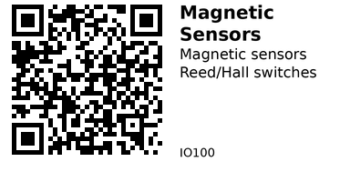

# Magnetic Sensors - IO100

Magnetic proximity sensors for contactless switching. Choose between passive reed switches (no power needed) and active Hall-effect sensors (bounce-free, solid-state).

## Components in This Family

{{ children() }}

---

## Comparison: Reed vs Hall

| Aspect | [IO101 - Reed Switch](IO101.md) | [IO102 - A3144E Hall](IO102.md) |
|---|---|---|
| Power needed | **None** | **Yes** (≥4.5 V) |
| Output type | Dry contact (polarity‑free) | Open‑collector (active LOW) |
| Bounce | **Yes** (needs debounce) | No (clean edges) |
| Speed | Low–medium | Medium–high |
| Distance/pole | Non‑polarity, needs sufficient field | **Unipolar**; sensitive face/pole matters |
| Robustness | Glass capsule, shock sensitive | Solid‑state |
| Price | Very cheap | Cheap |

## Selection Guide

**[IO101 - Reed Switch](IO101.md):** Choose for battery-off operation, simple door/window sensors, or end-stops. No power consumption, completely passive.

**[IO102 - A3144E Hall Effect](IO102.md):** Choose for RPM sensing, noisy environments, or when you need bounce-free clean edges. Solid-state reliability.

## Common Applications

**Door/window sensors:** Use IO101 (Reed) for ultra-low power installations - works even when system is off.

**RPM/speed sensing:** Use IO102 (Hall) for motor tachometers, wheel encoders, or rotation counters with clean digital output.

**End-stops/limit switches:** Either works, but IO101 (Reed) is simpler for 3D printers or CNC machines with moving magnets.

**Proximity detection:** IO102 (Hall) for industrial/automotive applications needing solid-state reliability and noise immunity.

---

*QR for printing will appear here after you run the script:*

