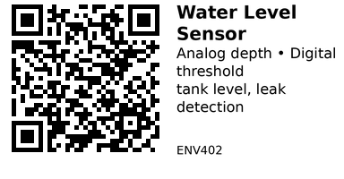

# Water Level Detection Sensor Module - ENV402

Simple water level sensor with exposed conductive traces. Detects presence and depth of water through analog voltage output. Useful for tank level monitoring, leak detection, and flood sensors.

## Key Specifications

| Parameter | Value |
|-----------|-------|
| **Supply voltage** | 3.0V - 5V |
| **Output type** | Analog (0-3V) + Digital (threshold) |
| **Sensing area** | ~40mm x 16mm (typical) |
| **Detection depth** | ~40mm (variable resolution) |
| **Operating temp** | 10°C to 30°C |
| **Current** | <20mA |

## How It Works

**Exposed parallel traces:**
- Multiple conductive lines on PCB
- Water bridges the traces
- More submersion = lower resistance = higher voltage
- Analog voltage proportional to water depth

## Pinout

```
Water Level Sensor Module
      ___
     |   |
     | S |  Sensing area
     | E |  (exposed traces)
     | N |
     | S |
     | O |
     | R |
     |___|
      | | | |
      S + - -
      V A D G
      C O O N
      C   U D
          T

S/VCC = Power (3.0-5V)
+     = (sometimes duplicate VCC)
AO    = Analog Output (water level voltage)
DO    = Digital Output (threshold)
-/GND = Ground
```

## Typical Wiring (ESP32)

```
ESP32           Water Level Sensor
-----           ------------------
3.3V   -------> VCC (or S)
GND    -------> GND
GPIO34 -------> AO (Analog Out)
GPIO25 -------> DO (Digital Out, optional)
```

**Power switching recommended:** Use transistor/MOSFET to control VCC.

## Example Code (ESP32)

```cpp
// ESP32 + Water Level Sensor
#define WATER_LEVEL_PIN 34   // Analog input
#define POWER_PIN 25         // Power control (optional)

void setup() {
  Serial.begin(115200);
  pinMode(POWER_PIN, OUTPUT);
  digitalWrite(POWER_PIN, LOW);
  analogSetAttenuation(ADC_11db);  // 0-3.3V range
}

int readWaterLevel() {
  // Power ON sensor
  digitalWrite(POWER_PIN, HIGH);
  delay(50);  // Stabilize

  // Read sensor
  int reading = analogRead(WATER_LEVEL_PIN);

  // Power OFF (prevent corrosion)
  digitalWrite(POWER_PIN, LOW);

  return reading;
}

void loop() {
  int waterLevel = readWaterLevel();

  // Calibrate these values for your sensor
  int dryValue = 0;      // ADC when dry (no water)
  int maxValue = 2800;   // ADC when fully submerged

  // Convert to percentage
  int levelPercent = map(waterLevel, dryValue, maxValue, 0, 100);
  levelPercent = constrain(levelPercent, 0, 100);

  if (levelPercent > 10) {
    Serial.printf("Water detected! Level: %d%% (ADC: %d)\n", levelPercent, waterLevel);
  } else {
    Serial.println("No water detected");
  }

  delay(1000);
}
```

## Calibration

**Step 1 - Dry reading:**
```cpp
// Sensor in air (no water)
// ADC typically reads 0-100
int dryValue = 50;
```

**Step 2 - Maximum submersion:**
```cpp
// Sensor fully submerged in water
// ADC typically reads 2000-3000
int maxValue = 2800;
```

**Step 3 - Depth steps (optional):**
```cpp
// Measure at 1cm, 2cm, 3cm depths
// Create lookup table for accurate depth
int depth1cm = 800;
int depth2cm = 1600;
int depth3cm = 2400;
```

## Key Features

**Analog output:**
- Voltage increases with water depth
- Gradual response (proportional)
- Can measure approximate depth

**Digital output:**
- ON/OFF threshold detection
- Adjustable sensitivity (potentiometer)
- Simple binary detection

## Gotchas

1. **Corrosion:** Exposed metal traces corrode rapidly - use power switching!
2. **Water quality:** Dirty/salty water gives different readings than clean water
3. **Orientation:** Sensor must be vertical for accurate depth measurement
4. **Condensation:** Humidity can trigger false positives
5. **Short lifespan:** Corrosion limits sensor life to months (with constant power) or years (with switching)
6. **Temperature:** Readings vary with water temperature

## Power Switching Circuit

**Recommended:** Control sensor power with GPIO to prevent corrosion

```
ESP32 GPIO --> Base (NPN transistor)
                 |
               Emitter --> GND
                 |
              Collector --> Sensor VCC
                             |
                          3.3V --> Sensor through transistor
```

Or use MOSFET (e.g., 2N7000, BS170) for simpler circuit.

## Applications

**Water tank level:** Monitor tank fill level for pumps/alarms.

**Leak detection:** Detect basement flooding, pipe leaks.

**Rain gauge:** Measure accumulated rainfall depth.

**Sump pump:** Trigger pump when water reaches threshold.

**Aquarium:** Detect low water level for auto top-off.

**Washing machine:** Overflow detection.

## Leak Detection Example

```cpp
#define WATER_PIN 34
#define ALARM_PIN 26  // Buzzer or LED

void loop() {
  int waterLevel = readWaterLevel();

  if (waterLevel > 500) {  // Water detected threshold
    Serial.println("LEAK DETECTED!");
    digitalWrite(ALARM_PIN, HIGH);  // Activate alarm
  } else {
    digitalWrite(ALARM_PIN, LOW);
  }

  delay(5000);  // Check every 5 seconds
}
```

## Tank Level Monitoring

```cpp
#define EMPTY_VALUE 100
#define FULL_VALUE 2800

void loop() {
  int level = readWaterLevel();
  int tankPercent = map(level, EMPTY_VALUE, FULL_VALUE, 0, 100);
  tankPercent = constrain(tankPercent, 0, 100);

  Serial.printf("Tank Level: %d%%\n", tankPercent);

  if (tankPercent < 20) {
    Serial.println("WARNING: Tank almost empty!");
  } else if (tankPercent > 90) {
    Serial.println("Tank full - stop filling");
  }

  delay(10000);  // Check every 10 seconds
}
```

## Sensor Placement

**Vertical orientation:**
- Mount sensor vertically for depth measurement
- Water level rises along traces

**Horizontal:** Only detects presence, not depth

**Protection:**
- Consider waterproof enclosure with sensor exposed
- Prevent mechanical damage
- Keep electronics dry (only sensing area in water)

## Alternatives

**Float switch:**
- More durable for tank level
- Binary only (full/empty)
- No analog depth measurement

**Ultrasonic sensor (HC-SR04):**
- Non-contact measurement
- Measures distance to water surface
- More expensive, more accurate

**Pressure sensor:**
- Measures water column pressure
- Very accurate for depth
- More expensive

## Troubleshooting

**Always reads "water detected":**
- Sensor corroded/shorted
- High humidity condensation
- Check dry reading (should be ~0-100)

**Never detects water:**
- Sensor damaged
- Wrong pin assignment
- Check voltage output with multimeter

**Inconsistent readings:**
- Corrosion starting
- Water quality varies (minerals)
- Temperature changes

## Maintenance

**Regular cleaning:**
- Wipe traces with dry cloth monthly
- Remove mineral deposits
- Check for corrosion

**Replacement:**
- With constant power: 3-6 months
- With power switching: 1-2 years
- Signs: erratic readings, visible corrosion

## Links

- **AliExpress**: Search "water level sensor module" (very common, $1-2)

---


