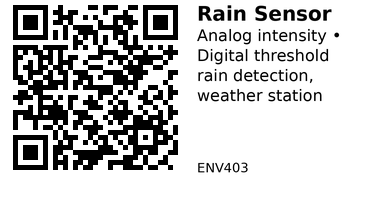

# Rain Detection Sensor Module - ENV403

Rain detection sensor with exposed conductive pads. Detects rainfall and measures intensity through resistance change when water hits the sensing board. Perfect for weather stations, automatic sprinkler control, and window closing automation.

## Key Specifications

| Parameter | Value |
|-----------|-------|
| **Supply voltage** | 3.3V - 5V |
| **Output type** | Analog (0-3V) + Digital (threshold) |
| **Sensing area** | ~50mm x 40mm (typical) |
| **Detection** | Raindrop presence + intensity |
| **Operating temp** | -10°C to 70°C |
| **Response time** | Immediate (<1 second) |

## How It Works

**Exposed parallel traces:**
- Interdigitated conductive pattern on PCB
- Water (rain) bridges the gaps
- More water = lower resistance = higher voltage
- Light rain = low voltage, heavy rain = high voltage

## Components

Most rain sensor modules come in **2 parts:**

1. **Sensing board:** Exposed traces that detect rain (outdoor)
2. **Control module:** Electronics with threshold adjustment (indoor/protected)

Connected by 3-4 wire cable.

## Pinout

**Control Module:**

```
Rain Sensor Module
      ___
     |   |
     |___|
      | | | |
      V A D G
      C O O N
      C   U D
          T

VCC  = Power (3.3-5V)
AO   = Analog Output (rain intensity)
DO   = Digital Output (threshold trigger)
GND  = Ground
```

**Sensing Board:** Just connects to control module (2 wires).

## Typical Wiring (ESP32)

```
ESP32           Rain Sensor (Control Module)
-----           ----------------------------
3.3V   -------> VCC
GND    -------> GND
GPIO34 -------> AO (Analog Out - intensity)
GPIO25 -------> DO (Digital Out - threshold)
```

**Sensing board:** Mount outdoors, exposed to sky.
**Control module:** Keep dry (indoors or weatherproof enclosure).

## Example Code (ESP32)

```cpp
// ESP32 + Rain Sensor
#define RAIN_ANALOG_PIN 34   // Analog - intensity
#define RAIN_DIGITAL_PIN 25  // Digital - threshold

void setup() {
  Serial.begin(115200);
  pinMode(RAIN_DIGITAL_PIN, INPUT);
  analogSetAttenuation(ADC_11db);  // 0-3.3V range
}

void loop() {
  // Read analog (rain intensity)
  int rainIntensity = analogRead(RAIN_ANALOG_PIN);

  // Read digital (threshold)
  bool isRaining = digitalRead(RAIN_DIGITAL_PIN);

  // Calibrate these values for your sensor
  int dryValue = 3000;      // ADC when dry
  int wetValue = 500;       // ADC in heavy rain

  // Convert to percentage (0% = dry, 100% = heavy rain)
  int rainPercent = map(rainIntensity, dryValue, wetValue, 0, 100);
  rainPercent = constrain(rainPercent, 0, 100);

  if (isRaining) {
    Serial.printf("RAIN DETECTED! Intensity: %d%% (ADC: %d)\n",
                  rainPercent, rainIntensity);
  } else {
    Serial.println("No rain (dry)");
  }

  delay(1000);
}
```

## Calibration

**Step 1 - Dry reading:**
```cpp
// Sensing board completely dry
// ADC typically reads 3000-4000 (high when dry)
int dryValue = 3200;
```

**Step 2 - Wet reading:**
```cpp
// Spray water on sensing board (simulate rain)
// ADC drops to 500-1500 (low when wet)
int wetValue = 800;
```

**Note:** Unlike other sensors, rain sensor voltage is HIGH when dry, LOW when wet!

## Key Features

**Analog output:**
- Higher voltage = DRY
- Lower voltage = WET (more rain)
- Can measure rain intensity

**Digital output:**
- Binary ON/OFF detection
- Adjustable threshold via potentiometer
- Simple rain/no-rain signal

**Two-part design:**
- Sensing board outdoors
- Electronics indoors/protected
- Connected by cable

## Gotchas

1. **Inverted logic:** HIGH = dry, LOW = wet (opposite of moisture sensors!)
2. **Evaporation:** Sensor stays wet after rain stops until water evaporates
3. **Dust accumulation:** Dust on sensing board can cause false positives
4. **Corrosion:** Exposed traces corrode over time (6-12 months typical)
5. **Sensitivity:** May not detect very light drizzle
6. **Snow/ice:** May not detect snow (requires liquid water)

## Mounting

**Sensing board placement:**
- Mount horizontally, facing up
- Full exposure to sky (no overhang)
- Slight tilt (5-10°) for water runoff
- Height above ground (avoid splash)

**Cable routing:**
- Weatherproof cable gland
- Strain relief to prevent pull-out
- Keep connections dry

**Control module:**
- Indoor or weatherproof box
- Accessible for threshold adjustment
- Protected from direct rain

## Applications

**Smart sprinkler system:** Disable sprinklers automatically when raining.

**Weather station:** Monitor rainfall events and duration.

**Window automation:** Trigger window motors to close when rain starts.

**Awning control:** Retract awning during rain.

**Car garage:** Alert if garage door left open during rain.

**Greenhouse:** Close vents/skylights when raining.

## Automatic Sprinkler Shutoff

```cpp
#define RAIN_PIN 25          // Digital input
#define SPRINKLER_PIN 26     // Relay control

void loop() {
  bool isRaining = digitalRead(RAIN_PIN);

  if (isRaining) {
    // Disable sprinklers when raining
    digitalWrite(SPRINKLER_PIN, LOW);
    Serial.println("Rain detected - sprinklers OFF");
  } else {
    // Normal sprinkler schedule
    digitalWrite(SPRINKLER_PIN, HIGH);
    Serial.println("No rain - sprinklers ON");
  }

  delay(5000);  // Check every 5 seconds
}
```

## Weather Station Integration

```cpp
void loop() {
  int rainIntensity = analogRead(RAIN_ANALOG_PIN);

  // Categorize rain intensity
  if (rainIntensity > 2500) {
    Serial.println("Weather: Dry");
  } else if (rainIntensity > 2000) {
    Serial.println("Weather: Light drizzle");
  } else if (rainIntensity > 1500) {
    Serial.println("Weather: Light rain");
  } else if (rainIntensity > 1000) {
    Serial.println("Weather: Moderate rain");
  } else {
    Serial.println("Weather: Heavy rain");
  }

  delay(60000);  // Update every minute
}
```

## Threshold Adjustment

**Potentiometer on control module:**
1. Spray water on sensing board (simulate rain)
2. Adjust pot until DO LED turns ON
3. Remove water (dry sensor)
4. Verify DO LED turns OFF when dry

This sets the digital threshold for rain detection.

## Limitations

**Not a rain gauge:**
- Detects presence/intensity, not volume
- Cannot measure rainfall amount (mm/inches)
- For rain volume, need tipping bucket rain gauge

**Affected by:**
- Dust/pollen accumulation
- Bird droppings
- Temperature (affects evaporation)
- Wind (faster evaporation)

**Best for:**
- Binary rain detection (yes/no)
- Rain intensity estimation
- Triggering actions when raining

## Maintenance

**Monthly cleaning:**
- Wipe sensing board with dry cloth
- Remove dust, pollen, debris
- Check for corrosion

**Seasonal:**
- Check cable connections
- Clean exposed traces thoroughly
- Verify threshold calibration

**Replacement:**
- Sensing board: Every 1-2 years (corrosion)
- Control module: Years if kept dry

## Troubleshooting

**Always detects rain (even when dry):**
- Sensing board dirty/dusty
- Corrosion bridging traces
- Clean thoroughly or replace board

**Never detects rain:**
- Cable disconnected
- Wrong wiring
- Sensing board damaged
- Test: short the sensing board wires (should trigger)

**Inconsistent detection:**
- Dust accumulation
- Partial corrosion
- Cable connection loose

## Alternatives

**Tipping bucket rain gauge:**
- Measures actual rainfall volume
- More accurate for weather data
- More expensive, mechanical

**Optical rain sensor:**
- Uses infrared reflection
- More reliable, no corrosion
- Much more expensive

## Links

- **Tutorial**: [Arduino Rain Sensor Guide](https://randomnerdtutorials.com/guide-for-rain-sensor-fc-37-or-yl-83-with-arduino/)

---


