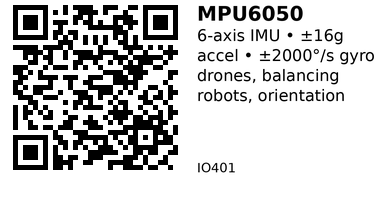

# MPU6050 6-Axis IMU (Gyro + Accel) - IO401

Popular 6-axis Inertial Measurement Unit combining 3-axis gyroscope and 3-axis accelerometer. Features built-in Digital Motion Processor (DMP) for sensor fusion. Perfect for drones, self-balancing robots, and orientation tracking.

## Key Specifications

| Parameter | Value |
|-----------|-------|
| **Axes** | 6 (3-axis gyro + 3-axis accel) |
| **Accelerometer range** | ±2g, ±4g, ±8g, ±16g (selectable) |
| **Gyroscope range** | ±250°/s, ±500°/s, ±1000°/s, ±2000°/s |
| **ADC resolution** | 16-bit |
| **Interface** | I2C (up to 400 kHz) |
| **I2C address** | 0x68 (default) or 0x69 (with AD0=HIGH) |
| **Supply voltage** | 3.3V - 5V (module), 2.375V - 3.46V (chip) |
| **Operating temp** | -40°C to +85°C |
| **DMP** | Built-in Digital Motion Processor |

## Pinout (GY-521 Module)

```
GY-521 (MPU6050) Module
    ___
   |   |
   | M |
   | P |
   | U |
   |___|
   | | | | | | | |
   V G S S X I A D
   C N D C D N D 0
   C D A L A T

VCC = Power (3.3V or 5V)
GND = Ground
SDA = I2C Data (ESP32 GPIO21)
SCL = I2C Clock (ESP32 GPIO22)
XDA = Auxiliary I2C Data (for connecting magnetometer)
INT = Interrupt output (data ready, motion detect)
AD0 = I2C Address select (LOW=0x68, HIGH=0x69)
```

**Most common:** Only use VCC, GND, SDA, SCL.

## Typical Wiring (ESP32)

```
ESP32           MPU6050 (GY-521)
-----           ----------------
3.3V   -------> VCC
GND    -------> GND
GPIO21 -------> SDA
GPIO22 -------> SCL
```

**Optional:**
```
GPIO23 -------> INT (interrupt for data ready)
```

## Example Code (ESP32)

```cpp
// ESP32 + MPU6050
// Install: Adafruit MPU6050 + Adafruit Unified Sensor
#include <Wire.h>
#include <Adafruit_MPU6050.h>
#include <Adafruit_Sensor.h>

Adafruit_MPU6050 mpu;

void setup() {
  Serial.begin(115200);
  Wire.begin();

  if (!mpu.begin()) {
    Serial.println("MPU6050 not found!");
    while (1) delay(10);
  }

  Serial.println("MPU6050 initialized");

  // Set ranges
  mpu.setAccelerometerRange(MPU6050_RANGE_8_G);   // ±8g
  mpu.setGyroRange(MPU6050_RANGE_500_DEG);        // ±500°/s
  mpu.setFilterBandwidth(MPU6050_BAND_21_HZ);     // Low-pass filter
}

void loop() {
  sensors_event_t accel, gyro, temp;
  mpu.getEvent(&accel, &gyro, &temp);

  // Acceleration (m/s²)
  Serial.printf("Accel: X=%.2f Y=%.2f Z=%.2f m/s² | ",
                accel.acceleration.x,
                accel.acceleration.y,
                accel.acceleration.z);

  // Rotation rate (°/s)
  Serial.printf("Gyro: X=%.2f Y=%.2f Z=%.2f °/s | ",
                gyro.gyro.x * 180/PI,
                gyro.gyro.y * 180/PI,
                gyro.gyro.z * 180/PI);

  // Temperature
  Serial.printf("Temp: %.1f°C\n", temp.temperature);

  delay(100);
}
```

## Tilt Angle from Accelerometer

When stationary, accelerometer measures gravity (1g downward):

```cpp
void loop() {
  sensors_event_t accel, gyro, temp;
  mpu.getEvent(&accel, &gyro, &temp);

  // Calculate tilt angles (only valid when stationary!)
  float ax = accel.acceleration.x;
  float ay = accel.acceleration.y;
  float az = accel.acceleration.z;

  float pitch = atan2(ax, sqrt(ay*ay + az*az)) * 180/PI;
  float roll  = atan2(ay, sqrt(ax*ax + az*az)) * 180/PI;

  Serial.printf("Pitch: %.1f° | Roll: %.1f°\n", pitch, roll);
  delay(100);
}
```

**Limitation:** Only works when sensor is stationary! During movement, acceleration includes both gravity and motion.

## Complementary Filter (Gyro + Accel Fusion)

Combine gyro (fast but drifts) and accel (slow but stable):

```cpp
float pitchFiltered = 0;
float rollFiltered = 0;
unsigned long lastTime = 0;

void loop() {
  sensors_event_t accel, gyro, temp;
  mpu.getEvent(&accel, &gyro, &temp);

  // Time delta
  unsigned long now = millis();
  float dt = (now - lastTime) / 1000.0;  // seconds
  lastTime = now;

  // Gyro integration (fast response, drifts)
  float pitchGyro = pitchFiltered + gyro.gyro.x * dt * 180/PI;
  float rollGyro = rollFiltered + gyro.gyro.y * dt * 180/PI;

  // Accel angles (slow response, stable)
  float ax = accel.acceleration.x;
  float ay = accel.acceleration.y;
  float az = accel.acceleration.z;
  float pitchAccel = atan2(ax, sqrt(ay*ay + az*az)) * 180/PI;
  float rollAccel = atan2(ay, sqrt(ax*ax + az*az)) * 180/PI;

  // Complementary filter (98% gyro, 2% accel)
  float alpha = 0.98;
  pitchFiltered = alpha * pitchGyro + (1 - alpha) * pitchAccel;
  rollFiltered = alpha * rollGyro + (1 - alpha) * rollAccel;

  Serial.printf("Pitch: %.1f° | Roll: %.1f°\n", pitchFiltered, rollFiltered);
  delay(10);
}
```

## DMP (Digital Motion Processor)

MPU6050 has built-in DMP for quaternion-based sensor fusion (better than complementary filter):

```cpp
// Requires: MPU6050_tockn library or Jeff Rowberg's I2Cdev library
// DMP provides quaternions, Euler angles, gravity-compensated accel
```

**Advantages:**
- Better accuracy than software filters
- Offloads computation from MCU
- Quaternions avoid gimbal lock

**Disadvantages:**
- Complex library setup
- Larger code size
- Not all libraries support DMP

## Motion Detection (Interrupt)

Use INT pin to trigger on motion:

```cpp
void setup() {
  // ... (MPU init code)

  // Enable motion interrupt
  mpu.setHighPassFilter(MPU6050_HIGHPASS_0_63_HZ);
  mpu.setMotionDetectionThreshold(1);  // 1 = 2mg
  mpu.setMotionDetectionDuration(20);  // 20ms
  mpu.setInterruptPinLatch(true);
  mpu.setInterruptPinPolarity(true);
  mpu.setMotionInterrupt(true);

  pinMode(23, INPUT);  // INT pin on GPIO23
}

void loop() {
  if (digitalRead(23) == HIGH) {
    Serial.println("Motion detected!");
    mpu.getEvent(&accel, &gyro, &temp);  // Clear interrupt
  }
  delay(100);
}
```

## Calibration

MPU6050 has offset registers for zero calibration:

```cpp
void calibrate() {
  Serial.println("Calibrating... keep sensor flat and still!");
  delay(2000);

  int samples = 100;
  float sumAX = 0, sumAY = 0, sumAZ = 0;
  float sumGX = 0, sumGY = 0, sumGZ = 0;

  for (int i = 0; i < samples; i++) {
    sensors_event_t a, g, t;
    mpu.getEvent(&a, &g, &t);

    sumAX += a.acceleration.x;
    sumAY += a.acceleration.y;
    sumAZ += a.acceleration.z - 9.81;  // Remove gravity
    sumGX += g.gyro.x;
    sumGY += g.gyro.y;
    sumGZ += g.gyro.z;

    delay(10);
  }

  Serial.printf("Offsets: AX=%.3f AY=%.3f AZ=%.3f GX=%.3f GY=%.3f GZ=%.3f\n",
                sumAX/samples, sumAY/samples, sumAZ/samples,
                sumGX/samples, sumGY/samples, sumGZ/samples);
}
```

Store offsets and subtract from readings.

## Key Features

**6-axis IMU:**
- Gyro + Accel in single chip
- Synchronized sampling
- Shared I2C interface

**Selectable ranges:**
- Accelerometer: ±2g to ±16g
- Gyroscope: ±250°/s to ±2000°/s
- Trade-off: sensitivity vs range

**Built-in DMP:**
- Hardware sensor fusion
- Quaternion output
- Reduces MCU load

**Low-pass filter:**
- Configurable bandwidth
- Reduces noise
- Improves stability

## Gotchas

1. **Gyro drift:** Gyroscope drifts over time - needs periodic recalibration
2. **Accel noise during motion:** Accelerometer includes motion + gravity (can't separate easily)
3. **I2C address conflict:** Default 0x68 conflicts with some RTC modules
4. **Temperature sensitivity:** Readings drift with temperature changes
5. **Coordinate system:** Z-axis points DOWN through board (not up!)
6. **DMP complexity:** DMP libraries are large and complex
7. **Clones common:** Many clones with varying quality

## Applications

**Drones/quadcopters:** Stabilization, orientation control.

**Self-balancing robots:** Two-wheel balancing (Segway-style).

**Gimbals:** Camera stabilization mounts.

**Motion tracking:** VR controllers, wearable devices.

**Inclinometer:** Measure slope, tilt angle.

**Step counter:** Detect walking motion (pedometer).

## Troubleshooting

**Sensor not found:**
- Check I2C wiring (SDA/SCL correct?)
- Verify address (0x68 or 0x69)
- Run I2C scanner sketch
- Try external pull-ups (4.7kΩ)

**Readings don't change:**
- Sensor may be dead
- Check power (VCC connected?)
- Verify module orientation (moving in correct axis?)

**Gyro drifts:**
- Normal behavior (integrate over time)
- Calibrate offsets
- Use sensor fusion (complementary filter or DMP)

**Erratic readings:**
- I2C communication errors (add pull-ups)
- Power supply noise (add capacitor)
- Temperature changes (recalibrate)

## Links

- **AliExpress**: Search "GY-521 MPU6050" (~$1-2)

---


