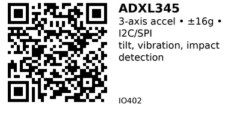

# ADXL345 3-Axis Accelerometer - IO402

Popular 3-axis MEMS accelerometer with selectable range up to ±16g. Features both I2C and SPI interfaces, tap/double-tap detection, and free-fall interrupt. Cheaper and simpler than full IMU when gyroscope not needed.

## Key Specifications

| Parameter | Value |
|-----------|-------|
| **Axes** | 3 (X, Y, Z) |
| **Measurement range** | ±2g, ±4g, ±8g, ±16g (selectable) |
| **Resolution** | 13-bit (full resolution mode) |
| **Interface** | I2C (up to 400 kHz) or SPI (up to 5 MHz) |
| **I2C address** | 0x53 (default) or 0x1D (with SDO=HIGH) |
| **Supply voltage** | 2.0V - 3.6V (module: 3.3V - 5V) |
| **Output data rate** | 0.1 Hz to 3200 Hz |
| **Operating temp** | -40°C to +85°C |
| **Current consumption** | 40 μA @ 100 Hz (normal), 0.1 μA (standby) |

## Pinout (GY-291 Module)

```
GY-291 (ADXL345) Module
    ___
   |   |
   | A |
   | D |
   | X |
   |___|
   | | | | | | | |
   V G S S S I C 3
   C N D C D N S V
   C D A L O T   3

VCC = Power (3.3V or 5V)
GND = Ground
SDA = I2C Data (or SPI MOSI)
SCL = I2C Clock (or SPI SCK)
SDO = I2C Address / SPI MISO
INT = Interrupt outputs (INT1/INT2)
CS  = Chip Select (SPI mode, tie HIGH for I2C)
3V3 = 3.3V output from regulator (optional)
```

## Typical Wiring (ESP32 - I2C Mode)

```
ESP32           ADXL345 (GY-291)
-----           ----------------
3.3V   -------> VCC
GND    -------> GND
GPIO21 -------> SDA
GPIO22 -------> SCL
       (tie CS to VCC for I2C mode)
```

**For SPI mode:**
```
ESP32           ADXL345
-----           -------
3.3V   -------> VCC
GND    -------> GND
GPIO23 -------> SDA (MOSI)
GPIO18 -------> SCL (SCK)
GPIO19 -------> SDO (MISO)
GPIO5  -------> CS
```

## Example Code (ESP32 - I2C)

```cpp
// ESP32 + ADXL345 (I2C)
// Install: Adafruit ADXL345 + Adafruit Unified Sensor
#include <Wire.h>
#include <Adafruit_ADXL345_U.h>

Adafruit_ADXL345_Unified accel = Adafruit_ADXL345_Unified(12345);

void setup() {
  Serial.begin(115200);
  Wire.begin();

  if (!accel.begin()) {
    Serial.println("ADXL345 not found!");
    while (1) delay(10);
  }

  Serial.println("ADXL345 initialized");

  // Set range (2G, 4G, 8G, 16G)
  accel.setRange(ADXL345_RANGE_16_G);

  // Set data rate
  accel.setDataRate(ADXL345_DATARATE_100_HZ);
}

void loop() {
  sensors_event_t event;
  accel.getEvent(&event);

  // Acceleration in m/s²
  Serial.printf("X: %6.2f | Y: %6.2f | Z: %6.2f m/s²\n",
                event.acceleration.x,
                event.acceleration.y,
                event.acceleration.z);

  delay(100);
}
```

## Tilt Angle Calculation

When stationary, accelerometer measures gravity vector:

```cpp
void loop() {
  sensors_event_t event;
  accel.getEvent(&event);

  float x = event.acceleration.x;
  float y = event.acceleration.y;
  float z = event.acceleration.z;

  // Calculate tilt angles
  float pitch = atan2(x, sqrt(y*y + z*z)) * 180 / PI;
  float roll  = atan2(y, sqrt(x*x + z*z)) * 180 / PI;

  Serial.printf("Pitch: %6.1f° | Roll: %6.1f°\n", pitch, roll);
  delay(100);
}
```

**Limitation:** Only accurate when sensor is stationary!

## Tap Detection

ADXL345 has built-in tap/double-tap detection:

```cpp
void setup() {
  // ... (init code)

  // Enable tap detection
  // See datasheet for register details
  // Requires writing to TAP_AXES, TAP_THRESH, DUR, LATENT, WINDOW registers
  // Most libraries don't expose this - use raw register writes
}
```

**Note:** Tap detection requires low-level register access (not in Adafruit library).

## Free-Fall Detection

Detect when all axes show low acceleration (free-fall):

```cpp
void loop() {
  sensors_event_t event;
  accel.getEvent(&event);

  float magnitude = sqrt(
    event.acceleration.x * event.acceleration.x +
    event.acceleration.y * event.acceleration.y +
    event.acceleration.z * event.acceleration.z
  );

  // Free-fall threshold (~0.5 g)
  if (magnitude < 5.0) {  // m/s² (0.5g ≈ 4.9 m/s²)
    Serial.println("FREE FALL!");
  }

  delay(50);
}
```

## Impact/Shock Detection

Detect sudden acceleration changes:

```cpp
float lastMagnitude = 9.81;

void loop() {
  sensors_event_t event;
  accel.getEvent(&event);

  float magnitude = sqrt(
    event.acceleration.x * event.acceleration.x +
    event.acceleration.y * event.acceleration.y +
    event.acceleration.z * event.acceleration.z
  );

  // Detect sudden change (impact)
  float change = abs(magnitude - lastMagnitude);
  if (change > 15.0) {  // Threshold in m/s²
    Serial.println("IMPACT DETECTED!");
  }

  lastMagnitude = magnitude;
  delay(20);
}
```

## Vibration Monitoring

```cpp
#define SAMPLES 100

void loop() {
  float sum = 0;

  // Collect samples
  for (int i = 0; i < SAMPLES; i++) {
    sensors_event_t event;
    accel.getEvent(&event);

    float magnitude = sqrt(
      event.acceleration.x * event.acceleration.x +
      event.acceleration.y * event.acceleration.y +
      event.acceleration.z * event.acceleration.z
    );

    sum += abs(magnitude - 9.81);  // Deviation from 1g
    delay(5);
  }

  float avgVibration = sum / SAMPLES;
  Serial.printf("Vibration level: %.2f m/s²\n", avgVibration);

  if (avgVibration > 2.0) {
    Serial.println("HIGH VIBRATION!");
  }

  delay(500);
}
```

## Key Features

**3-axis accelerometer:**
- Measures X, Y, Z acceleration
- Detects tilt via gravity
- No gyroscope (simpler than IMU)

**Selectable range:**
- ±2g to ±16g
- Higher range = lower sensitivity
- Choose based on application

**Dual interface:**
- I2C or SPI
- I2C simpler, SPI faster
- CS pin selects mode

**Built-in features:**
- Tap/double-tap detection
- Free-fall interrupt
- Activity/inactivity detection

**Low power:**
- 40 μA @ 100 Hz
- 0.1 μA standby
- Perfect for battery devices

## Gotchas

1. **No gyroscope:** Cannot measure rotation rate (use MPU6050 if needed)
2. **Motion interference:** During movement, cannot separate gravity from motion
3. **Temperature drift:** Readings affected by temperature (calibration needed)
4. **I2C address:** Default 0x53 may conflict with other devices
5. **CS pin mode:** Must tie CS HIGH for I2C, LOW for SPI
6. **Tap detection complex:** Requires register-level configuration

## ADXL345 vs MPU6050

| Feature | ADXL345 (IO402) | MPU6050 (IO401) |
|---------|-----------------|-----------------|
| **Axes** | 3 (accel only) | 6 (gyro + accel) |
| **Gyroscope** | No | Yes |
| **Tilt measurement** | Yes (stationary) | Yes (with fusion) |
| **Rotation rate** | No | Yes |
| **Power** | 40 μA | ~3.6 mA |
| **Price** | $2-3 | $1-2 |
| **Best for** | Tilt, vibration | Orientation, drones |

**Use ADXL345 when:**
- Only need tilt/vibration detection
- No rotation measurement needed
- Low power critical
- Simpler code preferred

**Use MPU6050 when:**
- Need rotation rate (gyro)
- Orientation tracking required
- Sensor fusion needed

## Applications

**Tilt sensing:** Inclinometer, angle measurement, leveling.

**Vibration monitoring:** Machine health, fault detection.

**Impact detection:** Drop detection for hard drives, packages.

**Pedometer:** Step counting, activity tracking.

**Gaming controller:** Motion-based controls (Wii-style).

**Anti-theft alarm:** Detect movement of protected object.

## Troubleshooting

**Sensor not found:**
- Check I2C wiring (SDA/SCL correct?)
- Verify address (0x53 default)
- CS pin HIGH for I2C mode
- Run I2C scanner

**Readings stuck at 0:**
- Sensor not initialized
- Wrong I2C address
- Power issue (VCC connected?)

**Noisy readings:**
- Normal for accelerometers
- Add averaging (read multiple samples)
- Reduce data rate
- Check power supply stability

**Wrong orientation:**
- Coordinate system different from MPU6050
- Check datasheet for axis directions
- May need to flip signs in code

## Links

- **AliExpress**: Search "GY-291 ADXL345" (~$2-3)

---


