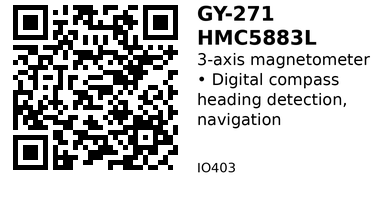

# GY-271 HMC5883L 3-Axis Digital Compass - IO403

3-axis magnetometer for detecting Earth's magnetic field. Provides digital compass functionality for heading/bearing measurement. Often used with IMU for 9-axis sensor fusion (gyro + accel + mag).

## Key Specifications

| Parameter | Value |
|-----------|-------|
| **Axes** | 3 (X, Y, Z) |
| **Measurement range** | ±1.3 to ±8.1 Gauss |
| **Resolution** | 12-bit ADC |
| **Interface** | I2C (up to 400 kHz) |
| **I2C address** | 0x1E (default, fixed) |
| **Supply voltage** | 2.16V - 3.6V (module: 3.3V - 5V) |
| **Heading accuracy** | 1° to 2° (with calibration) |
| **Output rate** | 0.75 Hz to 75 Hz |
| **Operating temp** | -30°C to +85°C |

## Pinout (GY-271 Module)

```
GY-271 (HMC5883L) Module
    ___
   |   |
   | H |
   | M |
   | C |
   |___|
   | | | | |
   V G S S D
   C N D C R
   C D A L D
       Y

VCC  = Power (3.3V or 5V)
GND  = Ground
SDA  = I2C Data
SCL  = I2C Clock
DRDY = Data Ready (optional interrupt)
```

## Typical Wiring (ESP32)

```
ESP32           GY-271
-----           ------
3.3V   -------> VCC
GND    -------> GND
GPIO21 -------> SDA
GPIO22 -------> SCL
```

## Example Code (ESP32)

```cpp
// ESP32 + HMC5883L
// Install: Adafruit HMC5883 Unified library
#include <Wire.h>
#include <Adafruit_HMC5883_U.h>

Adafruit_HMC5883_Unified mag = Adafruit_HMC5883_Unified(12345);

void setup() {
  Serial.begin(115200);
  Wire.begin();

  if (!mag.begin()) {
    Serial.println("HMC5883L not found!");
    while (1) delay(10);
  }

  Serial.println("HMC5883L initialized");
}

void loop() {
  sensors_event_t event;
  mag.getEvent(&event);

  // Magnetic field strength (microTesla)
  Serial.printf("X: %7.2f | Y: %7.2f | Z: %7.2f µT\n",
                event.magnetic.x,
                event.magnetic.y,
                event.magnetic.z);

  delay(500);
}
```

## Heading Calculation (Compass)

Calculate compass heading from X/Y magnetic field:

```cpp
void loop() {
  sensors_event_t event;
  mag.getEvent(&event);

  // Calculate heading (assumes sensor is level!)
  float heading = atan2(event.magnetic.y, event.magnetic.x);

  // Convert to degrees
  heading = heading * 180 / PI;

  // Normalize to 0-360°
  if (heading < 0) {
    heading += 360;
  }

  // Apply magnetic declination (location-dependent)
  // Example: +14° for Los Angeles
  float declination = 14.0;
  heading += declination;

  if (heading > 360) {
    heading -= 360;
  }

  Serial.printf("Heading: %.1f°\n", heading);
  delay(500);
}
```

## Magnetic Declination

Earth's magnetic north ≠ true north. Apply correction for your location:

**Find your declination:**
- Visit: https://www.magnetic-declination.com/
- Enter your coordinates
- Add value to heading

```cpp
// Examples:
float declination = 14.0;   // Los Angeles: +14°
float declination = -8.5;   // New York: -8.5°
float declination = 0.2;    // London: +0.2°
```

## Calibration (Hard-Iron Offset)

Metal objects nearby distort readings. Calibrate by rotating sensor 360°:

```cpp
void calibrate() {
  Serial.println("Rotate sensor in all directions for 30 seconds...");

  float minX = 1000, maxX = -1000;
  float minY = 1000, maxY = -1000;
  float minZ = 1000, maxZ = -1000;

  unsigned long startTime = millis();
  while (millis() - startTime < 30000) {  // 30 seconds
    sensors_event_t event;
    mag.getEvent(&event);

    minX = min(minX, event.magnetic.x);
    maxX = max(maxX, event.magnetic.x);
    minY = min(minY, event.magnetic.y);
    maxY = max(maxY, event.magnetic.y);
    minZ = min(minZ, event.magnetic.z);
    maxZ = max(maxZ, event.magnetic.z);

    delay(100);
  }

  // Calculate hard-iron offsets
  float offsetX = (maxX + minX) / 2;
  float offsetY = (maxY + minY) / 2;
  float offsetZ = (maxZ + minZ) / 2;

  Serial.printf("Hard-iron offsets: X=%.2f Y=%.2f Z=%.2f\n",
                offsetX, offsetY, offsetZ);
  Serial.println("Apply these offsets by subtracting from readings.");
}
```

Apply offsets:
```cpp
float x = event.magnetic.x - offsetX;
float y = event.magnetic.y - offsetY;
float z = event.magnetic.z - offsetZ;
```

## Tilt-Compensated Compass

When sensor is tilted, heading is incorrect. Compensate using accelerometer:

```cpp
// Requires accelerometer (e.g., ADXL345 or MPU6050)
void loop() {
  // Read magnetometer
  sensors_event_t magEvent;
  mag.getEvent(&magEvent);

  // Read accelerometer
  sensors_event_t accelEvent;
  accel.getEvent(&accelEvent);

  // Calculate pitch and roll
  float pitch = atan2(accelEvent.acceleration.x,
                      sqrt(accelEvent.acceleration.y * accelEvent.acceleration.y +
                           accelEvent.acceleration.z * accelEvent.acceleration.z));
  float roll = atan2(accelEvent.acceleration.y,
                     accelEvent.acceleration.z);

  // Tilt-compensated magnetic field
  float magX = magEvent.magnetic.x;
  float magY = magEvent.magnetic.y;
  float magZ = magEvent.magnetic.z;

  float Xh = magX * cos(pitch) + magZ * sin(pitch);
  float Yh = magX * sin(roll) * sin(pitch) + magY * cos(roll) - magZ * sin(roll) * cos(pitch);

  // Calculate heading
  float heading = atan2(Yh, Xh) * 180 / PI;
  if (heading < 0) heading += 360;

  Serial.printf("Tilt-compensated heading: %.1f°\n", heading);
  delay(500);
}
```

## Cardinal Direction

Convert heading to compass direction:

```cpp
const char* getDirection(float heading) {
  const char* directions[] = {"N", "NE", "E", "SE", "S", "SW", "W", "NW"};
  int index = (int)((heading + 22.5) / 45.0) % 8;
  return directions[index];
}

void loop() {
  // ... (heading calculation code)

  Serial.printf("Heading: %.1f° (%s)\n", heading, getDirection(heading));
  delay(500);
}
```

## Key Features

**3-axis magnetometer:**
- Detects Earth's magnetic field
- X, Y, Z field strength
- Digital compass functionality

**High accuracy:**
- 1-2° heading accuracy (calibrated)
- 12-bit resolution
- Auto-ranging

**I2C interface:**
- Simple 2-wire connection
- Compatible with most MCUs
- Can share bus with other sensors

## Gotchas

1. **Metal nearby:** USB cables, motors, wires distort readings - keep clear!
2. **Indoor use limited:** Building steel frames distort magnetic field
3. **Calibration required:** Must calibrate for hard-iron and soft-iron effects
4. **Tilt sensitivity:** Heading wrong if sensor tilted (need accel for compensation)
5. **Magnetic declination:** Must apply local correction for true north
6. **QMC5883L clones:** Many "HMC5883L" modules actually use QMC5883L (different chip!)
7. **I2C address conflict:** 0x1E may conflict with other sensors

## HMC5883L vs QMC5883L

**Warning:** Many GY-271 modules labeled "HMC5883L" actually contain QMC5883L chip!

| Feature | HMC5883L (Honeywell) | QMC5883L (QST) |
|---------|---------------------|----------------|
| **I2C Address** | 0x1E | 0x0D |
| **Registers** | Different | Different |
| **Library** | Adafruit HMC5883 | QMC5883LCompass |
| **Identification** | Read chip markings | Check I2C scanner |

**To check which chip you have:**
1. Run I2C scanner
2. If address is 0x0D → QMC5883L
3. If address is 0x1E → HMC5883L

Use appropriate library for your chip!

## Applications

**Digital compass:** Navigation, heading display, direction finding.

**Robot navigation:** Autonomous robots, line-following with compass.

**Drone heading hold:** Maintain bearing during flight.

**Metal detection:** Detect magnetic anomalies (hidden metal).

**9-axis IMU:** Combine with gyro + accel for full orientation.

**Augmented reality:** Heading reference for AR applications.

## Troubleshooting

**Sensor not found:**
- Check I2C wiring
- Verify address (0x1E or 0x0D for QMC5883L)
- Run I2C scanner
- Wrong library for chip type

**Heading jumps/erratic:**
- Metal nearby (USB cable, motors, wires)
- Not calibrated (run hard-iron calibration)
- Sensor tilted (use tilt compensation)

**Heading always same direction:**
- Sensor saturated (too much metal nearby)
- Dead chip (replace module)
- Wrong axis used in calculation

**Heading 180° off:**
- Swap X/Y in atan2 calculation
- Or add 180° to result

## Links

- **AliExpress**: Search "GY-271 HMC5883L compass" (~$2-3)
- **Declination Lookup**: https://www.magnetic-declination.com/

---


