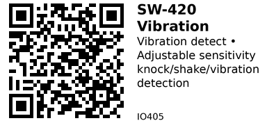

# SW-420 Vibration Sensor Module - IO405

Motion-activated vibration sensor with adjustable sensitivity. Detects vibration, shaking, knocking, or sudden movement. Based on spring-contact switch that closes momentarily when vibrated.

## Key Specifications

| Parameter | Value |
|-----------|-------|
| **Type** | Mechanical vibration switch |
| **Output** | Digital (active LOW on vibration) |
| **Sensitivity** | Adjustable via potentiometer |
| **Supply voltage** | 3.3V - 5V |
| **Operating temp** | -10°C to +50°C |
| **Response time** | <1ms |
| **Direction** | Omnidirectional (detects all axes) |

## How It Works

**Internal structure:**
- Conductive spring inside metal housing
- Spring normally doesn't touch contact
- Vibration causes spring to flex and touch contact
- Contact closes momentarily → triggers output
- Returns to open when vibration stops

**Sensitivity adjustment:**
- Potentiometer on module adjusts trigger threshold
- CW (clockwise) = more sensitive
- CCW (counter-clockwise) = less sensitive

## Pinout

```
SW-420 Vibration Sensor Module
    ___
   |   |
   |SW |  [POT]  Sensitivity
   |420|
   |___|
   | | |
   D V G
   O C N
       C D

DO  = Digital Output (LOW when vibration detected)
VCC = Power (3.3V or 5V)
GND = Ground

POT = Sensitivity adjustment potentiometer
```

**Some modules also have:**
```
AO = Analog output (vibration intensity)
```

## Typical Wiring (ESP32)

```
ESP32           SW-420
-----           ------
3.3V   -------> VCC
GND    -------> GND
GPIO25 -------> DO
```

## Example Code (ESP32)

```cpp
// ESP32 + SW-420 Vibration Sensor
#define VIBRATION_PIN 25

void setup() {
  Serial.begin(115200);
  pinMode(VIBRATION_PIN, INPUT_PULLUP);
}

void loop() {
  int vibrationState = digitalRead(VIBRATION_PIN);

  if (vibrationState == LOW) {  // Active LOW
    Serial.println("VIBRATION DETECTED!");
  }

  delay(100);
}
```

## Knock Detection

```cpp
#define VIBRATION_PIN 25

void setup() {
  Serial.begin(115200);
  pinMode(VIBRATION_PIN, INPUT_PULLUP);
}

void loop() {
  static unsigned long lastKnock = 0;
  static int knockCount = 0;

  if (digitalRead(VIBRATION_PIN) == LOW) {
    unsigned long now = millis();

    // Count knocks within 2-second window
    if (now - lastKnock < 2000) {
      knockCount++;
    } else {
      knockCount = 1;  // First knock in new sequence
    }

    lastKnock = now;

    Serial.printf("Knock #%d\n", knockCount);

    // Secret knock pattern: 3 knocks
    if (knockCount == 3) {
      Serial.println("Secret knock detected!");
      knockCount = 0;
    }

    delay(200);  // Debounce
  }
}
```

## Interrupt-Based Detection

More responsive than polling:

```cpp
#define VIBRATION_PIN 25

volatile bool vibrationDetected = false;

void IRAM_ATTR handleVibration() {
  vibrationDetected = true;
}

void setup() {
  Serial.begin(115200);
  pinMode(VIBRATION_PIN, INPUT_PULLUP);

  attachInterrupt(digitalPinToInterrupt(VIBRATION_PIN),
                  handleVibration,
                  FALLING);  // Trigger on LOW
}

void loop() {
  if (vibrationDetected) {
    Serial.println("VIBRATION!");
    vibrationDetected = false;

    delay(100);  // Debounce
  }

  // Do other tasks...
  delay(10);
}
```

## Shake Detector

Count shakes over time:

```cpp
#define VIBRATION_PIN 25

void loop() {
  static int shakeCount = 0;
  static unsigned long startTime = millis();

  if (digitalRead(VIBRATION_PIN) == LOW) {
    shakeCount++;
    delay(100);  // Debounce
  }

  // Check shake count every second
  if (millis() - startTime > 1000) {
    if (shakeCount > 5) {
      Serial.println("SHAKING DETECTED!");
    }

    shakeCount = 0;
    startTime = millis();
  }
}
```

## Anti-Theft Alarm

```cpp
#define VIBRATION_PIN 25
#define ALARM_PIN 26

void loop() {
  if (digitalRead(VIBRATION_PIN) == LOW) {
    Serial.println("ALARM: Movement detected!");
    digitalWrite(ALARM_PIN, HIGH);  // Sound buzzer
    delay(2000);  // Alarm for 2 seconds
    digitalWrite(ALARM_PIN, LOW);
  }

  delay(100);
}
```

## Calibration/Sensitivity Adjustment

**To adjust sensitivity:**
1. Power module
2. Tap or shake gently
3. Adjust potentiometer:
   - **Too sensitive:** CCW (counter-clockwise)
   - **Not sensitive enough:** CW (clockwise)
4. Test: tap should trigger, gentle handling should not

**Typical settings:**
- **Knock detection:** Medium-low sensitivity
- **Anti-theft:** Medium sensitivity
- **Vibration monitoring:** High sensitivity

## Key Features

**Adjustable sensitivity:**
- Onboard potentiometer
- Tune for application
- No code changes needed

**Fast response:**
- <1ms detection time
- Mechanical switch (instant)
- Good for knock patterns

**Omnidirectional:**
- Detects vibration in all directions
- No orientation required
- Simpler mounting

**Low cost:**
- Very cheap ($0.30-0.50)
- Simple design
- Easy to use

## Gotchas

1. **Active LOW:** Output goes LOW on vibration (not HIGH!)
2. **Bouncing:** Mechanical switch bounces - needs debouncing
3. **Constant triggering:** If too sensitive, noise triggers it (turn CCW)
4. **Not precise:** Cannot measure vibration intensity accurately
5. **Wear out:** Mechanical spring fatigues over time
6. **False triggers:** Nearby vibrations, footsteps may trigger
7. **Orientation independent:** Unlike tilt switch, works in any position

## Comparison with Accelerometer

| Feature | SW-420 (IO405) | ADXL345 (IO402) |
|---------|----------------|-----------------|
| **Output** | Digital ON/OFF | Analog magnitude |
| **Precision** | Low (threshold) | High (m/s²) |
| **Cost** | $0.30 | $2-3 |
| **Code** | Trivial | Moderate |
| **Frequency** | Mechanical (limited) | High-speed sampling |

**Use SW-420 when:**
- Simple vibration ON/OFF needed
- Budget constrained
- Knock/tap detection
- Code simplicity important

**Use accelerometer when:**
- Need vibration magnitude
- Frequency analysis required
- Multi-axis monitoring
- Precise measurement needed

## Applications

**Knock sensor:** Secret knock patterns, door knock detector.

**Anti-theft alarm:** Detect object movement or vibration.

**Earthquake detector:** Simple seismic alarm (low sensitivity).

**Machine monitoring:** Detect abnormal vibration in equipment.

**Musical instruments:** Tap-based MIDI triggers.

**Smart doorbell:** Alternative tap-to-ring mechanism.

**Package protection:** Detect rough handling during shipping.

## Troubleshooting

**Always triggered (constant LOW):**
- Too sensitive (turn pot CCW)
- Sensor damaged/shorted
- Loose connection vibrating

**Never triggers:**
- Not sensitive enough (turn pot CW)
- Wiring incorrect (DO not connected?)
- Sensor dead (replace)
- Test by tapping module directly

**Erratic triggering:**
- Nearby vibrations (floor, fans, motors)
- Reduce sensitivity
- Mount more securely
- Add debouncing in code

## Links

- **AliExpress**: Search "SW-420 vibration sensor" (~$0.30-0.50)

---


